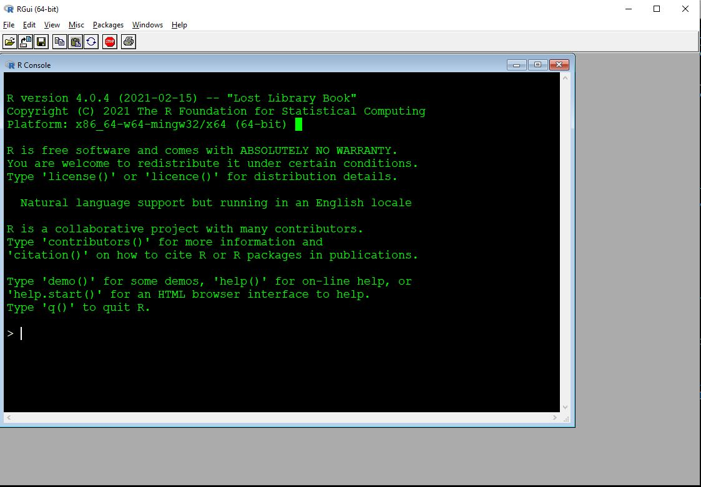
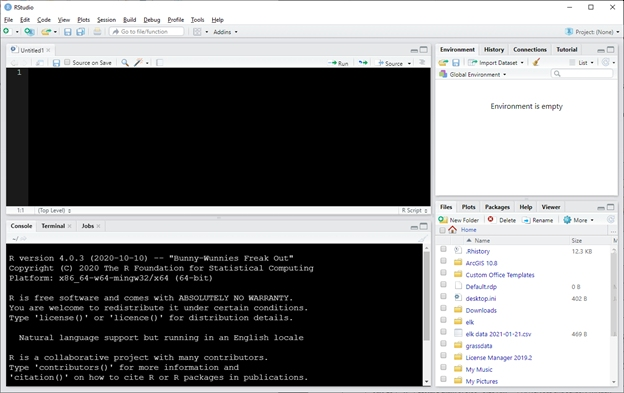
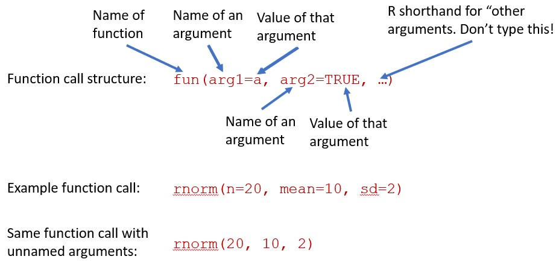
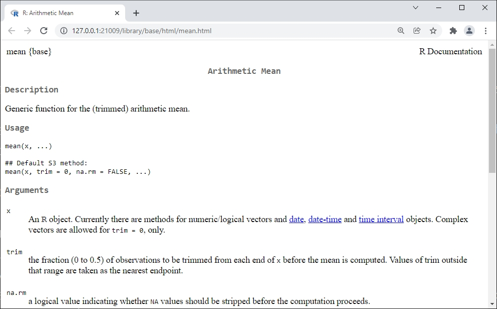
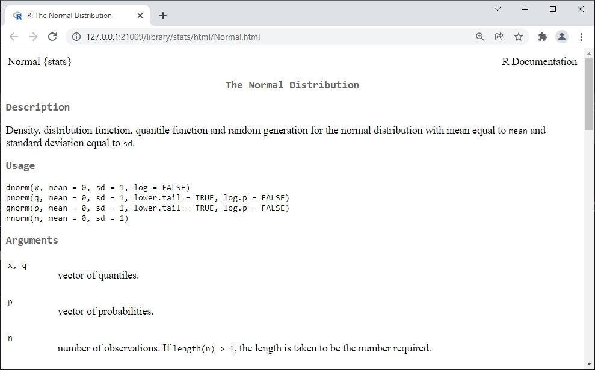

# Introduction to R {#sec-02}

```{r}
#| include: false
options(width=70)
```

This module is an introduction to the R program and language. We will begin with downloading and installing R, then explore the basics of running R commands and storing data, and finally answer some frequently asked questions (FAQ). Some of the topics in this module are covered in greater detail in @sec-03, @sec-04, and @sec-05. The current module is meant to get you up and running before moving on to more advanced material.

By the end of this module you should be able to:

-   Explain what R is and what it is used for
-   Explain the object-oriented programming paradigm used by R
-   Download and install R and RStudio
-   Write and execute commands in the R console
-   Describe basic R data types and structures
-   Manage R code as scripts (.r files)
-   Manage and use R packages
-   Identify sources of help for R programming

## Getting started with R {#sec-02-start}

### Download and install R (and RStudio) {#sec-02-start-install}

If you are on a university campus, many on-campus computers may already have R installed on them. This is the bare minimum you need to work with R. Many people also prefer to use another program for writing R code. The most popular is probably [RStudio](https://posit.co/downloads), which is a more user-friendly interface for R. If you are on a PC or Mac, you will need to download and install both R and RStudio. If you are using a Linux machine, you may already have R because it is included in some distros. You can still install RStudio to make your life easier.

First, install the latest version of R from the [R-project website](https://cran.r-project.org/mirrors.html) (accessed 2021-12-20). Select a mirror (download server) from the list. Once you select a mirror, you will be taken to a page where you will select the version of R that corresponds to your operating system. Click on the appropriate link for your operating system and follow the instructions from there to install R. Like many programs you download from the internet, R will come with an installer that will largely take care of everything automatically. Just let the installer run and accept the default options.

Next, install any code editing or IDE you want.

-   RStudio can be installed from [here](https://posit.co/downloads/) (accessed 2025-08-06). Select the version that corresponds to your operating system. As you did when you installed R, just let the installer run and accept the default options.

-   My personal favorite is Notepad++, which isn't an IDE but instead a very feature-rich code editor.

-   Other popular choices include [Visual Studio Code](https://code.visualstudio.com/download) and [emacs](https://www.gnu.org/software/emacs/).

### Using R {#sec-02-start-using}

#### Base R GUI

R has a very basic front end, or **graphical user interface (GUI)**. Most users find it easier to write their R code in another program. Some of these programs, such as RStudio, are **integrated development environments (IDE)**. Others are text editors with programming capabilities. We'll explore the default R GUI first and then meet some editor options. The basic R GUI is shown below. Your screen may look different than mine because I set some graphics options.

{fig-align="center"}

The main window with R is the **R console**. This is the command line interface to R. Some important features of the console are:

1.  Command prompt: The `>` symbol signifies the beginning of a command. You can enter commands here.

2.  Continue prompt: `+` signifies the continuation of a previous command. If you have a `+` at the beginning of your line, you can get back to a new line using ESCAPE. Note that this will delete the currently incomplete line or command.

3.  The ENTER key executes the current command. This could mean the current line, or multiple lines going back to the most recent `>`.

4.  `[1]` at the beginning of results: because your result is an object (with length $\ge$ 1). The very first value ("element") in the result is element 1.

5.  Up arrow key: cycles through previously entered commands. You can see many previous commands at once by using the command `history()`.

Other important features of the R GUI are found in the menu bar:

-   **File**
    -   **New script**: opens a new script window within the GUI.
    -   Ability to open saved scripts or load previous workspaces
-   **Edit**
    -   **Copy, paste, etc.**: very useful!
    -   **Data editor**: opens a rudimentary spreadsheet-like viewer for datasets that can be used to make edits. Not recommended for routine use.
    -   **GUI preferences**: options to change colors, fonts, font sizes, etc., in the GUI. To make changes permanent you will need to save a new `.RConsole` file in your home directory.
-   **View**
-   **Misc**
    -   **List objects**: lists all objects in workspace. Equivalent to command `ls()`.
    -   **Remove all objects**: removes all objects form workspace. Equivalent to command `rm(list=ls(all=TRUE))`.
    -   **List search path**: lists currently attached packages. Equivalent to command `search()`.
-   **Packages**: functions to download and install packages.
-   **Windows**: options to change how windows are displayed within GUI.
-   **Help**: options and resources for getting help, including several free R manuals in PDF format.

#### Using R in RStudio

Although you can type R code directly into the console, or type in script windows within the base R GUI, it is usually easiest to use a separate program for writing code. The two best, in my experience, are RStudio and Notepad++ (see above). **RStudio** is an IDE designed to manage R projects, and has many useful features. Unlike some other options, RStudio has R built in so you can write code and execute it within the same program. RStudio can be used on Windows, Mac, and Linux operating systems. RStudio also has built-in support for utilities like RMarkdown and Quarto (which was used to build this website).

Once you have RStudio installed, open it and you will see a screen like this:

{fig-align="center"}

Your RStudio might look different at first. You can change the color scheme by going to Tools - Global Options - Appearance and selecting a theme. Here I'm using the "Classic" theme with size 12 Courier New font and 110% zoom.

RStudio has an entire environment for working with R in one window. Each of the panels performs different functions. Starting at the bottom left and going clockwise, the panels are:

-   **Console**: command line interface for R. You can type commands here and execute them by pressing ENTER.
-   **Script**: a space where you can type code and later execute it by either clicking "Run" or pressing CRTL-ENTER (CMD-ENTER on a Mac). Usually people write code in the script window rather than typing it directly into the console.
-   **Environment**: this window lists all of the data objects that you have loaded.
-   **Files**: this window lists all of the files available in your R home directory. You can also navigate to other folders on your machine and select files to open.

The bottom right panel also has a tab called "**Plots**". This is where plots that you make can be seen. Sometimes you will need to resize this panel to see the plots clearly. All of the panels can be resized by clicking and dragging the borders between them.

## Commands, objects, and output {#sec-02-comm}

The key to understanding R is to understand [object orientation](https://en.wikipedia.org/wiki/Object-oriented_programming). This means that R code is built around manipulating objects. In programming, an **object** is a construct or thing with well-defined attributes and behaviors. For example, a graphics program might have object classes like “polygon” and “circle”. Rather than redefine “polygon” every time the user needs to draw a polygon, the program creates a polygon object with attributes like “number of sides” and “side length”. The new object is an **instance** of the polygon class. The **class** of an object defines what attributes it has and how it interacts with other objects.

### R commands--basics {#sec-02-comm-basic}

In R, ***everything*** is an object. We will learn more about some of the most important R object types in the examples in @sec-03. Objects are created in R by many functions.

Objects are stored to memory by **assignment**, using the left arrow `<-` (a “less than” followed by a hyphen). If an object already exists, then assignment is used to either modify the object, or replace it entirely. Here is an example:

```{r}
a <- 3
```

This creates an object called `a`, which contains the value `3`. You can then recall the value by typing `a` in the console and pressing Enter. You can also use the value stored in `a` in calculations or functions.

```{r}
a
```

```{r}
a * 2
```

```{r}
1:a
```

Assigning a different value to `a` will overwrite it.

```{r}
a
a <- 6
a
```

```{r}
a^2
```

Notice that there is no “Undo” button. If you make a mistake, you need to rerun the code before your mistake to get back to where you were. Objects can be deleted by “removing them” with command `rm()`.

```{r}
rm(a)
```

Besides assigning and working with values, R code contains comments: text that is for human readers, and is not interpreted by R. Comments are very important because they tell other people—or future you—what your code is doing and how it works. Some comments are just place markers (e.g., `# Analysis begins here`) to help you find important sections. Other comments might be more lengthy, holding explanations of why you chose to code a task the way that you did (e.g., `# condense with sapply() (maintains order of subunits)`). The latter kind of comment can be very useful to your future self.

In R, comments are made with the \# symbol. Anything on a line after \# is not read by R.

```{r}
# here is a comment
b <- 5 # here is another comment
```

You can write your code directly in the console, or in a script window. If you use the script panel in RStudio (as you should), you can send commands to the console by pressing Crtl-Enter (or Cmd-Enter on Mac). This will send and execute the entire command that the cursor is on. In the base R GUI script window, the equivalent is Crtl-R (or Cmd-R on Mac), but this runs only the line where the cursor rests (not the entire command).

The R console can seem daunting to new users. The `>` symbol at the start of a line is the **command prompt**. Commands must begin here. If there is a `+` at the beginning of a line, then this means that there is an incomplete command. Press Escape to exit the incomplete command and get back to `>`.

When you type a command like `2+2`, the output will print to the console with a `[1]` at the start of the line. The `[1]` signifies that that line starts with the first element of the output. This is to help read outputs with lots of elements. Try the command `rnorm(100)` to see why.

```{r}
2+2
```

```{r}
rnorm(100)
```

Commands can be split over multiple lines. When that happens, a `+` will be seen at the left side of the window instead of a `>`. A split command will be executed once a complete expression is input.

If you accidentally start a command and aren’t sure how to finish it, you can exit and cancel the command with the ESCAPE key. R executes commands, not lines. You can have more than one command on a line separated by a semi-colon ;, but this generally frowned upon.

```{r}
# command split across lines:
2 + 
1
```

```{r}
# 2 commands on a line (don't do this)
2 + 2; 3 + 3
```

Below is an example where the a command is broken across lines, with each line getting an explanatory comment. This is possible because R ignores whitespace (spaces, tabs, returns, etc.). Very complex functions or loops might benefit from this kind of commenting. Some programmers do not like this kind of comment--but you comment code the way that works for you.

```{r}
rnorm(
  10,  # sample size
  10,  # mean
  2    # sd
       # note no comma after last argument!
)#rnorm
```

Notice in the above example that the closing parenthesis for `rnorm()` is marked with a comment. This is a good practice if the open and close parentheses are separated by many lines of code. Most IDEs will highlight matching parentheses, but marking them yourself can potentially save some headache.

When writing comments or writing multi-line commands you should keep in mind that most code editors don’t do line breaks very well. Or, they will wrap text displayed in the editor, but this might not display the same on every device. As a rule I try to keep lines of code to ≤ 80 characters, so I don’t have to scroll over to see the end of a command. You can do this too, by breaking up commands and long comments into multiple lines. It also helps to indent additional lines by a set amount--most people prefer either 2 or 4 spaces rather than a tab stop.

### Using R functions {#sec-02-comm-functions}

R **functions** are objects that do things to other objects, or create objects, or modify objects... basically, functions ***do*** stuff while most other objects ***store*** stuff. Functions are called by name, and they have options or **arguments** contained within parentheses. It’s good practice to have the parentheses touching the function name.

Argument values are set using single equals sign `=`. Argument values must be of the correct **type** (numeric, character, logical, etc.), must take on valid values (or be one of the available options), must be spelled and capitalized correctly, and may be named or not at the user’s discretion. Most functions will print their results to the console upon completion. If you want to store the results of a function, you need to assign the results to an object using `<-`.

{fig-align="center"}

See below for some examples of function use using `rnorm()`, which draws random numbers from a normal distribution[^rnorm]. Your numbers may be different than those below, because the function is *random*.

[^rnorm]: The normal distribution comes up a lot in statistics. It is sometimes called the “bell curve”, but this is inappropriate because many distributions can be bell-shaped. It is also called the “Gaussian” distribution, but Gauss did not discover it. The normal distribution is defined by its mean $\mu$ and its standard deviation (SD) $\sigma$. In other words, its central tendency and spread, respectively.

```{r}
# arguments named
## draw 20 values with mean 10 and sd 2
rnorm(n=20, mean=10, sd=2)
```

```{r}
## equivalent with unnamed arguments
rnorm(20, 10, 2)
```

```{r}
## very different: 2 values from a normal
## distribution with mean=20 and sd=10
rnorm(2, 20, 10)
```

```{r}
## when in doubt, name your arguments!
rnorm(sd=2, n=20, mean=10)
```

You can use the R help pages to see what the arguments are, the order in which R expects them, and their default values (if any). For `rnorm()`, the mean and sd have defaults 0 and 1, respectively.

```{r}
#| eval: false
?rnorm
```

To recap, argument **order** is important when using functions. You can supply arguments to a function without naming them if you put them in the proper order. See the help files to see what the order is. *When in doubt, name your arguments*.

Functions expect arguments in a particular format. If a function is not working, you might have an argument formatted incorrectly. Sometimes it’s helpful to look at each argument separately in the R console, outside of the function. To do this, copy/paste each argument to the R console separately and execute by hitting ENTER.

Some function arguments have default values, so you don’t have to supply them. For example, `runif()`, which draws random numbers from the uniform distribution, defaults to the interval between 0 and 1. So, the two `runif()` commands below are equivalent because 0 and 1 are the defaults for the limits of the interval. The `set.seed()` command before each `runif()` command is to set the random number seed, ensuring that the results are identical. If you run the `runif()` commands without resetting the random number seed, the commands will return different results because of the random nature of the function.

```{r}
#| collapse: true

set.seed(123)
runif(10, 0, 1)

set.seed(123)
runif(10)
```

### The R workspace {#sec-02-comm-workspace}

When you use R, all objects and data that you use exist in the R **workspace**. Objects in the workspace can be called from the console. You can think of the workspace like a kind of sandbox or workbench.

Most of the time, when you start R this creates a new workspace with no objects. If you open a previously saved workspace, you will see the message `[Previously saved workspace restored]`. If you saved your R workspace without a unique name, it can be hard to figure out what workspace you are in. You can use the `ls()` command to see what is in the workspace, which might help you figure out what workspace has been loaded. If there are no objects in the workspace, the result of `ls()` will be `character(0)`. This output means that the `ls()` command returned a vector of text values (`character`) with 0 elements. In other words, the workspace contains no objects.

As you work, your workspace will fill up with objects. This isn’t a big deal until you start to either have too many names to keep track of, or start to use too much memory. The first problem can be dealt with by commenting your code. The second problem can be solved by deleting unneeded objects to save space. You can check to see how much memory your R objects are using with the following command:

```{r}
#| eval: false

# not run, but try on your machine
sort(sapply(mget(ls()),object.size), decreasing=TRUE)
```

This command will print the sizes of objects in memory in the current workspace, in descending order. The default units are bytes. If you want the results in Mb, divide the output by 1.024e6.

```{r}
#| eval: false

# not run, but try on your machine
a <- sort(sapply(mget(ls()),object.size), decreasing=TRUE)
a/1.024e6
```

R objects can be deleted or removed from the workspace with the `rm()` function. You can remove objects one at a time or by supplying a set of names. Note that the set of names is supplied to an argument called `list`, which is confusing because `list` is also the name of a special type of object in R.

```{r}
#| eval: false

# not run, but try on your machine
x <- 1
y <- 2
z <- 3

# shows x, y, and z in workspace
ls() 

# remove x
rm(x)
ls() # x is gone

# remove y and z
rm(list=c("y", "z"))
ls() # x, y, and z are all gone
```

## R syntax {#sec-02-syn}

### Object size and structure {#sec-02-syn-oss}

As you've already seen, the most important R function is **assignment**. When you assign a value to a variable, you can then use that variable in place of the value. Assigning a value to variable name will automatically create a new object in the workspace with that name. If an object with that name already exists, assigning a new value to that name will overwrite the old object.

***You should always use the left arrow `<-` as the assignment operator.*** The equals sign `=` can be used for assignment, but you should not do so because `=` is easily confused with the equality test operator `==`. Also, `=` is a mathematical symbol, but `<-` is unambiguously an R operation. You can also use `->` to assign to the right, but doing so usually makes your code harder to read rather than easier. Always use `<-` to assign to the left.

```{r}
aa <- 4
bb <- 1:10
```

Don’t do this:

```{r}
#| eval: false
cc = 5
```

Don’t do this either.

```{r}
#| eval: false
5 -> cc
```

And definitely don’t do this:

```{r}
#| eval: false
a <- 5 -> b
```

You can chain multiple assignments together in a single command. This is useful if you need to quickly create several objects with the same structure:

```{r}
#| eval: false

list3 <- list2 <- list1 <- vector("list", 5)
```

Assignment can also be used to **change or overwrite** parts of pre-existing objects. Usually this involves the bracket notation, which we will explore more in @sec-05. In the example below, the third element of object `a`, `a[3]`, is replaced with the number 42.

```{r}
#| collapse: true

a <- 1:5
a

a[3] <- 42
a
```

One little-known feature of R assignment is that it can **resize** objects. For example, if you assign a value to the n-th element of a vector that has fewer than n elements, R will increase the length of the object to the size needed. It should be noted that this can be done accidentally as well as intentionally, so you need to be very careful if you resize objects using assignment. Personally, I don’t do this because it is often clearer to change the size of objects in a separate command.

```{r}
#| collapse: true

# resize by assignment (not recommended)
a <- 1:3
a[5] <- 5
a

# resize in separate command (preferred)
a <- 1:3
length(a) <- 5
a

# resize by concatenation (preferred)
a <- 1:3
a <- c(a, 4:5)
a

# alternatively:
a <- 1:3
b <- 4:5
a <- c(a, b)
a
```

### Operators {#sec-02-syn-ops}

Most math operators in R are similar to those in other languages or programs. For math expressions, the standard order of operations (PEMDAS) applies, but you can use parentheses if you want to be sure. The integer sequence operator `:` comes first, and comparison tests (`==`, `<`, `<=`, `>`, and `>=`) come last. The examples below show how many common R operators function, taking advantage of the fact that you can use an object’s name in place of its value in most situations.

```{r}
#| collapse: true

# make some values to work with
aa <- 5
bb <- 8

# multiply
aa*3            

# add
bb+3            

# square root
sqrt(aa)        

# natural logarithm (base e)
log(aa)         

# logarithm (arbitrary base)
log(aa, base=3) 

log(aa, pi)     

# common logarithm (base 10)
log10(aa)       

# exponentiation with base e (antilog)
exp(aa)         

# Vectorized (element-wise) multiplication
bb*2:5          

# Exponentiation
bb^2            

# Alternate symbol for exponentiation (rare)
bb**2           

# Remainder (modulus)
## 13 / 5 == 2 remainder 3
13 %% 5         

# Quotient without remainder
13 %/% 5        

# Order of operations
aa+2*3          

# Order of operations
aa+(2*3)        

# Order of operations
(aa+2)*3        

# Sequence of integers
1:10            

# Note that ":" comes first!
1:10*10         

# Comparisons are last
2*2 > 1:5*2     
```

Some of these examples illustrate a key concept in R programming: **vectorization**. Many R functions can operate on sets of numbers, or **vectors**, just as well as on single values or **scalars**. The function will operate on every element of the vector in order. Most R functions are vectorized to some extent. This is very handy because many operations in statistics deal with vectors of values.

Vectorization can cause headaches if the vectors are not of the same length. If the length of one vector is a multiple of the length of the other, then the shorter vector gets recycled. This is sometimes called the “recycling rule”. The recycling rule can be very convenient if you know what you’re doing and are paying attention. If you don’t pay attention, or aren’t aware that recycling is happening, it can create a headache because values are recycled without telling you.

If the length of the longer vector is not a multiple of the length of the shorter vector, the shorter one will be recycled a non-integer number of times and R will return a warning (longer object length is not a multiple of shorter object length).

```{r}
#| collapse: true

# lengths compatible:
x <- 1:2
y <- 3:6
x+y

# lengths not compatible:
a <- 1:3
b <- 4:5
a + b
```

## R packages {#sec-02-pack}

**Packages** are modules that can be added to R to extend its capabilities. Most packages are written by R users and researchers who need functions that are not provided with the base R installation. These add-ons are one of the greatest strengths of R compared to other software packages. Commercial and proprietary statistics programs (like SAS) are upgraded only by a single group of developers, if at all. In contrast, new functions and capabilities are added to R by the user community every day.

Some packages are widely used and cited, others less so. Do your homework before depending on a package. Is the package included or recommended with the base R installation? Is the package associated with any peer-reviewed publications? Does the package author appear to have the credentials that would qualify them to produce a package? Do other packages depend on this package? All of these are good signs that a package is reliable.

Most packages are stored on The Comprehensive R Archive Network, or CRAN. Other repositories include R-Forge, BioConductor, and GitHub. Packages can also be downloaded and installed from local storage.

R-Forge and BioConductor can usually be accessed from the R command line just like CRAN. Installing packages from GitHub may require a different procedure. Most R packages are written in the R language itself, so even if you can’t find a way to install a package you can usually just copy and run its source code.

### Your R library {#sec-02-pack-lib}

When you install R packages, the files are downloaded and stored on your machine for R to access when needed. R will probably create a folder in your R home directory for this purpose. The first time you install a package in R you will be asked if R can create a personal library in which to store the package. Package installations are specific to the version of R that you used for the installation, and specific to your operating system login. This means that if someone else logs in to your machine and wants to use a package, they will have to install the package for themselves. This also means that if you update your R installation to a new version, you may need to install packages again because some packages are version-specific.

### Installing R packages {#sec-02-pack-install}

#### Installing R packages using the GUI

In the R GUI, go to Packages – Install package(s)…. You will be prompted to select a CRAN mirror (i.e., server from which to download). Pick any mirror you like. Then, scroll to and select your package. If the install fails, try a different mirror by going to Packages – Set CRAN mirror…, and then retrying the installation.

#### Installing packages in RStudio

You can install a package in RStudio by going to Tools–Install Packages… and searching for the name of the package you want.

#### Installing packages using R code

In the R console, you can install packages using function install.packages() as shown below. You will still be asked to select your CRAN mirror (most packages are hosted on CRAN).

```{r}
#| eval: false

install.packages("vegan")
```

### Working with packages in R {#sec-02-pack-work}

You can access the packages you have installed by loading them. In most situations you must load a package before you use it. The usual way is to use the `library()` function. Once a package is loaded, you can use its functions and datasets. The function require() does the same thing as `library()`, but it is designed for use inside other functions. Most of the time you should use `library()`. The command below will load the package `vegan` so its functions and datasets become available:

```{r}
library(vegan)
```

Notice that the package name does not have to be in quotation marks within the `library()` function.

You can see what packages are currently attached with `search()` or `sessionInfo()`. Packages can be unloaded detaching them from the workspace: `detach(package:x)`, where `x` is the name of the package you want to detach. In the example below, the first command loads the `MASS` package. Then, we can see that is loaded in the workspace with `search()`. The next command unloads `MASS`, then verifies that `MASS` was unloaded from the workspace with another `search()` command.

```{r}
#| collapse: false

search()
library(MASS)
search()
detach(package:MASS)
search()
```

There is rarely any need to unload a package from the workspace unless there are naming conflicts. The most common situation is when two attached packages have functions with the same name. In this situation, R will use the *most recently loaded* package’s function. This phenomenon is called masking. When there is a name conflict, you can use the double colon operator `::` to specify which package’s function you want to use.

Using `::` can also access a function without loading the entire package into the workspace. If both packages are already loaded into your workspace, then `::` will simply select which package’s function to use. Note that a package must be *installed* on your machine before you can use its functions.

The example below shows how `::` can be used to access the `fitdistr()` function from packages `MASS` without loading the package

```{r}
# simple example
base::log(10)
log(10)

# use a function without loading its package
MASS::fitdistr(rnorm(100, 50, 10), "normal")

# verify that MASS is not attached:
search()
sessionInfo()
```

#### Package dependencies {#sec-02-pack-work-dep}

Many R packages are built taking advantage of other R packages. The packages that a package depends on are called its dependencies or depends. Some packages have no dependencies (other than R itself), while others have many. Something to think about when deciding whether to use a package are the number and nature of its dependencies. If you use a package that depends on many other packages, then you are relying on the authors of those packages to maintain and update their code to work with new versions of R and new versions of packages. And, relying upon the authors of all of those packages’ dependencies. And so on.

You can see the dependencies of a package by checking out its page on CRAN. For example, the drc package [@ritz2015] is [here](https://cran.r-project.org/web/packages/drc/index.html). You can see the current version, what packages it depends on (“Depends”), and what packages depend on it (“Reverse depends”).

The point here is that you don’t want your code to break because one of the packages you use hasn’t been updated. This can get very frustrating if, for example, several packages you use all depend on each other, or even different versions of each other! Most R package authors and/or maintainers are pretty good about keeping their packages up to date, but some are not. If you really need a function from a package that is no longer maintained, or incompatible with your current version of R, you have three options:

1.  Download and use the older version of R that is compatible with the package. This is not recommended because you will lose the benefit of recent bug fixes and modifications to R. This option is also not recommended because by rolling back to an older version of R, you will likely need to roll back to older versions of other packages.

2.  Find another, current package that does what you need to do. This can be a quite a headache if you have a large codebase or a very specialized function.

3.  Access the source code to the package you need, and “borrow” the functions or code you need.

4.  Sometimes, if you only need 1 or 2 functions from a package, or you need to modify a function from a package to suit your needs. In these cases, you can “borrow” directly from the package source code. For most packages, the CRAN page will have a link to an online code repository (usually Github) and/or the package source as a “tarball” (“.tar.gz” file). A tarball is a compressed version of the package source code that may or may not need to be compiled using special functions in R.

Because most R packages are written in R itself, you can usually find and adapt the code you need. This is almost always permitted by the license of the package because most packages are released under some version of the GNU Public License (GPL). If you do borrow code from a package, it is considered good form to attribute the package authors in some way (e.g., “we adapted code from the package ”foo” version 1.0 (Nobody 2001)“).

#### Citing packages {#sec-02-pack-work-cite}

Just like any software, you need to cite a package if you use it. This is both to give appropriate credit to the package authors, and to allow others to understand what you did. The appropriate citation for a package can be accessed from the console with the `citation()` command.

Citation for R itself:

```{r}
citation()
```

Citation for a package (note the quotation marks):

```{r}
citation("MASS")
```

## Frequently asked questions about R {#sec-02-faq}

### What is R {#sec-02-faq-what}

**R** is both a computer program that does statistics, and the programming language for using that program. It was developed in the late 1990s and became popular among biologists by the mid-2000s. R offers several key advantages over other statistical programs:

1.  It is completely free to use. All you need is a computer with the minimum hardware requirements, and a way to download it.

2.  It is open source. Unlike commercial software like SAS or JMP, anyone can inspect the [source code of R](https://github.com/wch/r-source) and see exactly how it does what it does. One can also modify R to suit their purposes, although there are better ways to add functionality.

3.  R has an enormous user base, including many academic and professional statisticians and data scientists. This means that (a) new statistical methods are often implemented in R before in any other program; and (b) there are many community-driven sources of help online, such as [Stack Overflow](https://stackoverflow.com/questions/tagged/R).

4.  R is designed explicitly for statistical analysis and data manipulation, so the learning curve is usually gentle for common use cases. In terms of difficulty, R is similar to Microsoft Excel formulas and to [SciPy](https://scipy.org/) or [pandas](https://pandas.pydata.org/) (which are extensions of Python, an open source language often recommended for beginners).

5.  New methods and functions are constantly being added as add-on packages for R that can be downloaded for free and integrate (mostly) seamlessly with other packages. See the [CRAN task views](https://cran.r-project.org/web/views/) for a list of package collections by application area.

### Why do we have to write code? {#sec-02-faq-code}

Why don’t we use a point and click program? Why do we have to write code? There are 3 main reasons:

1.  Code is just a way to express instructions *clearly and unambiguously* to the computer. Human language is often imprecise. Computers do exactly what you tell them to do, so you must tell them exactly what you want them to do. A programming language is a structured and orderly way of doing that.

2.  Code, once written, can be *easily repeated* by running it again. Repeating a series of “point and click” instructions can be tedious, time-consuming, and highly error prone.

3.  Writing the code to execute an analysis has the side effect of *documenting exactly what was done*. This can be extremely useful if there is ever a question about whether an analysis was done correctly, or how the data were handled. In R, we save our code in files called scripts that have a .R file extension.

As you learn, it’s better to think of R as a language, rather than as a code. Don’t think, “How do I *do* X in R?” Instead, think, “How do I *say* X in R?” With this perspective, it becomes clear that “writing code” is really an exercise in “expressing instructions clearly and efficiently”.

### Advantages and disadvantages {#sec-02-faq-advdis}

For all of its advantages, R has some drawbacks. Chief among them:

-   R is free. Unlike some paid and proprietary software, there is no official help line to call if you have issues.

-   Along the same lines, R is distributed with absolutely no warranty (it says so every time you open R). The accuracy of your analysis depends on the competence of the (unpaid) contributors and the user.

-   R often requires more coding than SAS or other tools to get a similar amount of output or perform a similar amount of work. The `tidyverse` ecosystem of packages addresses some of these issues, but not without some costs (see @sec-02-faq-tidy).

-   R is slower than SAS and other tools at handling large datasets because it holds all data and objects in memory (RAM) at once. This limits the performance of your machine if you are doing other tasks.

-   R is single-threaded by default. This means that R does not handle parallel computation very easily, which could potentially speed up many tasks.

-   R has a difficult learning curve because it is so programming-focused.

-   Error messages that R gives are often vague and infuriating.

### Base R vs. tidyverse {#sec-02-faq-tidy}

A colleague of mine who moved from using mostly SAS to using mostly R says that the tidyverse makes R feel more like SAS. The difference he was referring to is the way that SAS functions (“PROCs”, or procedures) tend to automate or abstract away a lot of the low-level functionality and options associated with their methods. Those functions and options are there, but they can be inconvenient to access. The equivalent base R functions, on the other hand, require the user to specify options and manipulate output to a far greater extent. Or, depending on your perspective, they *allow* the user to specify options and manipulate output. Some people like that, and some people don’t. The amount of interaction and coding in R require to get outputs that other programs like SAS produce automatically is, in my experience, one of the biggest stumbling blocks for new R users.

Because of the amount of work required to get base R to do anything, the degree of automation and abstraction available in the tidyverse packages [@wickham2019] is very attractive to many R users: they can focus on high-level decisions without having to get into every picayune detail of routine workflows and standard analyses. Tidyverse packages allow for very streamlined and (once you learn it) easy to understand code. These advantages come at a cost: because the functions abstract the finer details away, those details are harder to see. This can be problematic if you need to work more directly with function inputs and outputs, or manipulate options or data in non-standard ways. For example, if a journal editor is adamant about some minute detail of formatting on a figure, it might be much easier to made the changes in base graphics rather than Tidyverse graphics. The abstraction of the low-level workings of an analysis or program can save a lot of time and headache, but can also make it harder to track down or even to notice errors (although to be fair, systematic approaches to data manipulation such as in package `dplyr` can also prevent many errors as well).

Recently Norm Matloff of the University of California, Davis posted an [essay about the advantages of base R compared to the tidyverse](https://github.com/matloff/TidyverseSkeptic). It argues very well some ideas that I've thought for years, but could never quite articulate. Matloff is the author of several books on R, former editor of the R journal, and a longtime teacher of statistics and computer science. He argues that new R users should focus on learning base R rather than tidyverse. His main points can be summarized as follows:

-   Tidyverse packages and code tend to utilize functional programming, rather than object-oriented programming. Functional programming is more abstract than object-oriented programming, which makes it harder to new users with little to no programming background.

-   Tidyverse functions eschew use of the `$` operator, square brackets `[]`, and base R data structures in general[^tidy]. This means that people who learn only tidyverse are not equipped to take advantage of some of the most fundamental and powerful features of R--including many statistical functions!

-   Tidyverse code avoids loops, a fundamental programming construct. Loops are, for beginning programmers, easy to “step through” and debug. In tidyverse, operations that would be in loops in base R are “hidden” inside functions. This makes it very hard to track down errors. There are base R functions that can be used to avoid loops as well (e.g., `lapply()` and its cousins), and they are equally hard for beginners to use.

-   Tidyverse is intentionally designed to equip users with a small set of R tools. This means that tidyverse-only users are less equipped to deal with new situations.

[^tidy]: In my humble opinion, this aspect of tidyverse is just insane.

In my own workflow, and in this course, I tend to use base R methods instead of tidyverse for reasons above, as well as a few other resaons that are entirely personal and subjective:

-   I learned R before tidyverse became a thing. This isn’t an advantage or disadvantage to either paradigm; it just is. For me, the time and effort costs of switching to tidyverse would likely outweigh the benefits.

-   I prefer the syntax of base R to the “grammar” of tidyverse. In particular, tidyverse makes extensive use of the pipe operator `%>%`, which tends to make for obfuscated (to me) code. In base R, multi-step operations are laid out on multiple lines, with intermediate objects being available in the workspace. This is not the case in tidyverse.

-   I prefer to write code with as few dependencies as possible. This makes it less likely that some random update will break my code.

The other two reasons are more functional and less subjective:

-   Debugging and error correction is easier in base R because of the lack of abstraction. If every step is coded manually and out in the open, errors are easier to find, isolate, and fix.

-   Debugging and fixing tidyverse code often requires knowing base R, but the reverse is never true.

The takehome message is that while both base R and tidyverse offer powerful tools for working with and analyzing data, they represent two overlapping but different programming paradigms. Which framework you use depends on what level of abstraction vs. explicitness you are comfortable with in your own code. Base R makes it easier to work flexibly with the different kinds of inputs and outputs, but usually at the cost of a steeper learning curve. tidyverse makes routine tasks more streamlined with a unified syntax and grammar for data manipulation, but at the cost of flexibility. My advice is to learn base R first, then move on to tidyverse if and only if it has a specific tool you need that is not available in base R.

### Where can I get R help? {#sec-02-faq-help}

The most important message of this course is simple: ***Don't panic!*** Lots of people have trouble with R. The learning curve is steep, and the error messages are inscrutable. But, there are a lot of resources available to help you.

#### R documentation (help) files {#sec-02-faq-help-doc}

Documentation for each function, or help files, come included with the base R installation. You can access them from within R by using the `?` command. `?functionname` will open the documentation file for function `functionname`. `?` will search all currently attached packages. The command below opens the page for the `mean` function. Notice that this file is stored on your local machine, so no internet access is required.

```{r}
#| eval: false
?mean
```

{fig-align="center"}

Some functions belong to a family of related functions that share a common documentation page. For example, all of the functions related to the normal distribution share a common page:

```{r}
#| eval: false
?dnorm
?pnorm
?qnorm
?rnorm
```

{fig-align="center"}

You can also search for help on functions in packages that are not attached. Or, you might want to know about a function but don’t know what package it belongs to. Either way, `??functionname` is a more general search option that will search any package in your library. Compare what happens if search for function `fitdistr()` using `?` and `??` (this function is in package `MASS`, and so not loaded by default). With `??`, R searches all installed packages and returns a browser window with every result that might match your search term.

```{r}
#| eval: false
#| collapse: true
?fitdistr
??fitdistr
```

{fig-align="center"}

The R documentation pages all tend to follow the same format:

**Description**: brief description of what the function does.

**Usage**: presentation of the function with its arguments in their typical format and expected order.

**Arguments**: list of the arguments to the function in order, their required type/format, and allowed values. This section is very important. When my code isn’t working, the answer to why is usually in the arguments section.

**Details**: additional information necessary to use the function.

**Value**: description of the function’s outputs.

**Source**: description of where the original algorithm or method came from.

**References**: citations for the methods used.

**See also**: list of similar or related R functions.

**Examples**: illustration of how to use the function. This section is ***very*** important. If your code is not working, compare how you are using the function to the examples. Are you inputs in the right format? Did you name your arguments or put unnamed arguments in the wrong order? Careful examination and running of the examples will usually reveal why your code is not working.

R documentation pages tend to be very terse and include very little in the way of background or explanation. They are generally meant to refresh the memory of people already familiar with R and with statistics, not to educate new R users or inexperienced statisticians. If you fall into one of the latter categories, or if you are trying to learn a new function, read on.

#### R vignettes {#sec-02-faq-help-vig}

A **vignette** is a document demonstrating the use of an R package or its functions, with more details and explanation than in the help files. Not all packages offer vignettes. You can see what vignettes are available with the command `vignette()`. Specific vignettes are accessed by name and package. The examples below show how to get a list of available vignettes, available vignettes by package, and open specific vignettes.

```{r}
#| eval: false

# list vignettes in all installed packages
vignette()
```

{fig-align="center"}

```{r}
#| eval: false
vignette(package="vegan")
```

{fig-align="center"}

```{r}
#| eval: false

# open vignette "intro-vegan" in local PDF reader
vignette("intro-vegan", package="vegan")
```

{fig-align="center"}

#### Official resources {#sec-02-faq-help-off}

The R project maintains an [official help page](https://www.r-project.org/help.html) with lists of places to get help. They also maintain a [list of manuals and documentation](https://cran.r-project.org/manuals.html). If you want a handy desk reference, you could do worse than the [R reference card](https://cran.r-project.org/doc/contrib/Short-refcard.pdf) (accessed 2021-12-21).

The [Journal of Statistical Software](https://www.jstatsoft.org/index) publishes papers about new statistical algorithms and software packages. Many of its papers are about new R packages and applications. The papers about new R packages and methods often include extensive code examples.

#### R task views

The [Task Views](https://cran.r-project.org/web/views/) on CRAN contain frequently updated lists of packages that are useful for specific domains. For example, ecologists might check the [Environmetrics](https://cran.r-project.org/web/views/Environmetrics.html), [Hydrology](https://cran.r-project.org/web/views/Hydrology.html) or [Spatial](https://cran.r-project.org/web/views/Spatial.html) task views. Paleontologists might be more interested in [Paleontology](https://cran.r-project.org/web/views/Paleontology.html) or [Phylogenetics](https://cran.r-project.org/web/views/Phylogenetics.html). Physiologists and biochemists might be interested in [Pharmacokinetics](https://cran.r-project.org/web/views/Pharmacokinetics.html), [Clinical Trials](https://cran.r-project.org/web/views/ClinicalTrials.html), or [Survival](https://cran.r-project.org/web/views/Survival.html). I've spent a lot of time in the [Bayesian](https://cran.r-project.org/web/views/Bayesian.html), [Numerical Mathematics](https://cran.r-project.org/web/views/NumericalMathematics.html), and [Machine Learning](https://cran.r-project.org/web/views/MachineLearning.html) task views. There's something for everyone...even a [Teaching Statistics](https://cran.r-project.org/web/views/TeachingStatistics.html) task view with resources to help you learn R and stats at the same time.

(All links accessed 2025-08-06).

#### R mailing lists {#sec-02-faq-help-mail}

If your question has been asked before---and this is very likely---there may be an answer waiting for you on the [R Help mailing list](https://www.r-project.org/mail.html). Results from the R help mailing list will usually show up in Google results. You can submit a question to the R mailing list, but be very cautious about doing so. You will need to provide a short, clear, reproducible example in your question so that other people can see the issue you are having[^mailing]. You also need to be sure that your question hasn't been asked before. Some members of the mailing list will respond with great hostility and condescension if you fail to follow those rules.

[^mailing]: This means a *very* minimal code example that people can use to get the same problem that you are having. Don't post your entire dataset or include many lines of pre-processing steps or other code that led up to your problem. Use base R functions or built-in datasets to create a small dataset or set of values that will immediately provoke the same error code. Often the process of doing this will help you solve your own problem!

There are several [special interest groups (SIG)](https://stat.ethz.ch/mailman/listinfo), e-mail mailing lists for R users who work in specific fields. For example, [R-sig-ecology](https://stat.ethz.ch/mailman/listinfo/r-sig-ecology) is an e-mail list for ecologists who use R. Other SIG of interest to biologists include [R-sig-genetics](https://stat.ethz.ch/mailman/listinfo/r-sig-genetics) for genetics, [R-sig-mixed-models](https://stat.ethz.ch/mailman/listinfo/r-sig-mixed-models) for mixed models, [R-sig-phylo](https://stat.ethz.ch/mailman/listinfo/r-sig-phylo) for phylogenetics and related methods, and [R-sig-Geo](https://stat.ethz.ch/mailman/listinfo/r-sig-geo) for GIS and spatial analysis.

#### Unofficial online resources {#sec-02-faq-help-unoff}

Unofficial resources are becoming more and more abundant and useful. One of the most important sources for R help is [StackOverflow](https://stackoverflow.com). StackOverflow is a hugely popular forum site where programmers ask and answer questions, and has an active [R section](https://stackoverflow.com/questions/tagged/r). When (not if) you find a solution on StackOverflow, include a link to the answer in your code as a comment. This can save you some headache down the line when you need to remember how you solved a problem. Other useful resources include [RSeek.org](https://rseek.org/), a search engine for R resources; and [R-Bloggers](https://www.r-bloggers.com/), which aggregates many blogs about R and statistics.

Many R users maintain blogs or websites that may or may not be aggregated on R-Bloggers. You can usually find these via a Google search. I have used the pages on [Quick-R](https://www.statmethods.net/) many times. The UCLA Statistical Consulting Group has an [excellent collection of tutorials](https://stats.oarc.ucla.edu/r/).

#### R books {#sec-02-faq-help-books}

The last few years have seen an explosion of books published specifically about the R language and its uses. Some of these books are general introductions to R and statistics; others are very domain specific. Inclusion of a book here does not constitute specific endorsement. I own some of these, but others are included because they are common R-related references that you might find helpful.

-   The [Use R! series](https://www.springer.com/series/6991) contains many high-quality general and domain-specific books, although some of the older titles are a bit dated. For example:
    -   A Beginner's Guide to R by Alain Zuur et al.
    -   Data Manipulation with R by Phil Spector
    -   Introductory time series with R by P.S.P. Cowperthwaite and A.V. Metcalfe.
    -   Bayesian computation with R by Jim Albert
    -   Introductory Statistics with R by Peter Dalgaard
    -   Morphometrics with R by Julien Claude
-   The R Book by Michael Crawley
-   Advanced R by Hadley Wickham
-   R for Dummies by Andrie DeVries

When I was first starting out with R I found several books invaluable. Having code examples printed where I could highlight, annotate, etc., was really helpful. Over time I've found myself relying less on textbooks and more on online sources (especially StackOverflow). Still, a there are a few books that I use frequently, for their statistical exposition more than their code examples. At least one of @bolker2008ecological, @kery2010, @legendre2012numerical, @zuur2007analysing, and @zuur2009mixed is usually on my desk at any given time.

#### Two reminders {#sec-02-faq-help-two}

I said it at the beginning of this section, and it bears repeating: ***Don't panic!*** R has a steep learning curve, but the pay-off is worth it. There are plenty of resources and people out there who can help you.

Finally, be sure to ***read the manual*** when you are stuck. The R help pages and code examples usually have a solution. Make sure your inputs are in the right format. Check for syntax and spelling error--including capitalization! As a funny meme on I saw on Reddit said, *6 hours of debugging can save you 5 minutes of reading documentation*.
