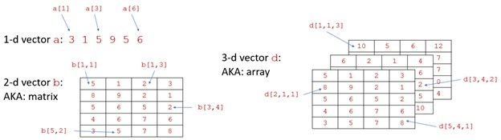
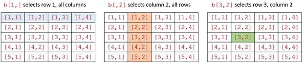
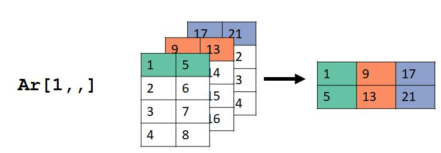
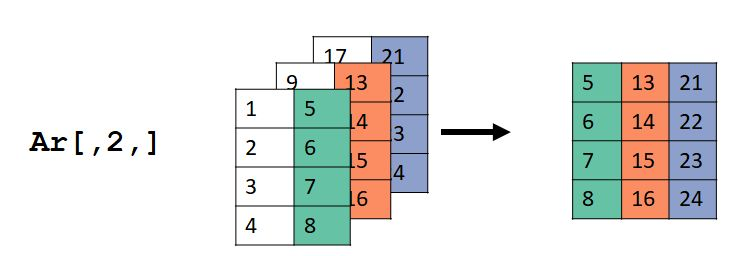
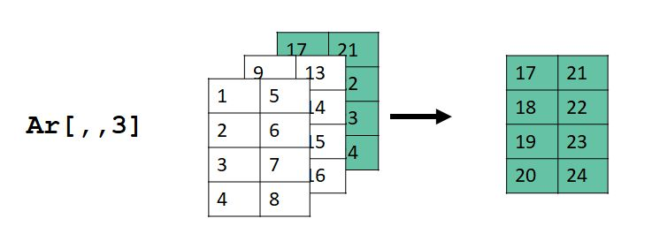
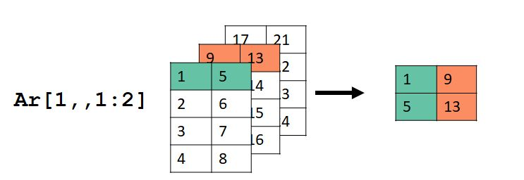
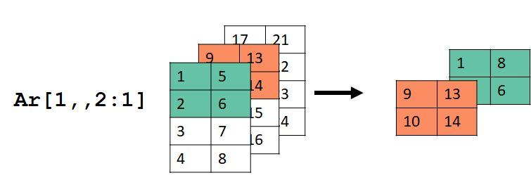
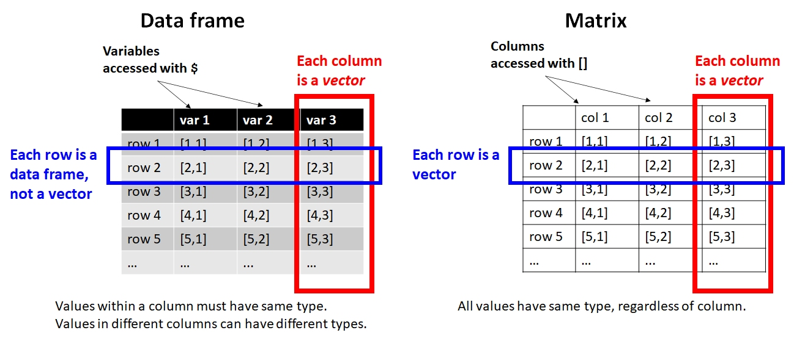
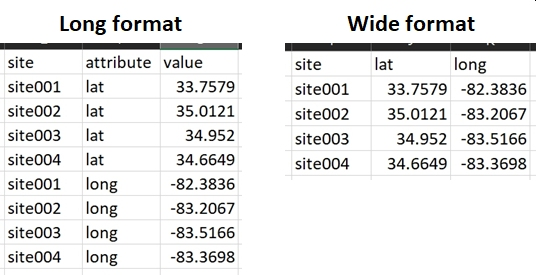

# Data manipulation with R {#sec-05}

In @sec-02 we introduced the basics of the R language and program environment. In this module, we'll go a few steps further and get into the finer details of **data manipulation**: the practice of arranging, sorting, cleaning, and modifying data--and the objects that contain data. Data manipulation is an important R skill because real datasets usually need some fixing before they can be properly analyzed. Data manipulation is also and essential part of R programming for tasks other than data analysis. For example, [simulation modeling](https://doi.org/10.5066/P935Y7NO) or document production (e.g., this website!).

## Making values {#sec-05-make}

The typical analysis workflow in R involves importing data from text files or other sources. Sometimes, however, it is necessary to make values within R. This can be for a variety of reasons:

1. Producing test data sets with desired distributions
1. Making sets of indices or look-up values to use in other functions
1. Modifying existing datasets
1. Running simulations
1. And many more...

This section demonstrates some methods for producing values--i.e., data--within R.

### Make arbitrary values with the c() function {#sec-05-make-c}

In a [previous section](#mod-03-c) we saw how function `c()` combines its arguments as a **vector**. As with all functions, arguments must be separated by commas and can be on different lines. This method can be used to make vectors with any set of values.

```{r}
c(1:3,9:5)
a <- c(1,
	  3,
       5
       )
a
```

Like `scan()`, this is an inefficient way to make vectors but can be useful for small numbers of values. Or, for sets of values that can't be defined algorithmically.

### Generating sequences {#sec-05-make-seq}

#### Consecutive values with the colon : operator {#sec-05-make-seq-col}

Consecutive values can be generated using the colon operator `:`. A command like `X:Y` will generate consecutive values from *X* to *Y* in increments of 1 or -1. If $X<Y$, the increment is 1; if $X>Y$, the increment is -1. The usual use case is to make sets of consecutive integers.

```{r}
# Simple examples:
1:10
5:2
-1:10
10:-1
```

Sometimes you may need to use parentheses to get the intended values because of the order in which R runs operators (aka: "operator precedence").

```{r}
# effect of parentheses (operator precedence):
a <- 2:6
length(a)
1:2*length(a)
1:(2*length(a))
```

*X* and *Y* don't have to literally be numbers; they can be variables or R expressions that evaluate to a number. Below are some examples:

```{r}
a <- 2:6
# length(a) evaluates to a number (5)
length(a):10
```

Most people use `:` to produce sets of integers, but it can also make non-integers. The values will be separated by 1 or -1. The first value will be the value before the `:`. The last value might not be the value after the `:`. It will be the value up to or before the second number along the sequence from the first number. If the value before the `:` is an integer, then the sequence will consist of integers. Note that if you want a sequence that includes non-integers, it might be safer to use `seq()` (see below).

```{r}
2.3:5
5:2.3
2.7:6.1
```

#### Regular sequences with the seq() function {#sec-05-make-seq-seq}

Function `seq()` generates regular sequences of a given length (`length=`), or by an interval (`by=`). The command must be supplied with a length or an interval, but not both. If you specify a length, R will calculate the intervals for you. If you specify an interval, R will calculate the length for you. If you specify a length and an interval, R will return an error.

```{r}
seq(0,20,by=0.5)
seq(-pi,pi,by=0.1)
seq(-1,1,length=20)
```

```{r, eval=FALSE}
# returns an error:
## not run:
seq(1, 20, by=3, length=3)
```

If you want the values to go from greater to smaller, the by argument must be negative.

```{r}
#| eval: false

# not run, but try on your machine:
# returns an error
seq(-1, -10, by=1)
```

```{r}
# works:
seq(-1, -10, by=-1)

# extra steps, but could also work:
rev(seq(-10, -1, by=1))
-1*(seq(1, 10, by=1))
```

#### Repeated values with the rep() function {#sec-05-make-seq-rep}

The function `rep()` creates a sequence of repeated elements. It can be used in several ways.

One way is to specify the number of times its first argument gets repeated. Notice that in the second command `rep(1:3, 5)`, the entire first argument `1 2 3` is repeated 5 times.

```{r}
rep(2, times=5)
rep(1:3, times=5)
```

Another way is to repeat each element of its input a certain number of times each:

```{r}
rep(1:3, each=5)
```

The arguments `times` and `each` can be combined. Notice that `each` takes precedence over `times`.

```{r}
rep(1:3, each=4, times=2)
rep(1:3, each=2, times=4)
```

#### The recycling rule {#sec-05-make-seq-rec}

One quirk of R sequences and vectors is the **recycling rule**. Values in one vector can be "recycled" to match up with values in another vector. This rule is ***only*** invoked if the length of the longer vector is a multiple of the length of the shorter vector. Otherwise you will get an error. Consider the following example:

```{r}
my.df <- data.frame(x=1:12)

# add a value with 3 unique values
my.df$x3 <- 1:3

# add a value with 4 unique values
my.df$x4 <- 1:4

# add a value with 2 random values:
my.df$x2 <- runif(2)

my.df
```

Trying to add a variable to `my.df` with a number of values that is not a factor of 12--like 5, 7, 8, 9, 10, or 11--will usually return an error.

```{r}
#| eval: false

# not run
my.df$x7 <- 1:7
```

### Random values {#sec-05-make-rand}

R can generate many types of **random values**. This makes sense because R was designed for statistical analysis, and randomness is a key feature of statistics. What most people don't realize is that random values in R (or in most programs) are not really random--they are **pseudorandom**. This means that while the values appear random, and can pass many statistical tests for randomness, they are calculated deterministically from the state of your computer. So, if you want your analysis or script to be fully reproducible, you need to set the state so that the same pseudorandom values are always returned. Otherwise, you will get different results every time.

#### The random number seed {#sec-05-make-rand-seed}

The random number seed can be set with function `set.seed()`. Setting the seed defines the initial state of R's pseudo-random number generator.

```{r}
#| collapse: true


# different results each time:
runif(3)
runif(3)
runif(3)

# same results each time:
set.seed(42)
runif(3)

set.seed(42)
runif(3)

set.seed(42)
runif(3)
```

#### Random values from a set with the sample() function {#sec-05-make-rand-samp}

The function `sample()` pulls random values from a set of values. This can be done with or without replacement. If you try to pull too many values from a set without replacement R will return an error. The default argument for `replace=` is `FALSE`.

```{r}
#| collapse: true

set.seed(456)
sample(1:10, 5, replace=FALSE) 
sample(1:10, 5, replace=TRUE)
```

```{r}
#| eval: false

# returns an error
# not run:
sample(1:10, 20)
```

The command above will return an error because it basically asks R to pull 20 cards from a deck of 10, without putting any cards back. The command below, with `replace=TRUE`, puts the cards back in the deck after each draw so that 20 cards can be drawn.

```{r}
#| collapse: true

# this works:
sample(1:10, 20, replace=TRUE)
```

You can use `sample()` with values other than numbers. The function will pull values from the vector in its first argument.

```{r}
#| collapse: true


x1 <- c("heads", "tails")
sample(x1, 10, replace=TRUE)

x2 <- c(2.3, pi, -3)
sample(x2, 10, replace=TRUE)
```

By default, every element in the set has an equal probability of being chosen. You can alter this with the argument `prob`. This argument must have a probability for each element of the set from which value are chosen, and those probabilities must add up to 1.

```{r}
#| collapse: true

# a is an unfair coin where heads
# comes up 75% of the time.
# b is a fair coin.
x <- c("heads", "tails")
probs <- c(0.75, 0.25)
a <- sample(x, 100, replace=TRUE)
b <- sample(x, 100, replace=TRUE, prob=probs)

# compare:
table(a)
table(b)
```

#### Random values from a distribution {#sec-05-make-rand-dist}

One of the strengths of R is its ease of working with probability distributions. We will explore probability distributions more in @sec-09, but for now just understand that a probability distribution is a function that describes how likely different values of a random variable are. In R, random values from a probability distribution can be drawn using a function with a name like `r_()`, where `_` is the (abbreviated) name of the distribution.

The syntax of the functions for working with distributions in R is very consistent. For random values, the first argument is always the sample size (`n`), and the next few arguments are the distributional parameters of the distribution. These arguments can be provided with or without their names. The default order of the arguments is shown on the help page for each function (e.g., `?rnorm`). Below are some examples of random draws from different distributions, displayed as histograms.

```{r}
# sample size
N <- 1000

# draw random distributions
## normal with mean 0 and SD = 1
a1 <- rnorm(N)

## normal with mean 25 and SD = 100
a2 <- rnorm(N, 25, 100)

## uniform in [0, 1]
a3 <- runif(N)

## uniform in [5, 25]
a4 <- runif(N, 5, 25)

## Poisson with lambda = 10
a5 <- rpois(N, 10)

## lognormal with logmu = 1.2 and logsd = 2
a6 <- rlnorm(N, 1.2, 0.9)

# produce histogram of each distribution above
par(mfrow=c(2,3))
hist(a1)
hist(a2)
hist(a3)
hist(a4)
hist(a5)
hist(a6)

# reset graphical parameters
# so the next figure is 1 x 1 panel
par(mfrow=c(1,1))
```

## Selecting data with square brackets {#sec-05-select}

One of the most common data manipulation tasks is selecting, or **extracting**, from your data. The most common way of selecting subsets of an object (aka: extracting) is the R **bracket notation**. This refers to the symbols used, `[]`. These are also sometimes called **square brackets**, to distinguish them from **curly brackets**, `{}`. The latter are more properly called **braces** and have a different purpose in R.

Brackets tell R that you want a part of an object. Which part is determined either by a name, or an **index** inside the brackets. Indices should usually be supplied as numbers, but other types can be used. For objects with more than 1 dimension, you need to supply as many indices, or vectors of indices, as the object has dimensions. Within brackets, vectors of indices are separated by commas.

Brackets can also be used to exclude certain elements by using the negative sign, but this can be tricky. We'll explore how negative indices work below.

### Basics of brackets {#sec-05-select-bas}

The most direct way to work with most R objects is the **bracket notation**. Square brackets `[]` allow you to access parts of objects with a simple syntax to specify position within the object.

{fig.align="center"}

Positions within an object are accessed using bracket notation. For example, `a[3]` denotes the third element of vector a. For vectors with $>1$ dimension, commas are used to separate dimensions. The first dimension is rows, the second dimension is columns, and the third dimension is layers (maybe?). The general term for the dimensions of an object rows, columns, etc., is **margins**. So, the rows are the first margin, the columns are the second margin, and so on.

The values inside the brackets that specify rows or columns or whatever are called **indices**. In R, *indices start at 1* (this is unlike some other languages, like Python). The trickiest part of bracket notation is that you must specify indices for each margin. If you don't, you will either get an error (bad) or something unexpected (worse). Indices can be a single value, a vector of values, or left blank to request all values.

{fig.align="center"}

#### Selecting from a vector {#sec-05-select-bas-vec}

Vectors have 1 dimension, so you must specify a single vector of indices. Notice that the brackets can be empty, in which case all elements can be returned. If the vector supplied is of length 0, then no elements will be returned. When a vector of indices with $>0$ elements is specified, R will return the elements of the vector in the order requested. For example, `a[c(1,3,5)]` and `a[c(3,5,1)]` will return the same values but in different order.

```{r}
#| collapse: true

a <- 11:20
# all elements returned
a[]        

# second element
a[2]

# elements 3, 4, 5, 6, and 7
a[3:7]

# error (not run)
# a[3:7,2]    

# correct version of previous command
a[c(3:7,2)]

# notice different ordering from previous command
a[c(2:7)]   
```

#### Selecting from a matrix {#sec-05-select-bas-mat}

Matrices have 2 dimensions, so you must specify two dimension's worth of indices. If you want all of one dimension (e.g., rows 1 to 3 and all columns), you can leave the spot for the index blank. Separate the dimensions using a comma. Positive indices select elements; negative elements remove elements.

I'll reiterate this because it is a common mistake: you must specify all dimensions using a comma. Failing to do so will result in an error (bad) or unexpected results (worse).

**Remember: in R, indices start at 1. In some languages such as Python indices start at 0. R is not Python.**

```{r}
#| collapse: true


a <- matrix(1:12, nrow=3, byrow=TRUE)
a

# value in row 1, column 2
a[1,2]

# values in rows 1-3 and columns 1-2
a[1:3, 1:2]

# rows 1 and 2, all columns
a[1:2,]

# columns 1 and 2, all rows
a[,1:2]
```

Negative indices remove elements, or return all positive indices.

```{r}
# rows except for row 1
a[-1,]
```

Removing multiple elements with `-` can be a bit tricky. All elements of the vector of things to remove must be negative. In the first example below, R returns an error because you request elements -1, 0, 1, and 2. Element -1 does not exist, and you don't want elements 1 and 2!

```{r}
#| eval: false

# try to request rows except for
# rows 1 and 2
# not run (error):
a[-1:2,]
```

There are several correct ways to get rows other than 1 and 2. Notice that all of them result in indices with a 1-, a -2, and no positive values. The first option is probably the best for most situations.

```{r, collapse=TRUE}
a[-c(1,2),]
a[-1*1:2,]
a[-2:0,] # includes -2, -1, and 0,
         # but 0 doesn't do anything
```

Notice that all three of the commands above return a vector, not a matrix. This is because a single row or column of a matrix simplifies to a vector. If you want to keep your result in matrix format, you can specify this using the argument `drop=FALSE` after the last dimension and a comma:

```{r}
a[-c(1,2),,drop=FALSE]
```

#### Selecting from an array {#sec-05-select-bas-arr}

Selecting from an array is a lot like selecting from a matrix, only with one more dimension. Consider an array with 3 dimensions: rows, columns, and "layers"[^arraylayers].

[^arraylayers]: I don't know if there is an actual name for this, but I like to call them layers.

```{r}
Ar <- array(1:24, dim=c(4,2,3))
Ar
```

Each element in any dimension of the array is a 2-dimensional slice of the array--i.e., a matrix:

```{r, collapse=TRUE}
Ar[1,,]
Ar[,2,]
Ar[,,3]
```

The images below show what happened. For `Ar[1,,]`, the values in the first row (dimension 1), all columns (dimension 2), and all layers (dimension 3) were selected. Dimension 2 in the input `Ar` became dimension 1 in the output, and dimension 3 in `Ar` became dimension 2 in the output.

{fig.align="center"}

For `Ar[,2,]`, the values in the second column (dimension 2), all rows (dimension 1), and all layers (dimension 3) were selected. Dimension 2 in the input `Ar` became dimension 1 in the output, and dimension 3 in `Ar` became dimension 2 in the output.

{fig.align="center"}

For `Ar[,,3]`, the values in the all rows (dimension 1), all columns (dimension 2), and layer 3 (dimension 3) were selected. Dimension 2 in the input `Ar` became dimension 1 in the output, and dimension 3 in `Ar` became dimension 2 in the output.

{fig.align="center"}

Selecting by $\ge$ 1 dimension can be tricky. Consider this example:

```{r, collapse=TRUE}
Ar[1,,1:2]
```

Here we selected the first row (dimension 1), all columns (dimension 2), and layers 1 and 2 (dimension 3).

{fig.align="center"}

And if you want a headache, consider this example:

```{r, collapse=TRUE}
Ar[1:2,,2:1]
```

{fig.align="center"}

I can't think of a reason why you would need to do something like the last example, but it's nice to know that you could.

#### Selecting from a data frame {#sec-05-select-bas-df}

Selecting from a data frame using brackets is largely the same as selecting from a matrix. Just keep in mind that the result might come back as a vector (if you select rows in a single column) or a data frame (any other situation).

{fig.align="center"}

```{r}
#| collapse: true

# make a small data frame from
# the first 5 rows of iris
a <- iris[1:5,]

# returns a vector
a[,1]

# returns a data frame
a[1,]

# returns a data frame
a[1:3,]

# returns a data frame
a[1:3, 1:3]
```

#### Selecting from lists {#sec-05-select-bas-list}

One of the most important kinds of R object is the **list**. A list can be thought of like a series of containers or buckets. Each bucket can contain completely unrelated things, or even other series of buckets. Each bucket is called an **element** of the list. Because of this flexibility, lists are extremely versatile and useful in R programming. Many function outputs are really lists (e.g., the outputs of `lm()` or `t.test()`).

Single elements of a list can be accessed with **double brackets** `[[]]`. Elements can be selected by name or by index. Elements that have a name can be selected by name using the `$` symbol instead of by double brackets.

```{r}
#| collapse: true

# make a list "a"
x <- runif(10)
y <- "zebra"
z <- matrix(1:12, nrow=3)
a <- list(e1=x, e2=y, e3=z)

a[[1]]
a[[2]]
a[["e1"]]
a$e1
```

Multiple elements of a list can be selected using **single brackets**. Doing so will return a new list containing the requested elements, **not** the requested elements themselves. This can be a little confusing. Compare the following two commands and notice that the first returns the 10 random numbers in the first element of `a`, while the second returns a list with 1 element, and that element is the numbers 1 through 10.

```{r}
#| collapse: true

a[[1]]
a[1]
```

Next, observe what happens when we select more than one element of the list `a`. The output is a list.

```{r}
#| collapse: true

a[1:2]
class(a[1:2])
```

The reason for this syntax is that the single brackets notation allows you to extract multiple elements of the list at once to quickly make a new list.

```{r}
a2 <- a[1:2]
a2
```

### Selecting and extracting with logical tests

Selecting data from a data frame is one of the most common data manipulations. R offers several ways to accomplish this. One of the most fundamental is the function `which()`, returns the indices in a vector where a logical condition is `TRUE`. This means that you can select any piece of a dataset that can be identified logically. Consider the example below, which extracts the rows of the `iris` dataset where the variable `Species` matches the character string `"setosa"`.

```{r}
#| eval: false


# not run (long output); try it on your machine!
iris[which(iris$Species == "setosa"),]

# better: define which indices you want,
#         and make selection in separate
#         commands.
flag <- which(iris$Species == "setosa")
iris[flag,]
```

In most situations, `which()` can be omitted because it is implicit in the command. However, not using it can sometimes produce strange results. Because of this, I always use `which()` in my code. Including `which()` can also make your code a little clearer to someone who is not familiar with R. For example, the two commands below are exactly equivalent:

```{r}
#| eval: false


# not run (long output); try it on your machine!
iris[which(iris$Species == "setosa"),]
iris[iris$Species == "setosa",]
```

What `which()` is really doing in the commands above is returning a vector of numbers. That vector is then used by the containing brackets `[]` to determine which pieces of the data frame to pull. The numbers returned by `which()` are the indices at which a logical vector is TRUE. Compare the results of the two commands below, which were used in the commands above to select from `iris`:

```{r}
#| collapse: true


# logical vector:
iris$Species == "setosa"

# which identifies which elements of vector are TRUE:
which(iris$Species == "setosa")
```

Multiple conditions can be used to select data using the `&` (and) and `|` (or) operators.

```{r}
#| eval: false
# not run (long output):
iris[which(iris$Species == "versicolor" & iris$Petal.Length <= 4),]

iris[which(iris$Species == "versicolor" | iris$Petal.Length <= 1.6),]
```

The examples above could also be accomplished in several lines; in fact, splitting the selection criteria up can make for cleaner code. The commands below also show how splitting the selection commands up can help you abide by the "single point of definition" principle.

```{r}
#| eval: false


# not run (long output):
flag1 <- iris$Species == "versicolor"
flag2 <- iris$Petal.Length <= 4

## meet both conditions:
iris[flag1 & flag2,]
iris[intersect(flag1, flag2),]

## meet either condition
iris[flag1 | flag2,]
iris[union(flag1, flag2),]
```

More than 2 conditions can be combined just as easily:

```{r}
flag1 <- iris$Species == "versicolor"
flag2 <- iris$Petal.Length <= 4
flag3 <- iris$Petal.Length > 0.5
iris[flag1 & flag2 & flag3,]
```

Selections can return 0 matches. This usually manifests as a data frame or matrix with 0 rows.

```{r}
flag1 <- iris$Species == "versicolor"
flag2 <- iris$Petal.Length <= 1
iris[flag1 & flag2,]
```

A related function is the binary operator[^ch05-2] `%in%`. For a command like `A &in% B`, R returns a vector of logical values for each element in `A`, indicating whether those values occur in `B`.

[^ch05-2]: A binary operator uses two arguments, one before the symbol and one after. For example, `+` is a binary operator that adds the the argument before the `+` to the argument after the `+`

```{r}
#| collapse: true


A <- c("a", "b", "c", "d", "e")
B <- c("c", "d", "e", "f")
A %in% B
B %in% A
```

While we're here, the set operations `union()`, `intersect()`, and `setdiff()` can be useful for selecting data.

```{r}
#| collapse: true

A <- c("a", "b", "c", "d", "e")
B <- c("c", "d", "e", "f")

# elements in both sets: intersect
# i.e., AND
intersect(A, B)

# elements in either set:
# i.e., OR
union(A, B)

# elements in first set only:
# (asymmetric)
# i.e., XOR (one-sided)
setdiff(A, B)
setdiff(B, A)

# elements in only one set
# (symmetric)
# i.e., XOR (two-sided)
union(setdiff(A, B), setdiff(B, A))
```

One example of how this might be useful is if you want to select observations from a dataset containing one of several values. The example below illustrates this with `iris`:

```{r}
#| eval: false


# not run (long output):
iris[iris$Species %in% c("setosa", "versicolor"),]
```

We'll go over some more complicated selection methods in a future section, but what you've seen so far can be very powerful.

## Dates and temporal data {#sec-05-date}

Most of the data we deal with in R are numbers, but textual and temporal data are important two. Working with dates, times, and character strings can be significantly more complicated than working with numbers...so, I've put together an entire page on it. I am the first to admit that the approaches demonstrated here are a little "old-school" compared to some of the newer packages. In particular, many people prefer the tidyverse package `lubridate` [@grolemund2011] for temporal data. Much of this section is based on @spector2008.

Temporal data can be read and interpreted by R in many formats. The general rule is to use the simplest way that you can, because the date and time classes can be very complicated. For example, don't store date and time if you only need date. This doesn't mean to discard potentially useful data; just to be judicious in what you import to and try to manipulate in R.

It should be noted that the easiest way to deal with dates and times is "don't". In many situations it's actually not necessary to use temporal data classes. For example, if a field study was conducted in two years, and there is no temporal component to the question, it might be sufficient to just call the years `year1` and `year2` in the dataset. Or, if an elapsed time is used as a variable, it might make more sense to store the elapsed time (e.g., 10 minutes, 11.2 minutes, etc.) rather than use full date/time codes for each observation time.

### Dates without times {#sec-05-date-date}

The easiest way to handle dates is to use the base function `as.Date()`. This function converts character strings to the R date format. This implies that you will have a much easier time if you send dates to R in YYYY-MM-DD format. You can do this in Excel by setting a custom number format. Once in R, use `as.Date()` to convert your properly-formatted text strings into date objects. Once converted, R can do simple arithmetic such as finding intervals between dates.

```{r}
#| collapse: true


# enter dates as text strings
a <- c("2021-07-23", "2021-08-01", "2021-09-03")

# convert to date
b <- as.Date(a)

# check classes
class(a)
class(b)

# can do math with dates!
b[2] - b[1]
```

The examples above use the [ISO 8601 date format](https://en.wikipedia.org/wiki/ISO_8601), Year-Month-Day (or YYYY-MM-DD). This format has the advantage that sorting it alphanumerically is the same as sorting it chronologically. Each element has a fixed number of digits to avoid issues like January and October (months 1 and 10) being sorted next to each other.

I suggest that you get in the habit of storing dates this way. This format is the default date format in R (and many other programs), such that R can read dates in this format without additional arguments. If you insist on storing dates in other formats, you can still read those dates into R. You just need to tell `as.Date()` the format that the date is in. The syntax for formatting dates and times is handled by the function `strptime()` (see `?strptime` for more examples). Something common to all of the formats below is that each element has a *fixed number of digits*, 4 for year and 2 for month or day. This is to avoid ambiguity: does "7/2/2019" "July second, 2019", or "February 7, 2019"?. This also avoids issues arising from treating numbers as character strings. For example, January and October (months 1 and 10) might be sorted next to each other unless represented by "01" and "10" instead of "1" and "10".

```{r}
#| collapse: true


# YYYYMMDD
a <- "20210721"
as.Date(a, "%Y%m%d")

# MMDDYYYY
a <- "07212021"
as.Date(a, "%m%d%Y")

# MM/DD/YYYY
a <- "07/21/2021"
as.Date(a, "%m/%d/%Y")

# DD-MM-YYYY
a <- "21-07-2021"
as.Date(a, "%d-%m-%Y")
```

An even simpler option for dates, if all dates are within the same year, is to use Julian dates (i.e., day-of-year). If you want to read Julian dates into R as dates, you can also use `as.Date()`. Notice in the example below that the Julian dates must be supplied as *character strings with 3 digits*, not as numerals. Notice also that R assigns the current year to the dates unless you specifically tell it to do something else.

```{r}
#| collapse: true


a <- as.character(c(204, 213, 246))
as.Date(a, "%j")

## not run:
## causes error because nchar("15") < 3:
#a <- c(15, 204, 213, 246)
#as.Date(a, "%j")

# convert all numbers to 3 digit
# character strings first with formatC():
a <- c(15, 204, 213, 246)
x <- formatC(a, width=3, flag="0")
as.Date(x, "%j")
```

Dates can be reformatted using the function `format()`. Notice that the output is a character string, not a date. The syntax for the conversion comes from `strptime()`, just as with `as.Date()` above. If you need to use a formatted date (character string) as a date (R class) you need to convert it with `as.Date()`.

```{r}
#| collapse: true


# make some dates as character strings and convert to date
a <- c("2021-07-23", "2021-08-01", "2021-09-03")
x <- as.Date(a)

# Julian day (day of year), as character
format(x, "%j")
# as number
as.numeric(format(x, "%j"))

# ISO format
format(x, "%Y-%m-%d")

# use month abbreviations, separate by slashes
format(x, "%b/%d/%y")
```

### Dates with times and time zones {#sec-05-date-time}

[Here be dragons](https://en.wikipedia.org/wiki/Here_be_dragons).

Things get more complicated when time is included with a date, but the basic procedures are the same as date-only data. By default, R assumes that times are in the time zone of the current user. So, if you are collaborating with someone in a different time zone, you need to account for time zone in your code. Another default behavior is that R will assume that times without dates are on the current day.

The main function for working with dates *and* times is `strptime()`. This function takes in a character vector and a format argument, which tells R how the character vector is formatted. It returns objects of class `POSIXlt` and `POSIXt`, which contain date and time information in a standardized way.

```{r}
#| collapse: true


# create some times as character strings
a <- c("01:15:03", "14:28:21")

# time with seconds
strptime(a, format="%H:%M:%S")

# time with seconds dropped
strptime(a, format="%H:%M")    # seconds dropped
```

Notice that the current date was included in the result of `strptime()` (at least, the date when I rendered the document).

Time zones should be specified when working with data that contain dates and times. Remember that R will assume the time is in the current user's time zone. This almost always means the time zone used by the operating system in which R is running. If you did something silly like record data in one time zone and analyze it in another, you have to be careful. For example, I once ran a field study in Indiana where data were recorded in Eastern time. But, the office where I analyzed the data was in Missouri (Central time). R kept converting the time-stamped data to Central time, which interfered with the analysis until I learned how to work with time zones in R. To make things worse, data were recorded in the summer (Eastern daylight time) but analyzed in both early fall (Central daylight time) and late fall (Central standard time).

```{r}
#| collapse: true


# make some date-times and convert to date-time class
a <- c("2021-07-23 13:21", "2021-08-01 09:15")
x <- strptime(a, "%Y-%m-%d %H:%M")
x

# times without dates will be assigned current date:
a2 <- c("13:21", "09:15")
x2 <- strptime(a2, "%H:%M")
x2
```

Time zone names are not always portable across systems. R has a list of built-in time zones that it can handle, and these should work, but be careful and ***always*** validate any code that depends on time zones. The list of time zones R can use can be printed to the console with the command `OlsonNames()`.

```{r}
#| collapse: true


# US Central Daylight Time (5 hours behind UTC)
a <- c("2021-07-23 13:21", "2021-08-01 09:15")

# strptime() will assign whatever time zone you enter:
b <- strptime(a, "%Y-%m-%d %H:%M", tz="US/Eastern")
b

b <- strptime(a, "%Y-%m-%d %H:%M", tz="US/Central")
b
```

Internally, dates and times are stored as the number of seconds elapsed since midnight (00:00 hours) on 1 January 1970, in UTC. You can see these values with `as.numeric()`. The time zone of a value affects what is printed to the console. That time zone is stored by R as an **attribute** of the value. Attributes are a kind of metadata associated with some R data types that can be accessed with `attributes()`.

```{r}
attributes(b)$tzone
```

To change the time zone associated with value, simply set the attribute to the desired time zone. This is basically telling R the time zone that a date and time refer to. Note that will change the actual value of a date/time. It does NOT translate times in one time zone to another.

```{r}
#| collapse: true


as.numeric(b)
attr(b, "tzone") <- "America/Los_Angeles"

# Central and Pacific time different
# by 7200 seconds (2 hours)
as.numeric(b)
```

To convert one time zone to another, the values must first be converted to the `POSIXct` class.

```{r}
#| collapse: true


b <- strptime(a, "%Y-%m-%d %H:%M", tz="US/Central")
b2 <- as.POSIXct(b)

# check time zone
attributes(b2)$tzone

# check actual time (seconds since epoch)
as.numeric(b2)

# change time zone of POSIXct object
attr(b2, "tzone") <- "Europe/London"

# actual time same as before:
as.numeric(b2)
```

### Working with dates and times {#sec-05-date-work}

Why should we go through all of this trouble to format dates and times as dates and times? The answer is that R can perform many useful calculations with dates and times. One of these is time intervals by using subtraction or the function `difftime()`. Subtracting two date/times will return an answer but perhaps not in the units you want; use `difftime()` if you want to specify the units.

```{r}
#| collapse: true


# how many days, hours, and minutes until Dr. Green can retire?

## current time:
a <- Sys.time()

## retirement date per USG:
b <- "2048-07-01 00:00"

## convert to POSIXlt
x <- strptime(a, "%Y-%m-%d %H:%M")
y <- strptime(b, "%Y-%m-%d %H:%M")

## calculate time in different units:
difftime(y,x, units="days")
difftime(y,x, units="hours")
difftime(y,x, units="mins")
y-x
```

Another application: what is the time difference between Chicago and Honolulu?

```{r}
a <- c("2025-08-08 14:17")
x <- strptime(a, "%Y-%m-%d %H:%M", tz="US/Central")
y <- strptime(a, "%Y-%m-%d %H:%M", tz="US/Hawaii")
difftime(x,y)
```

Oddly, `difftime()` cannot return years. This is probably because there are [different types of years](https://en.wikipedia.org/wiki/Year) (sidereal, tropical, anomalistic, lunar, etc.). You can convert a time difference in days to one in years by dividing by the number of days in the kind of year you want. The example below converts to does this and changes the "units" attribute of the difftime output to match.

```{r}
#| collapse: true


d <- difftime(y,x, units="days")

# julian year
d <- d/365.25
attr(d, "units") <- "years"
d
```

The Julian year is useful because it is defined in terms of SI units as 31557600 seconds, or 365.25 days[^ch05-3]. Most of the alternative years at the link above vary by less than a few minutes.

[^ch05-3]: This is slightly longer than a *Rent* year, which is 525600 minutes (31536000 seconds).

R can also generate regular sequences of dates and times just like it can numeric values. See `?seq.date` for details and syntax.

```{r}
#| collapse: true


a <- as.Date("2025-08-08")
seq(a, by="day", length=10)
seq(a, by="days", length=6)
seq(a, by="week", length=10)
seq(a, by="6 weeks", length=10)
seq(a, by="-4 weeks", length=5)
```

## Character data {#sec-05-char}

Recall from earlier that "character" is just another **type** of data in R--the type that contains text. This means that text values can be stored and manipulated in many of the same ways as numeric data. The vectorized functions in R can make managing your text-based data very fast and efficient.

A value containing text, or stored as text, is called a **character string**. Character strings can be stored in many R objects. A set of character strings is called a **character vector**.

### Combining character strings {#sec-05-char-comb}

Character strings can be combined together into larger character strings using the function `paste()`. Notice that this is not the same as making a vector containing several character strings. That operation is done with `c()`.

```{r}
#| collapse: true


x <- paste("a", "b", "c")
y <- c("a", "b", "c")
x
y
length(x)
length(y)
```

The function `paste()`, and its cousin `paste0()`, combine their arguments together and output a character string. The inputs do not have to be character strings, but the outputs will be. The difference between `paste()` and `paste0()` is that `paste0()` does not put any characters between its inputs, while `paste()` can place any valid character between its inputs. The default separator is a space.

```{r}
#| collapse: true


paste0("a", "zebra", 3)
paste("a", "zebra", 3)
paste("a", "zebra", 3, sep="_")
paste("a", "zebra", 3, sep=".")
paste("a", "zebra", 3, sep="/")
paste("a", "zebra", 3, sep="giraffe")
```

One of my favorite uses for the paste functions is to automatically generate folder names and output file names. The example below adds the current date (`Sys.Date()`) into a file name.

```{r}
#| eval: false

# not run
top.dir <- "C:/_data"
out.dir <- paste(top.dir, "test", sep="/")
out.name <- paste0("output_", Sys.Date(), ".csv")
write.csv(iris, paste(geo.dir, out.name, sep="/"))

# even better:
top.dir <- "C:/_data"
out.dir <- paste(top.dir, "test", sep="/")
out.name <- paste0("output_", Sys.Date(), ".csv")
out.path <- paste(geo.dir, out.name, sep="/")
write.csv(iris, out.path)
```

When the inputs to a `paste()` function are contained in a single vector, then the desired separator must be supplied using the argument `collapse` instead of `sep`.

```{r}
#| collapse: true


a <- c("a", "b", "c")
paste(a, collapse="-")
paste(a)
```

### Printing character strings {#sec-05-char-print}

The `cat()` function can not only put strings together, but also print them to the R console. This is useful if you want to generate messages from inside functions or loops. When `cat()` receives inputs that are not character strings, it evaluates them and converts them to character strings. The examples below show how inputs can be evaluated and printed. It also illustrates the use of `\n` and `\t` to insert new lines and tabs, respectively. Finally, the command `flush.console()` ensures that the console is updated with the most recent outputs.

```{r}
#| collapse: true


# using cat() in a function:
my.fun <- function(x){
	cat("You entered", x, "!", "\n")
	cat("\t", "1 more is", x+1, "\n")
}
my.fun(7)
my.fun(42)

# using cat() in a loop:
for(i in 1:5){
	cat("starting iteration", i, "\n")
	for(j in 1:3){
		cat("\t", "iteration", i, "part", j, "complete!", "\n")
		flush.console()
	}
	cat("iteration", i, "complete!", "\n")
}
```

The other printing function, `sink()`, is specifically for printing outputs into text files. Refer back to the @sec-04-export-sink for an example.

### Matching character strings {#sec-05-char-match}

Like numeric data, character strings can be matched exactly with the comparison operator `==`.

```{r}
#| collapse: true

# make a charcter vector
x <- c("zebra", "hippo")

# element-wise test
x == "zebra"

# get indices where TRUE or FALSE
which(x == "zebra")
which(x != "zebra")

# test all at once
any(x == "zebra")
all(x == "zebra")
```

Notice that this kind of matching is case-sensitive. If you need to match regardless of case, you can either force all of the comparands to be the same case, or use regular expressions (see @sec-05-char-grep).

```{r}
#| collapse: true


x <- c("zebra", "hippo")
any(x == "Zebra")
any(x == tolower("zebra"))
```

R is smart enough to sort text alphabetically, and to make comparisons based on alphabetical sorting.

```{r}
#| collapse: true


x <- c("zebra", "hippo", "lion")
sort(x)
"zebra" > "hippo"
"lion" > "zebra"
which(x > "jaguar")
```

### Searching text with the grep() and grepl() functions {#sec-05-char-grep}

**Regular expressions**, or **regex**, are a [syntax for searching text strings](https://en.wikipedia.org/wiki/Regular_expression). Learning how to use regular expressions is easily a semester-long course on its own. Here we'll just explore a few common use cases. The R functions that deal with regular expressions are `grep()` and its cousins. The most commonly used versions are `grep()` and `grepl()`.

- `grep()` returns the indices in the input vector that match the pattern. The length of the output will be the number of matches.
- `grepl()` returns a logical value (`TRUE` or `FALSE`) telling whether each element in the input vector matches the pattern. The length of the output will be same as the length of the input.

This means that `grepl()` is analogous to using `==` to test for equality, while `grep()` is analogous to using `which()`. Compare the results of the two commands on the simple vector `x` below. It's not hard to imagine how powerful these functions can be.

```{r}
#| collapse: true


x <- c("zebra", "hippo", "lion", "tiger")
grep("e", x)
grepl("e", x)
```

Some of the arguments to `grep()` can save you some time. Setting `value=TRUE` will return the values where the input matches the pattern.

```{r}
#| collapse: true

grep("e", x, value=TRUE)

# equivalent to:
x[grep("e", x)]
```

Setting `invert=TRUE` will find elements of the input that do NOT match the pattern.

```{r}
#| collapse: true

grep("e", x)
grep("e", x, invert=TRUE)
```

By default, `grep()` is case-sensitive. This can be overridden with the option `ignore.case`.

```{r}
#| collapse: true

x <- c("zebra", "hippo", "lion", "tiger", "Tiger")
grep("tiger", x)
grep("Tiger", x)
grep("tiger", x, ignore.case=TRUE)
grep("TIGER", x, ignore.case=TRUE)
```

We will see some uses of `grep()` and its cousins in the examples later.

### Replacing parts of character strings {#sec-05-char-replace}

Text within character strings can be replaced or modified in several ways. If you are comfortable with regular expressions (see previous section) then you can use function `gsub()`. The syntax for `gsub()` is similar to that of `grep()`, with an additional input for the replacement string.

Note that `gsub()` will replace every occurrence of the pattern, whether or not an occurrence is a whole word or not. The related function `sub()` works like `gsub()`, but only replaces the first occurrence of the pattern.

```{r}
#| collapse: true

x <- c("zebra", "hippo", "lion", "tiger", "Tiger")
gsub("tiger", "giraffe", x)
gsub("tiger", "giraffe", x, ignore.case=TRUE)
gsub("z", "Z", x)
sub("tiger", "giraffe", x, ignore.case=TRUE)
```

### Extracting from and splitting strings {#sec-05-char-split}

Character strings can be split up using the function `strsplit()` (short for "string split"). This function can use regular expressions like `grep()` or `gsub()` can. It works by breaking a character string apart at a given text string. Unfortunately, its output can be a little confusing if you're not used to working with R objects:

```{r}
x <- c("Peromyscus_leucopus",
       "Sigmodon_hispidus",
       "Microtus_pennsylvanicus")
strsplit(x, "_")
```

Function `strsplit()` returns a list with one element for each element in the input vector. Each element of that list is a character vector, consisting of the pieces of that element of the input vector split by the splitting string. So, if you want only one part of each element of the input vector, you need to extract them from the output list. In this example, we can get the generic epithets by pulling the first element of each list element. The function `sapply()` applies a function to each element of a list and returns a result with the simplest possible structure (`sapply` is short for "apply and simplify"). The two commands below are equivalent, but the first is much simpler and should be the method you use.

```{r}
#| collapse: true

sapply(strsplit(x, "_"), "[", 1)

# equivalent, not as easy:
do.call(c, lapply(strsplit(x, "_"), "[", 1))
```

The "`sapply`-`strsplit`" method is useful for breaking apart strings whose parts carry information. One common use case is breaking up dates into year, month, and day. Note that there are more elegant ways to do this using the R date classes, but treating dates as text strings can be convenient because the date and time classes are such a pain in the neck. When using this method, you will need to keep track of when date components are stored as text and when they are stored as numbers.

The code block below shows how to break apart dates using `strsplit()` and `sapply()`.

```{r}
#| collapse: true

x <- c("2019-08-03", "2020-08-15", "2021-08-07")
ssx <- strsplit(x, "-")
a <- data.frame(year=sapply(ssx, "[", 1),
                mon=sapply(ssx, "[", 2),
                day=sapply(ssx, "[", 3))

class(a$year) # character, not a number!
class(a$mon) # character, not a number!
class(a$day) # character, not a number!

a$year <- as.numeric(a$year)
a$mon <- as.numeric(a$mon)
a$day <- as.numeric(a$day)

class(a$year) # numbers!
class(a$mon)  # numbers!
class(a$day)  # numbers!
```

### Matching text strings as indices {#sec-04-char-inds}

As biologists we often keep our data in several separate spreadsheets or tables. These tables are interrelated by a set of "key" variables. If that sounds like a sketchy, haphazard way to build a database, that's because it is. Databases are outside the scope of this course, but we will learn how to relate tables using R. If you've ever used the VLOOKUP function in Excel, then you know exactly what problem `match()` is designed to solve.

The function `match()` finds the indices of the matches of its first argument in its second. In other words, it searches for the values in one vector in a second vector, then returns the positions of the matches from the second vector. A simple example is below:

```{r}
#| collapse: true


vec1 <- c("gene1", "gene2", "gene3", "gene4")
vec2 <- c("gene1", "gene2", "gene1", "gene2", 
          "gene5", "gene3", "gene3", "gene4")
vec3 <- c("gene1", "gene2", "gene1", "gene2", 
          "gene4", "gene3", "gene3", "gene4")

match(vec1, vec2)
match(vec2, vec1)
match(vec3, vec1)
```

The first example shows what `match()` is doing. For element in the first vector, `match()` returns the first position where that value occurs in the second vector. The second example shows what happens when trying to match a value that is not in the second vector: R returns `NA`. The third example shows how `match()` can be used to relate tables. The longer vector `vec3` is matched to the shorter vector `vec1`, which contains each unique value only once. If `vec1` was a variable in a data frame that contained other variables associated with genes, then the result of `match(vec3, vec1)` would return the rows in `vec1`'s data frame associated with each row of `vec3`'s data frame.

The code below demonstrates how `match()` might be used in practice. This example uses `iris` and an imaginary second table. The commands use `match()` to assign a second variable, petal color, to iris using species as the key variable. We'll revisit this example dataset again in @sec-05-df-oth-merg when we learn how to merge data frames.

```{r, eval=FALSE}
# not run (see next section)

options(stringsAsFactors=FALSE)
name1 <- "dat_samples_2021-08-04.csv"
name2 <- "dat_stream_indices_2021-08-04.csv"
name3 <- "loc_meta_vaa_2020-11-18.csv"

x1 <- read.csv(name1, header=TRUE)
x2 <- read.csv(name2, header=TRUE)
x3 <- read.csv(name3, header=TRUE)

# x2 contains the response variable
dat <- x2
# add site name, year, and date from x1
matchx <- match(dat$uocc, x1$uocc)
dat$site <- x1$loc[matchx]
dat$year <- x1$year[matchx]
dat$doy  <- x1$doy[matchx]

# equivalent to:
#dat$site <- x1$loc[match(dat$uocc, x1$uocc)]
#dat$year <- x1$year[match(dat$uocc, x1$uocc)]
#dat$doy  <- x1$doy[match(dat$uocc, x1$uocc)]

# grab latitude and longitude from x3
matchx <- match(dat$site, x3$loc)
dat$lat <- x3$lat[matchx]
dat$long <- x3$long[matchx]
```

### Standardizing numbers as text {#sec-05-char-stan}

The function `formatC()` formats numbers in a manner similar to the language C[^ch05-4]. This is useful for naming objects or parts of objects with numeric names that have a fixed width or format. The most common use case is converting numbers like "1, 12, 112" to strings like "001, 012, 112". The example below uses `formatC()` in combination with `paste()` to generate some file names.

[^ch05-4]: Or so the documentation claims. I've never learned C.

```{r}
file.nums <- formatC(1:4, width=3, flag="0")
file.names <- paste("file", file.nums, sep="_")
file.names
```

This is useful for generating text strings that need to be sorted. In the example above, the files "file_001.txt", "file_002.txt", "file_003.txt", and "file_004.txt" would be in the order you expect, and a file like "file_010.txt" would come *after* "file009.txt". If the leading zeros had not been added, then the order would be "file_1.txt", "file_10.txt", "file_2.txt", "file_3.txt", etc. (notice that 10 was between 1 and 2).

## Data frame management {#sec-05-df}

Most of the time when you work with data in R, those data will be stored in **data frames**. A data frame looks like a matrix, but functions in many ways spreadsheet. Internally, a data frame is really a list, but for most day-to-day use you can think of a data frame as a table with *rows* and *columns*.

***Being able to manage data frames is an important part of working with R.***

This section demonstrates some of the most common data frame operations.

### Data frame structure {#sec-05-df-str}

Data frames and matrices look very similar, but their internal structures are very different. This has huge implications for how you work with and manipulate data frames and matrices. The figure below shows some of the most important differences.


When using [bracket notation](@sec-05-select-bas), accessing parts of a data frame is the same as for a matrix. There are a couple of differences though:

-   Matrices do not need column names, but data frames do. They are accessed with `colnames()` for matrices, but `names()` for data frames.

-   Columns of a data frame can be called with `$`; e.g., `iris$Petal.Length`. The equivalent for a matrix would be `iris[,"Petal.Length"]`. The `$` works for data frames only, while the brackets method works for both data frames and matrices.

Here are some common methods of accessing values in a data frame:

```{r}
#| collapse: true


# single variables (columns): $
iris$Petal.Length

# multiple variables: brackets []
## head() shows only first few rows (output very long)
a <- iris[,c("Petal.Length", "Sepal.Length")]
head(a)

# rows: brackets []
# remember the comma!
iris[1:4,]
iris[1,]
```

When a data frame is printed to the console, this is only a representation of the data frame's true form: a **list**. This is why single columns are accessible by a `$`: this is the symbol for accessing an element of a list. The list nature of a data frame is also why **rows** of a dataset are actually data frames themselves and not vectors.

### Common operations {#sec-05-df-com}

#### Adding and deleting variables {#sec-05-df-com-vars}

New variables can be added to a data frame by **assignment** (`<-`). Assigning values to a variable in a data frame will create that variable if it doesn't already exist--and overwrite values if the variable is already in the data frame.

```{r}
#| collapse: true

# spare copy with just a 
# few rows for demonstration
x <- iris[1:5,] 

# make a new column with <-
x$Petal.Area <- apply(x[,3:4], 1, prod)

# shows data frame with new variable:
x

# overwrite the new variable
x$Petal.Area <- 3
x
```

Variables can also be added using function `cbind()`. This name is short for "column bind"\~\[`cbind()` works on matrices too.\]. To use `cbind()`, the input data frames must have the same number of rows. Note that `cbind()` sticks the data frames together as they are. If the records in the inputs need to be matched up and are not already in the same order, then either the data frames need to be aligned, merged with function `merge()`, or the variables need to be added using `match()` and a key variable.

```{r}
#| collapse: true

# make 2 data frames where rows line up
x <- iris[1:5, 1:2]
y <- iris[1:5, 3:5]
cbind(x,y)

# shows that cbind() uses inputs as-is
# and makes no attempt at matching.
cbind(x, y[5:1,])
```

Variables can be deleted by setting them to `NULL` (notice all caps) or by making a new version of the data frame without the variable. If I am only removing a few variables, I prefer setting them individually to NULL. This makes it less likely that I will accidentally remove the wrong columns.

```{r}
#| collapse: true

# delete this variable
z <- x
z$Petal.Area <- NULL
z

# delete 1 variable with brackets
z <- x
z <- z[,which(names(z) != "Petal.Area")]
z

# delete >1 variable
z <- x
del.cols <- c("Petal.Area", "Petal.Length")
z <- z[,which(!names(z) %in% del.cols)]
z
```

#### Modifying variables {#sec-05-df-com-mod}

Variables in a data frame (or anywhere) can be modified by assigning them new values. Note that this overwrites the previous values. If you think you might want the old values for some reason, save the modified values in a new variable or even new object instead.

```{r}
#| eval: false

# not run

# spare copy with just a 
# few rows for demonstration
x <- iris[1:5,] 
x$Petal.Length <- log(x$Petal.Length)

# better: keep modified values in new variable

# spare copy with just a 
# few rows for demonstration
x <- iris[1:5,] 
x$log.petlen <- log(x$Petal.Length)
```

#### Changing values using a rule {#sec-05-df-com-rule}

By combining the logical tests, bracket notation, and assignment, values in a variable can be replaced according to their values.

```{r}
#| eval: false

# not run (long output), but try it on your machine!
x <- iris

# select and replace by one condition:
flag <- which(x$Sepal.Length >= 6)
x$Sepal.Length[flag] <- 5.99
x

# select and replace by 2 conditions:
flag1 <- which(x$Petal.Length >= 3)
flag2 <- which(x$Petal.Length <= 5)
x$Petal.Length[intersect(flag1, flag2)] <- 4
x

# equivalent to above, but with &
flag1 <- which(x$Petal.Length >= 3)
flag2 <- which(x$Petal.Length <= 5)
x$Petal.Length[flag1 & flag2] <- 4
x
```

#### Renaming variables {#sec-05-df-com-renam}

Renaming variables in Excel is easy: just enter the new name into the cell at the top of a column. Things are a little more complicated in R but not much.

There are a few ways to rename columns, and they all involve accessing the variable names using function `names()`.

```{r}
#| collapse: true


# spare copy with just a 
# few rows for demonstration
x <- iris[1:5,] 

# rname by column number:
names(x)[1] <- "sep.len"
x

# match name exactly:
names(x)[which(names(x) == "Petal.Length")] <- "pet.len"
x

# equivalent, but separate search and action
flag <- which(names(x) == "Petal.Width")
names(x)[flag] <- "pet.wid"
x

# by position:
names(x)[ncol(x)] <- "species"
x

names(x)[1] <- "sepal.len"
x

# change several names at once:
names(x)[1:4] <- paste0("x", 1:4)
x
```

Finally, if you have a a lot of time on your hands, you can make a new copy of the variable with the name you want, then delete the original version. This has the disadvantage of changing the order of columns.

```{r}
x <- iris[1:5,] # spare copy for demonstration
x$pet.len <- x$Petal.Length
x$Petal.Length <- NULL
x
```

#### Rearranging columns {#sec-05-df-com-rearr}

Reordering records or columns within a data frame is accomplished by creating a new version of the dataset with the desired arrangement. This rearrangement is accomplished using methods we have already seen.

```{r}
#| collapse: true


# spare copy with just a 
# few rows for demonstration
x <- iris[1:5,] 

# rearrange by number
x <- x[,c(5, 3, 4, 1, 2)]
x

# rearrange by name
col.order <- c("Species", "Sepal.Length", "Sepal.Width", 
               "Petal.Length", "Petal.Width")
x <- x[,col.order]
x
```

#### Sorting and ordering data {#sec-05-df-com-sort}

Sorting data frames is mostly done using the function `order()` (function `sort()` works on vectors, not data frames). Function `order()` is usually put inside brackets in the rows slot. The arguments to `order()` define the variables by which the data frame will be sorted. Rows are sorted by the first variable, then the second, and so on. By default, rows are placed in *ascending* order.

Use `sort()` on vectors:

```{r}
#| collapse: true

# values 1:12 in random order
set.seed(123)
w <- sample(1:12, 12, replace=FALSE)
w

# sort ascending
w.inc <- sort(w)
w.inc

# sort descending:
w.dec1 <- sort(w, decreasing=TRUE)
## or:
w.dec2 <- rev(sort(w))
w.dec1
w.dec2
```

One of my favorite uses of `sort()` is to get the unique values of a vector in ascending (especially alphabetical) order.

```{r}
#| collapse: true

# get 100 random letters from a:e
a <- sample(letters[1:5], 30, replace=TRUE)
a

# get the unique values, in alpha order
a.uniq <- sort(unique(a))
a.uniq
```

Using `order()` on a data fame is similar to running 1 or more `sort()` commands, but where `sort()` returns the sorted vector, `order()` actually returns the indices of the sorted object.

```{r}
#| collapse: false

# 6 random rows of iris:
set.seed(124)
z <- iris[sample(1:nrow(iris), 6),]
z

# order z by increasing Petal.Length

## returns indices
order(z$Petal.Length)

## uses those indices in []
## to produce sorted data frame
z[order(z$Petal.Length),]


## order by species (alphabetical ascending), 
##  then by petal length (ascending)
z[order(z$Species, z$Petal.Length),]
```

You can multiple variables to `order()`, by name, and R will order the rows in each variable in the order supplied. By default, records are sorted in ascending order. If you want a mix of ascending and descending order, you have to specify the `radix` method and specify whether you want the order to be decreasing (TRUE) or not (FALSE) for each variable:

```{r, eval=FALSE}

# sort alpha by species, then
# by decreasing petal length
z[order(z$Species, z$Petal.Length, 
           decreasing=c(TRUE, FALSE),
           method="radix"),]
```

#### Adding and removing rows {#sec-05-df-com-add}

Removing rows works a lot like removing columns. You can use the bracket notation to either remove the rows with negative indices, or make a new version of the data frame with only some of the rows.

```{r}
#| collapse: true

# spare copy with just a 
# few rows for demonstration
x <- iris[1:10,] 

# remove rows by their number
x[-1,]
x[-c(1:3),]
x[-c(1, 3, 5, 7, 9),]

# or, make a new copy with the 
# rows to keep
x[2:10,]
x[c(2, 4, 6, 8, 10),]
```

Adding rows can be done with `rbind()` (short for "row bind"). This function is analogous to `cbind()`, which joins objects by their columns.

Adding rows to a data frame is tantamount to combining it with another data frame. The data frames being combined *must have the same columns*, with the *same names*, but the *order of columns can be different*.

```{r}
#| collapse: true


x <- iris[1:5,]
y <- iris[51:55,]

# columns match exactly:
rbind(x, y)

# columns in different order
# is still ok, but rbinding
# without making column orders
# match makes me nervous.
y2 <- y[,c(3,5,2,1,4)]
rbind(x,y2)

# result inherits order of columns from first argument:
rbind(y2,x)
```

### Other operations {#sec-05-df-oth}

#### Merging data frames {#sec-05-df-oth-merg}

Data sets for a complex project might reside in several tables, related by **key variables**. These are variables that are shared by more than one table, and define which records in each table are related to records in another table. This is exactly what **relational databases** do, but most biologists have small enough datasets that proper databases aren't really necessary.

Data frames can be combined by manually matching records between tables, using the function `match()`. The example below uses three interrelated tables from a stream dataset I work with. You need the datasets [neon_grids_2025-08-03.csv](../datasets/neon_grids_2025-08-03.csv), [neon_measures_2025-08-03.csv](../datasets/neon_measures_2025-08-03.csv), and [neon_measures_2025-08-03.csv](../datasets/neon_measures_2025-08-03.csv). Download them, put them in a folder, and make that folder your R working directory.

```{r}
#| include: false

old_root <- knitr::opts_knit$get("root.dir")
knitr::opts_knit$set(root.dir = "../datasets")
```

```{r}

# data file names
name1 <- "neon_grids_2025-08-03.csv"
name2 <- "neon_measures_2025-08-03.csv"
name3 <- "neon_taxa_2025-08-03.csv"

# import
grd <- read.csv(name1, header=TRUE)
mes <- read.csv(name2, header=TRUE)
tax <- read.csv(name3, header=TRUE)

# spare copies for later, so we can 
# revert without having to reimport
grd.orig <- grd
mes.orig <- mes
tax.orig <- tax
```

Notice that the tables have only "key" variables in common. If you have $>2$ tables, each table doesn't necessarily have to share a variables with *every* other table. Each table only needs to share a variable with at least one other table.

```{r}
#| collapse: true
intersect(names(grd), names(mes))
intersect(names(grd), names(tax))
intersect(names(mes), names(tax))
```

Data frames `grd` (trapping grid characteristics) and `mes` (animal measurements) share variable "grid". Each animal in `mes` was captured on one trapping grid (`mes$grid`), and the characteristics (location, region, etc.) are stored in `grd`.

Data frames `mes` and `tax` are related by variable `abb`. Each animal measured in `mes` is identified by a four-letter abbreviation of its scientific name (`mes$abb`), usually the first 2 letters of its generic eptithet and the first 2 letters of its specific epithet[^ch05-5]. Characteristics of that species are held in data frame `tax`.

[^ch05-5]: (except where abbreviating this way would have created duplicate abbreviations).

So, if you wanted to tally up the mean body mass (`mes$mass`) for each species in each habitat in which it occurs, you would have to somehow get the habitat of each grid (`grd$nlcd`) from `grd` into `mes`. You could build the necessary data frame by merging `grd` and `mes`, using their common variable `grid` to make sure that data from one data frame are associated with the correct rows of the other.

A trickier problem would be tallying up how many animals in each taxonomic family (`tax$family`) were measured in each habitat (`grd$nlcd`)--because `tax` and `grd` have no variables in common! You would need to daisy chain the data frames together: first, join `grd` to `mes` by "grid", then join the result to `tax` by `abb`.

There are two methods to accomplish these joins in base R: `match()` and `merge()`. I use a mix of both in my workflows:

-   `match()` can be more efficient when only a single or a few columns are needed from each data frame.

-   `merge()` can be more useful when all variables are needed.

Here is an example of using `merge()`:

```{r}
#| collapse: true


# add habitat from grid table grd
# to measurement table mes
# by matching grid names
matchx <- match(mes$grid, grd$grid)
mes$nlcd <- grd$nlcd[matchx]
head(mes)

# mes now has habitat (nlcd), which
# will allow us to relate habitat to 
# taxonomic family from table tax
matchz <- match(mes$abb, tax$abb)
mes$family <- tax$family[matchz]
head(mes)

```

Matching many variables by hand can become very tedious and error-prone. An alternative, and usually faster way is the function `merge()`. This is a shortcut for the matching that we did manually above. The downside of using `merge()` is that it can be a little obtuse.

-   `merge()` will attempt to match records exactly, which may or may not return the results you expect.

-   Using `merge()` can also sometimes result in many duplicate columns or extra rows in the result.

Always inspect the results of `merge()` to make sure it is doing what you expect (i.e., that you wrote the code correctly to get what you wanted!).

The commands below duplicate the merging done piecemeal above.

```{r}
#| collapse: true

# get the original versions
# of each data frame that we
# set aside earlier
grd <- grd.orig
mes <- mes.orig
tax <- tax.orig

# merge by the variables in common:
res <- merge(mes, grd)
res <- merge(res, tax)
head(res)

# what if you only want some variables to be merged?
## specify which columns you want!
use.cols.grd <- c("grid", "nlcd")
use.cols.mes <- c("grid", "abb", "mass")
use.cols.tax <- c("abb", "genus")

res2 <- merge(mes[, use.cols.mes],
              grd[, use.cols.grd])
res2 <- merge(res2, tax[,use.cols.tax])
head(res2)
```

Some of the tidyverse packages offer alternative solutions for merging datasets that can be more or less elegant than `merge()`. However, the methods shown above use only base R functions and will get the job done.

#### Reshaping data frames {#sec-05-df-oth-shap}

In your career you are likely to encounter datasets organized in a variety of formats. Most of these formats fall into one of two categories: **wide** and **long**.



In a **long-format dataset**, every *value* is stored in a separate *row*. The variable (aka: feature or attribute) that each value represents is kept in a separate *column*. Many public or online data sources serve datasets in long format. This is usually because the data are pulled from a database, and it left to the user to reshape the data to fit their needs. Storing data in this manner can sometimes be more efficient from a computational standpoint, but it is usually not convenient for analysis. The reason that long format is inconvenient for analysis is because all of the information about individual samples (i.e, observations) are on different rows of the dataset.

In a **wide-format dataset**, each row contains **all values** associated with a particular **sample**. This means that each variable gets its own column, and each cell contains a single value. This format is sometimes called **tidy** format by the authors of the `tidyverse` set of R packages [@wickham2014], but researchers were formatting data this way long before the tidyverse packages or R were developed [@broman2018]. As a rule, you should store and manage your data in wide/tidy format. This format makes it easy to take advantage of R's vectorized nature. This is also the format expected by most functions that work with data frames.

Base R has some functions for reshaping data, but most sources recommend using the `reshape2` package or the `tidyverse`. The examples below demonstrate reshaping a dataset from a typical long format to a more useful wide format. You will need the file [reshape_example_2025-08-12.csv](https://greenquanteco.github.io/reshape_example_2025-08-12.csv) in your R home directory and package `reshape2`.

```{r}
#| collapse: true

library(reshape2)
in.name <- "reshape_example_2025-08-12.csv"
x <- read.csv(in.name)
head(x)
class(x$value)
```

Notice that the `value` column contains a mix of numeric and text values--so the numbers are stored as text. If we wanted to do something with those values, they need to be pulled out of the vector `value` and converted to numeric values. Because a vector can have only one type of value, the attributes will need to end up in their own columns. The fastest way to do this is to use the function `dcast()` from package `reshape2`.

```{r}
dx <- dcast(x, grid~attribute)
dx$lat <- as.numeric(dx$lat)
dx$lon <- as.numeric(dx$lon)
dx
```

If we needed to go the other way, from wide to long format, we use function `melt()`. This is essentially the reverse of `dcast()`.

```{r}
#| collapse: true


mx <- melt(dx, 
           id.vars="grid", 
           measure.vars=c("lat", "lon", "nlcd"))

# default:
head(mx)

# sort by grid, then variable:
head(mx[order(mx$grid, mx$variable),])
```

The `tidyverse` equivalents for `melt()` and `dcast()` are `pivot_longer()` and `pivot_wider()`, respectively. The syntax of these `tidyverse` functions are similar to the `reshape2` functions. Note that the `tidyverse` functions will output a **tibble**, which is a form of data frame peculiar to the `tidyverse`. Some non-`tidyverse` functions can use tibbles, and some cannot. Tibbles can be converted to base R data frames with function `data.frame()`.

```{r}
#| collapse: true


library(tidyr)

# long to wide:
# eqv. to reshape2::dcast
tdx <- pivot_wider(x, 
                   names_from="attribute",
                   values_from="value")
head(tdx)

# wide to long:
# eqv. to reshape2::melt
tmx <- pivot_longer(tdx,
               cols=c("lat", "lon", "nlcd"),
               names_to="variable")
head(tmx)

# if needed:
tdx.df <- data.frame(tdx)
```

```{r}
#| include: false

knitr::opts_knit$set(root.dir = old_root)
```