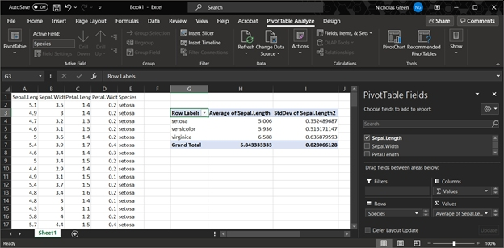

# Summarizing biological data {#sec-summ}

In the last module we saw how single variables can be described or summarized using descriptive statistics (see @sec-desc). In this chapter we will extend that to summarizing values by groups. Indeed, comparing the mean values in different groups is one of the most important types of tests we do in biology (see @sec-groups).

## Summarizing a data frame {#sec-summ-df}

You can get a quick numerical summary of a vector or a dataset with `summary()`.
The examples below use the built-in dataset `iris`.

```{r}
# summarize a data frame
summary(iris)
```

```{r}
# summarize a single variable
summary(iris$Petal.Length)
```

The function `summary()` has methods for many other types of R objects such as `glm`, `lm`, `aov`, and so on. 

### Summarizing by groups (AKA: pivot tables) {#sec-summ-agg}

One of the most common data operations is **aggregation**, or **summarization by groups**. In Excel, this is done using **Pivot Tables**. In R, the functions `aggregate()` and `tapply()` are used for pivot table-like functionality. The `tidyverse` equivalent for `aggregate()` and `tapply()` is `dplyr::summarise()`. All of these can be much more powerful than an Excel pivot table because while Excel pivot tables are limited to a small set of built-in functions, R can aggregate by any function.

{fig-alt="Pivot table in Excel calculating the mean and SD of sepal length from the iris dataset."}

#### `aggregate()`

The base R workhorse for summarizing data by groups is `aggregate()`. It is straightforward and powerful enough to cover almost all use cases. The most important inputs to `aggregate()` are the data to be summarized, the variable or variables that define the groups, and the function by which to summarize. The examples below shows how to calculate the mean petal length for each species in the `iris` dataset.

If the variable to be summarized and the grouping variables are in the same data frame (which is usually the case), you can use the formula interface to `aggregate()`; otherwise, use the `by=` interface.

```{r}
# example using by=
aggregate(iris$Petal.Length,
          by=list(iris$Species),
          mean)
```

```{r}
# better method using formula
aggregate(Petal.Length~Species,
          data=iris,
          mean)
```

The formula interface is cleaner and easier than the `by=` interface (first example), and has the key advantage that it automatically passes variable names to the result.
If you use `by=` you may want to rename the columns in the result.

In my own code I prefer to name my aggregation tables `agg`, with additional parts like `agg1`, `agg.fish`, and so on if needed. Function `aggregate()` produces a data frame with a column for each grouping variable (`Group.1`, `Group.2` and so on) and a single column `x` containing the summarized values. We can use this property to construct tables that summarize by more than one variable.

```{r}
# spare copy
x <- iris

# add another grouping variable
x$color <- c("red", "white")

# by= example: notice how columns in result need to be renamed
agg <- aggregate(x$Petal.Length,
                 by=list(x$Species, x$color),
                 mean)
agg
```

```{r}
# change column names
names(agg) <- c("spp", "color", "mean")
agg
```

```{r}
# formula example: much easier
agg <- aggregate(Petal.Length~Species+color, data=x, mean)
agg
```

Notice that in `agg` the values are sorted by the grouping variables from right to left: in this example, by `color`, then `Species`. This is the reverse of the order in the original command. The result of `aggregate()` is a data frame, so data within it can be rearranged using `order()`.

Often we want to summarize a variable by multiple functions--for example, to get a table with the mean and SD in each group. My preferred way to do this is to use several `aggregate()` commands, and then combine the results.
The examples below shows two ways to construct a table with the mean and SD of a variable.

```{r}
# define a formula and save some typing:
f1 <- formula(Petal.Length~Species)

# method 1: single table using formula
agg <- aggregate(f1, data=x, mean)
agg$sd <- aggregate(f1, data=x, sd)$Petal.Length
names(agg)[which(names(agg) == "Petal.Length")] <- "mn"

agg
```

The `$Petal.Length` on the end of `aggregate()` is important because we want only column `Petal.Length` of the output. Without `$Petal.Length`, the result will be messy when we try to add it to `agg`. If you ever want to do this with the `by=` method, the column of the output containing the summarized values will be named `x`.

```{r}
# method 1a: single table, using by=
agg <- aggregate(iris$Petal.Length, by=list(iris$Species), mean)
## note use of $x:
agg$sd <- aggregate(iris$Petal.Length, by=list(iris$Species), sd)$x

# change names in result:
names(agg)[which(names(agg) == "x")] <- "mn"
names(agg)[which(names(agg) == "Group.1")] <- "species"
agg
```

The second approach is to make several `aggregate()` tables, and combine them into a single result.

```{r}
# method 2: multiple tables
#           (note: there are lots of ways to do this)
agg.mn <- aggregate(f1, data=x, mean)
agg.sd <- aggregate(f1, data=x, sd)
agg <- data.frame(agg.mn, sd=agg.sd$Petal.Length)
names(agg)[2] <- "mn"
agg
```

#### `tapply()`

The base function `tapply()`, like `aggregate()`, summarizes a numeric variable by a grouping variable. In fact, `aggregate()` uses `tapply()` internally. The difference is that while `aggregate()` returns a data frame, `tapply()` returns an array with number of dimensions equal to the number of grouping variables. The inputs are a vector to be summarized, a grouping variable or set of variables, and the function by which to summarize.

```{r}
#| collapse: true


# spare copy
x <- iris
# add some extra grouping variables
x$color <- c("red", "white")
x$treat <- c("a", "b", "c")

# tapply by 1 variable
tapply(x$Petal.Length, x$Species, mean)
```

```{r}
# tapply by 2 variables
tapply(x$Petal.Length, x[,c("Species", "color")], mean)
```

```{r]}
# tapply by 3 variables
tapply(x$Petal.Length, x[,c("Species", "color", "treat")], mean)
```

```{r}
# vary the arrangement of groups:
tapply(x$Petal.Length, x[,c("color", "Species")], mean)
```

Personally, I prefer `aggregate()` to `tapply()` because it is usually more convenient to have the results in a data frame. You also need to be more careful with `tapply()` because it will interpret factors as factors and thus return values for missing levels. `aggregate()`, on the other hand, will drop the missing levels.

```{r}
# aggregate drops the missing levels.
aggregate(Petal.Length~Species, data=iris[1:100,], mean)
```

```{r}
# tapply includes the missing levels
tapply(iris$Petal.Length[1:100], iris$Species[1:100], mean)
```

Which behavior you want depends on what you are trying to do. Just be aware that `aggregate()` and `tapply()` might return different numbers of values depending on what you have already done to your data frame.

### Summarizing by arbitrary functions

If you've ever used Excel Pivot Tables, you will have noticed that data can only be summarized by a limited set of functions.
On the other hand, `aggregate()` (and `tapply()`, but we'll focus on `aggregate()`) can be used with pretty much any function that takes in a vector and returns a scalar. You can even write your own functions! Below are some examples.
Notice in the first example that arguments to the summarizing function follow its name.

```{r}
# first quartile (25th percentile)
aggregate(Petal.Length~Species, data=iris, quantile, 0.25)
```

```{r}
# number of values
aggregate(Petal.Length~Species, data=iris, length)
```

The following examples illustrate **anonymous functions**: functions defined within another function and never defined in the R workspace. The `x` in `function(x)` is taken to be the values within each group defined by the variable(s) on the right-hand side of `~` or in `by=`. Notice that the end of such a command will need a lot of `)`, `}`, and sometimes `]`.
Using an editor with syntax highlighting is very helpful!

```{r}
# number of missing values
aggregate(Petal.Length~Species,
          data=iris,
          function(x){length(which(is.na(x)))})
```

```{r}
# number of non-missing values
aggregate(Petal.Length~Species, 
          data=iris,
          function(x){length(which(!is.na(x)))})
```

```{r}
# number of values >= 2
aggregate(Petal.Length~Species,
          data=iris,
          function(x){length(which(x >= 2))})
```

```{r}
# number of UNIQUE values >= 2
aggregate(Petal.Length~Species,
          data=iris,
          function(x){length(unique(x[which(x >= 2)]))})
```

Being able to use almost any function, and to define your own functions, makes `aggregate()` an immensely powerful tool to have in your R toolbox.

## The `apply()` family

The `apply()` family is a group of functions that operate over the **dimensions** or **margins** an object. You can use the `apply()` family to summarize across rows or columns, or across elements of a list, and so on. The function used most often is `apply()`, which works on data frames, matrices and arrays.
There are also `lapply()`, which works on lists and returns a list; `sapply()`, which operates on lists and returns the simplest object possible; and a few others.

We already saw `tapply()`, which works on subsets of a data frame or array.

### `apply()` for arrays and data frames

Function `apply()` works on data frames or arrays with $\ge2$ dimensions. Its arguments are the object to be operated on, the margin (or dimension) on which to operate, and the operation (or function). The first margin is rows, the second is columns, and so on. The result of `apply()` will *always* have one fewer dimension than the input.

Some typical `apply()` commands are demonstrated below. The first calculates the sum of values in each row (margin `1`) of its input `x`.

```{r}
# test dataset with only numeric values
x <- iris[,1:4]

# margin 1 = rows --> row sums
apply(x, 1, sum)
```

This command calculates the sum of values in each column (margin `2`).

```{r}
# margin 2 = columns --> column sums
apply(x, 2, sum) # 2 = columns
```

The results are vectors whose lengths are the same as the corresponding dimension of the input (number of rows or columns).

The first commmand above is equivalent to:

```{r}
y <- numeric(nrow(x))
for(i in 1:nrow(x)){y[i] <- sum(x[i,])}

# verify that results are the same:
all(apply(x, 1, sum) == y)
```

Below are some examples of calculations you can do with the `apply()` function. Notice that when the function to be applied takes its own arguments, those arguments are supplied following the function name, in the same order as they would be supplied to the function if used outside of `apply()`.

```{r}
# column minima
apply(x, 2, min)
```

```{r}
# 75th percentile of each column
apply(x, 2, quantile, 0.75)
```

```{r}
# interquartile range of each row
apply(x, 1, IQR)
```

Arrays with $>2$ dimensions can have functions applied across multiple dimensions:

```{r}
# object with 3 rows, 2 columns, and 3 "layers":
x <- array(1:18, dim=c(3,2,3))
x
```

```{r}
# how many dimensions does the result have?
apply(x, c(1,2), sum)
```

You can also write custom functions and apply them to rows or columns. Below are some useful functions to apply.
These functions can be defined inside `apply()` or outside `apply()`. Each of the functions below takes an input called `x`, but this is not as the `x` that is the input to `apply()`.
The `x` in `function(x)` is used inside the braces `{}` as the name for the input passed from `apply()` to the inner function.

```{r}
x <- iris[,1:4]

# count values > 2
apply(x, 2, function(x){length(which(x > 2))})
```

```{r}
# count missing (NA) values
apply(x, 2, function(x){length(which(is.na(x)))})
```

```{r}
# count non-missing values
count.nonmissing <- function(x){length(which(!is.na(x)))}
apply(x, 2, count.nonmissing)
```

### `lapply()` and `sapply()` for lists and other objects

The other members of the `apply()` family that are most often used are `lapply()` and `sapply()`.

- `lapply()`, operates on lists and returns a *list*. Short for "list apply", and usually pronounced "el apply" (or maybe "lap-lie").
- `sapply()` operates on many object types (including lists) and returns the simplest object possible. Short for "simplify apply", and usually pronounced "ess apply" or "sap-lie". Usually the goal with `sapply()` is to get a vector or matrix out of a list.

The code block below makes a list called `mylist` and illustrates the use of `lapply()` and `sapply()`.

```{r}
# make mylist, a list with 5 elements
mylist <- vector("list", 5)

# make each element of mylist a vector
# of 20 random numbers from standard normal dist.
for(i in 1:length(mylist)){
	x <- rnorm(20)
	mylist[[i]] <- t.test(x)
}#i

# get estimated mean of each element of mylist, in a list
lapply(mylist, function(x){x$estimate})
```

```{r}
# get estimated mean of each element, simplified to vector
sapply(mylist, function(x){x$estimate})
```

The function `lapply()` can sometimes be combined with `do.call()` to produce similar outputs as `sapply()`:

```{r}
do.call(c, lapply(mylist, function(x){x$estimate}))
```

Clever use of `lapply()` and `sapply()` can save you a lot of time and typing. Interestingly, using these functions can make base R code feel a lot like `tidyverse` code, in the sense that commands are issued as functions with much less focus on manipulating objects.

## Tabulation (frequency tables) {#sec-summ-tab}

**Aggregation** is summarizing numeric variables by group.
The equivalent for counting up occurrences of values in non-numeric variables is **tabulation**. A lot of tabulation is just counting. R can do a lot of counting for you.

### Frequency tables with `table()'

The `table()` function tallies the occurrences of each unique value in a vector. This is called a **frequency table**. Notice that `table()` only returns a result for the values that actually occur in the input.

```{r}
aa <- rpois(50,10)	# Random Poisson distribution
table(aa)
```

If you need a count that includes 0s for missing values, there are a few ways to do this. My preferred solution is to use the custom function below. This function counts how many times each value in `values` occurs in `input`.

```{r}
table.all <- function(input, values){
	res <- sapply(values, 
                   function(x){length(which(input == x))})
	names(res) <- as.character(values)
	return(res)
}

# use with random poisson values:
x1 <- rpois(20, 10)
table.all(x1, 0:30)
```

```{r}
# compare to:
table(x1)
```

If you plot a `table()` result, you get a sort of bar graph.
This is similar to what you get with a command like `plot(...,type = "h")`.[^ellipsis]

[^ellipsis]: The ellipsis `...` is a stand in for other arguments to the function that are irrelevant to the point being made; there are some circumstances where an ellipsis is necessary to control how variables are passed from one function to another.

```{r}
plot(table(rpois(30, 10)))
```

### Contingency tables with `ftable()` {#sec-summ-ftable}

**Contingency tables** summarize how many observations occur in combinations of categories. They are calculated with `ftable()`. This function counts the number of values in each combination of different factors. The example below uses the built-in dataset `iris` modified to have some additional factors.

```{r}
set.seed(123)
x <- iris
x$color <- c("purple", "white")
x$bloom <- sample(c("early", "late"), nrow(x), replace=TRUE)
color.ftab <- ftable(x$color~x$bloom)
color.ftab
```

Contingency tables produced by `ftable()` can be used directly for chi-squared ($\chi^2$) tests:

```{r}
chisq.test(color.ftab)
```

The function `ftable()` also has a formula interface, much like many statistical functions (e.g., `lm()`) or `aggregate()`. This is useful if you want more complicated tables or more combinations of categories. Notice that the order of variables affects the structure of the resulting table. The 6 commands below produce equivalent tables, but the results are organized differently.

```{r}
ftable(Species~color+bloom, data=x)
```

```{r}
ftable(Species~color+bloom, data=x)
```

```{r}
ftable(Species~bloom+color, data=x)
```

```{r}
ftable(color~Species+bloom, data=x)
```

```{r}
ftable(color~bloom+Species, data=x)
```

```{r}
ftable(bloom~color+Species, data=x)
```

```{r}
ftable(bloom~Species+color, data=x)
```

Variables on the left side of the `~` will be on the top of the table, and variables on the right side of the `~` will be on the left side of the table. On each side, variables are ordered in reverse order from the table matrix outwards. I can never remember how this works, so usually just have to tinker with the code until I get the table I want.

Compare the results of these commands:

```{r}
ftable(Species~color+bloom, data=x)
```

```{r}
ftable(Species~bloom+color, data=x)
```

The output of `ftable()` is of class `ftable`, which *looks* like a matrix or data frame but does not function like one.
Sometimes it is necessary to convert an `ftable()` output to different class in order to pull values from it.
This can be done with base R conversion functions.
Notice that the data frame form of `handed.table` resembles the "long" data format we discussed in @sec-manip-df-oth-shap.

```{r}
spp.color.ftab <- ftable(x$Species~x$color)
as.matrix(spp.color.ftab)
```

```{r}
spp.color.df <- as.data.frame(spp.color.ftab)
names(spp.color.df) <- c("color", "species", "freq")
spp.color.df
```
