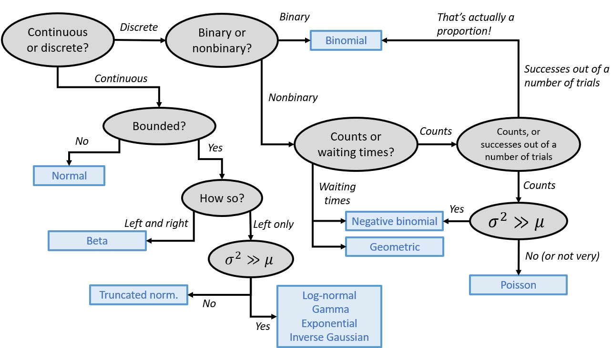

# Visualizing biological data {#sec-08}

## Visualizing single variables {#sec-09-single}
In statistics, we think of values within a variable coming from a probability distribution. **Probability distributions**, or **distributions** for short, are mathematical functions that describe the way that values vary randomly. Distributions are a key idea in statistics and data analysis and we'll cover them in detail in the [next module](@mod-09). We usually consider data to be essentially random, but with the values forming predictable patterns over many observations. The nature of those patterns is what probability distributions attempt to model. A probability distribution does not tell us the value of any particular observation, but it does let us estimate the likelihood of observing any particular value. The figure below demonstrates some common probability distributions: the heights of the bars reflect the likelihood of the values on the *x*-axes occurring under those distributions.

```{r}
#| echo: FALSE
par(mfrow=c(1,3), mar=c(5.1, 5.1, 1.1, 1.1), bty="n", las=1, lend=1)
hist(rnorm(100), main="Normal dist.", xlab="Value of x")
hist(rlnorm(100, 0.5, 1), main="Lognormal dist.", xlab="Value of x")
hist(rgamma(100, 1, 0.1), main="Gamma dist.", xlab="Value of x")
par(mfrow=c(1,1))
```

Successful data analysis requires paying attention to and thinking carefully about the way that your data are distributed. Different kinds of biological processes, like counts, waiting times, measurements, etc., have randomness that is described by different probability distributions. The assumption that values follow certain distributions is baked into most statistical methods. Trying to use a method that assumes an inappropriate distribution will probably lead to invalid results.

For example, if you try to analyze count data as if they came from a continuous, unbounded distribution, your statistical model could predict nonsensical outcomes such as negative or non-integer counts. The figure below shows this: the red shaded area are predictions of negative counts!

```{r}
#| echo: false
# illustration of linear models vs. count data
set.seed(123)
n <- 20
x <- runif(n, 1, 4)
y <- rpois(n, exp(0.02 + 0.97 * x))

mod <- lm(y~x)
px <- seq(0, 4, length=50)
pred <- predict(mod, newdata=data.frame(x=px), se.fit=TRUE)
lo <- qnorm(0.025, pred$fit, pred$se.fit)
up <- qnorm(0.975, pred$fit, pred$se.fit)
mn <- pred$fit

# find problem x values
z <- px[which(up <= 0 | lo <= 0)]
zlo <- lo[which(px %in% z)]
zup <- up[which(px %in% z)]

par(mfrow=c(1,1), mar=c(5.1, 5.1, 1.1, 1.1), bty="n",
    las=1, lend=1, cex.axis=1.2, cex.lab=1.2)
plot(x,y, xlim=c(0, 4), ylim=c(-20, 40),
     ylab="Count data", xlab="Predictor variable",
     pch=16, cex=1.1, xpd=NA)
polygon(x=c(z, rev(z)),
    y=c(pmin(0, zup), rev(pmin(0, zlo))),
    border=NA, col="pink", xpd=FALSE)
axis(side=1, at=0:4)
segments(0, 0, 4, 0, lty=2, lwd=2)
points(px, lo, type="l", lty=2, lwd=3, col="red")
points(px, up, type="l", lty=2, lwd=3, col="red")
points(px, mn, type="l", lwd=3, col="red")
arrows(1.5, -14, 1, -11, length=0.1, lwd=2)
text(1.6, -14, "Problem!", adj=0, cex=2)
```

Sometimes it is not always obvious what distribution your data should follow.
Some cases are relatively straight forward: counts should usually follow a Poisson or negative binomial distribution. Other cases are less straightforward: should gene expression data be considered normally, log-normally, or some other-ly distributed? Usually there is a clear *a priori* answer to this question that can be obtained by thinking about what kind of process gave rise to the numbers.

A related question to "what distribution does my data follow?" is "do my data follow this distribution?" Even if you have some expectation of how your data should be distributed, that is no guarantee that your study system cooperated. You should always check to see if your data follow the distribution you assumed, and the distribution assumed by your statistical test.

Deciding what distribution your data follow is always somewhat subjective, and real datasets often contain some departure from expectations. In this section we will explore some graphical techniques and heuristics for determining how data are distributed.

Knowing about [data distributions](@mod-09) is a one thing, but is quite another.
Like much of the data analysis workflow, picking a distribution can be as much an art as it is a science. This is because distributions of real data are often messy, or do not conform exactly to any one distribution, or may conform partly to several!
Sometimes the answer to "what distribution should I use to analyze this data?" is not clear-cut.

The figure below gives a (very) rough guide to starting to identify a response distribution. Note that this is only a guide for where to look first, and not a definitive guide to selecting a response distribution. Even if your choices lead you to, say, the normal distribution, you must still verify that your data conform (at least roughly) to that distribution. Note also that this diagram does not include every distribution out there, but rather a select set of commonly encountered distributions in biology.

{#fig-alt="Decision tree for selecting a probability distribution based on the response variable. First determine whether the response is continuous or discrete. Continuous variables that are unbounded are modeled with a normal distribution. Bounded continuous variables are modeled with a beta distribution if bounded on both sides. If bounded only on the left, use a truncated normal distribution when the variance is not much larger than the mean, or a log-normal, gamma, exponential, or inverse Gaussian distribution when the variance greatly exceeds the mean. For discrete variables, first determine whether the response is binary. Binary responses use a binomial distribution. Nonbinary discrete responses are divided into counts and waiting times. Waiting times use a geometric distribution or, when overdispersed, a negative binomial distribution. Count data are next classified as simple counts or counts out of a fixed denominator (proportions). Counts out of a denominator are treated as binomial data. For simple counts, use a Poisson distribution when the variance is approximately equal to the mean and a negative binomial distribution when the variance greatly exceeds the mean."}

### Histograms {#sec-08-sing-hist}

**Histograms** show how values of a distribution are spread across different intervals. These intervals are sometimes called **cells** or **bins**. A good histogram will show, approximately, the shape of a **probability density function (PDF)** of a [continuous distribution](@mod-09-cont) or the **probability mass function (PMF)** of a [discrete distribution](@mod-09-disc). A histogram with bin widths of 0 should look like a [kernel density plot](@sec-08-sing-kern).

The base function `hist()` will automatically select intervals that look nice, but you can specify the intervals with argument `breaks`.

```{r}
x <- rnorm(100)

# 1 row, 2 column plot layout
par(mfrow=c(1,2))
hist(x, sub="Default breaks")
hist(x, breaks=seq(-4, 4, by=2), sub="Different breaks")
```

```{r}
# reset plot layout to 1 x 1
par(mfrow=c(1,1))
```

The *area* of each bar is also proportional to the number of values in each interval.

R histograms can be presented as counts (`freq=TRUE`, the default), or as probability density (`freq=FALSE`). We'll talk more about probability density later in the [next section](@mod-05-dists1).

Compare these results:

```{r}

par(mfrow=c(1,2))
hist(x)
hist(x, freq=FALSE)

# reset
par(mfrow=c(1,1))
```

Because the second histogram shows probability densities, the areas under the bars sum to 1 (this is part of the definition of a PDF) (see @sec-05-cont).

A histogram can provide a visual first clue as to the shape of a distribution's PDF or PMF. For example, the histograms of `x1` and `x2` below suggest very different distributions:

```{r}
x1 <- rnorm(1000)
x2 <- rlnorm(1000)

par(mfrow=c(1,2))
hist(x1)
hist(x2)

# reset
par(mfrow=c(1,1))
```

Notice that `x1` appears roughly normal. It is symmetric, has a bell-shape, and is concentrated near its center. Contrast this with `x2`. Distribution `x2` is strongly right-skewed (i.e., lots of small values with a long positive tail), with most values near 0. It also has no negative values (`range(x2)`). Because of these properties we might suspect that `x2` is really a log-normal distribution. We can check this by making a histogram of the log of `x2`:

```{r}
hist(log(x2))
```

Other distributions might be tricky. Consider the histograms below:

```{r}
x1 <- rnorm(1000, 5, 2)
x2 <- rnorm(1000, 15, 3)
x3 <- c(x1, x2)

x1 <- rnorm(1000, 5, 2)
x2 <- runif(1000, 3, 20)
x4 <- c(x1, x2)

par(mfrow=c(1,2))
hist(x3)
hist(x4)

# reset
par(mfrow=c(1,1))
```

What a mess!

- Histogram `x3` shows what is commonly referred to as a **bimodal** distribution. This is a distribution with two **modes**, or most common values, with a gap between them. Bimodal distributions often arise from a **mixture** of two distributions (in this case, two normals). Or, they can indicate that something in the data generating process leads to diverging outcomes. For example, in many college courses the grade distribution can be bimodal, with most students making either a B or D.
- Histogram `x4` shows a distribution with some right skew, but not the long, tapering tail characteristic of the lognormal distribution (see `x2`, above).
The fact that the mean is near 5 and not 0 is another point against a lognormal.
But the clincher is that there are negative values, which a lognormal distribution cannot take (think about why this is).

Think for a few minutes about what distribution `x4` might be, then click the footnote to find out[^guessdist].

[^guessdist]: Distribution `x4` is a mixture of a normal with mean = 5 and SD = 2 with a uniform in [3, 20].

### Barplots {#sec-08-sing-bar}

Barplots are usually used to show the *mean* within each group. But, that's all they show. Barplots might be more appropriate than barplots if you have so many groups that a boxplot is too cluttered to read, or if the distributions within each group are known to be symmetrical and about the same width (and thus, showing them is not necessary).

Unlike `boxplot()`, `barplot()` does not calculate its own values. The values supplied to `barplot()` will be used as the bar heights. This means you need to calculate the means (or medians or whatever) ahead of time using a function like `aggregate()`. In the example, below, SD is also calculated so the plot will include some measure of variability. This is one of the disadvantages of barplots in R compared to boxplots: `boxplot()` automatically computes and displays variability about the mean, but `barplot()` does not.

Another difference is that unlike `boxplot()`, the *x* coordinates in a barplot are calculated by the `barplot()` function. What this means is that you often need to run it twice: once to get the *x* coordinates, and again to make the plot. Those *x* coordinates are needed to place the line segments that show the SD.

```{r, fig.width=6, fig.height=6, fig.align="center"}
# get means and SD of a y variable by species in iris
agg <- aggregate(Petal.Length~Species, data=iris, mean)
agg$sd <- aggregate(Petal.Length~Species,
                    data=iris, sd)$Petal.Length

# get x axis values
bar <- barplot(Petal.Length~Species, data=agg)
```

```{r}
# make plot with second call
barplot(Petal.Length~Species, data=agg, ylim=c(0, 7))
segments(bar[,1], agg$Petal.Length, bar[,1], agg$Petal.Length+agg$sd)
```

The above plot is called a "dynamite plot" because the bar and error bar look like an old stick of dynamite. Because they show less than a boxplot, and are harder to make than a boxplot, I almost never make dynamite plots. Instead, I suggest you use boxplots or something like the "point-and-whisker" plots below (@sec-08-sing-box).

### Boxplots {#sec-08-sing-box}

**Boxplots**, or **box-and-whisker plots**, summarize the distribution of continuous variables. They are often used to summarize data by a factor, making it easier to see how the distribution of a variable differs between groups. The boxplot shows the median, the first and third quartiles, and extreme values (whiskers and points)^[boxplot].

[^boxplot]: Or close enough. The actual, slightly different values, are in the documentation. See `?boxplot.stats`.

Boxplot of a single variable:

```{r}
boxplot(iris$Petal.Width)
```

Boxplot with some options for a nicer plot:

```{r}
boxplot(iris$Petal.Width,
        ylab="Petal width (cm)",
        ylim=c(0,3))
```

Boxplot across levels of a factor (note formula interface):

```{r}
boxplot(iris$Petal.Width~iris$Species,
        xlab="Species",
        ylab="Petal.Width (cm)",
        ylim=c(0,3))
```

A highly asymmetric box-and-whisker plot can indicate that data are skewed or non-normal.

The base `boxplot()` function can produce summaries across multiple variables.
Essentially it treats each combination of grouping variables as a separate set of values. There are better ways to plot group differences (e.g., for publication), but the base `boxplot()` does just fine for data exploration.

Boxplots can be constructed using several grouping variables. The order of grouping variables in the formula will determine the order of boxes in the plot.

```{r}
x <- iris
x$color <- c("red", "white") #made up variable

# group by species and color:
boxplot(Petal.Width~Species+color, data=x,
        ylab="Petal width (cm)", ylim=c(0,3))
```

Notice the difference in order of grouping:

```{r}
# difference in order of grouping:
boxplot(Petal.Width~color+Species, data=x,
        ylab="Petal width (cm)", ylim=c(0,3))
```

When constructing complicated boxplots, you may need to manually fix the x-axis labels, because they are not all rendered. Fortunately, the x-axis tick marks are simply numbered from left to right. So if, say, the 6^th^ label was missing, you can draw it manually like this:

```{r}
boxplot(Petal.Width~Species+color, data=x,
        ylab="Petal width (cm)", ylim=c(0,3))
# add missing tick mark with axis()
axis(side=1, at=6, labels="virginica.white")
```

If you want to construct a totally custom box and whisker plot, you can do so using base graphics functions like `rect()`, `arrows()`, `segments()`, and so on. All you need is to get the values for the different parts of the boxplot by saving a boxplot to an object.

```{r, eval=FALSE}
# not run
myboxplot <- boxplot(Petal.Width~Species+color, data=x)
```

The `stats` part of the resulting list will contain most of what you need. See `?boxplot.stats` for a guide.

### ECDF plots {#sec-08-sing-cdf}

The **cumulative distribution function (CDF)** is the probability that a random variable will take on a value less than or equal to some value. Formally, we say that a continuous distribution $x$ will take on value $\le{x}$ with probability $F\left(x\right)$, where $F\left(x\right)$ is the CDF.

The figure below shows what this means.

{alt-text: "Plot of the cumulative distribution function (CDF) of a normal distribution. The CDF is an S-shaped curve that increases smoothly from 0 to 1 as the value of the variable increases. Dashed red lines highlight the point where the CDF equals 0.4, showing that 40% of observations are less than or equal to x=−0.253. Additional annotations indicate that the CDF approaches 0 for very small values of x and approaches 1 for very large values of x. The figure illustrates that the CDF gives the cumulative probability up to a specified value of the variable."}

The figure shows the CDF of a normal distribution with mean = 0 and SD = 1 (i.e., the standard normal distribution. Like all CDFs, $F\left(x\right)$ increases monotonically (slope never changing sign) from 0 to 1 as $x$ increases from the lower bound to the upper bound of the distribution.

In the case of the normal distribution, the bounds of $x$ are $\left[-\infty,+\infty\right]$. The CDF approaches 0 as $x$ decreases, and approaches 1 as $x$ increases.

The red dashed lines show how to interpret the relationship between the axes. For any value on the *x*-axis, the *y*-axis shows what proportion of values are $\le{x}$. For any value on the *y*-axis, the *x*-axis shows the value at the *y*-th quantile of the distribution.

**The CDF is in a very real sense the *definition* of a probability distribution.**

Every probability distribution can be identified by a unique CDF. It doesn't matter whether a distribution is continuous, discrete, or a mixture of both. The figure below shows what the CDFs of a discrete or mixed distribution look like compared to that of a continuous distribution[^mixed].

[^mixed]: adapted from <https://commons.wikimedia.org/wiki/File:Discrete_probability_distribution_illustration.svg> (public domain).

{Three schematic cumulative distribution functions (CDFs) illustrating different types of distributions. The top panel, labeled "Discrete," shows a step function with horizontal segments and jumps; open circles indicate the CDF immediately before each jump and filled circles indicate the value after the jump. The middle panel, labeled "Continuous," shows a smooth S-shaped curve with no jumps, indicating that the CDF changes continuously. The bottom panel, labeled "Mixed," shows a smooth curve containing a single jump, illustrating a distribution with both continuous probability and discrete point masses. The figure emphasizes that CDFs are step functions for discrete variables, smooth for continuous variables, and a combination of both for mixed distributions.}

The examples below calculate and plot ECDF plots for a uniform (left) and a normal distribution (right).

```{r, fig.width=8, fig.height=4, fig.align="center"}
set.seed(42)
n <- 1e3
x1 <- runif(n, 3, 8)
x2 <- rnorm(n, 7, 4)
par(mfrow=c(1,2))
plot(ecdf(x1))
plot(ecdf(x2))
# add lines at 20th percentile:
abline(h=0.2, lty=2, col="red")
abline(v=quantile(x2, 0.2), lty=2, col="red")
```

The *y*-axis of an ECDF plot shows the calculated quantile of the distribution (e.g., 0.4 quantile = 40th percentile--40% of *x* are $\le F(x)$). The *x*-axis shows the values of the distribution. In the **left** plot, we see that the slope of the ECDF plot is roughly constant. This suggests a uniform distribution. The plot on the **right** shows the S-shaped ECDF typical of a bell-shaped curve, so we might suspect a normal distribution. The red lines on the right plot illustrate that about 20% of values are $\le{3.6}$.

ECDF plots can be calculated for discrete distributions as well---they just look like step functions. Step-like ECDF plots can also appear when a continuous distribution has many more observations than unique values.

```{r, fig.width=8, fig.height=4, fig.align="center"}
set.seed(42)
n <- 1e3
x1 <- rpois(n, 3)   # Poisson 
x2 <- rgeom(n, 0.3) # geometric 
par(mfrow=c(1,2))
plot(ecdf(x1))
plot(ecdf(x2))
```

Recall that every result in R is an object.
The output of the function `ecdf()` is actually another function that calculates the estimated CDF for a new value.
This can be very handy if you want to interpolate the ECDF to make a smoother curve.

```{r}
class(ecdf(rnorm(100)))
```

Here is how to use it. The example below can be useful if you need to calculate the ECDF for values that are not in the original dataset, but within its domain. In the example below, the ECDF is estimated for x = 30, which is not in the original data `x`. Notice what happens for values in `x1` that are greater than `max(x)` and less than `min(x)`.

```{r, fig.width=6, fig.height=6, fig.align="center"}
set.seed(123)
x <- rnorm(1e2, 20, 5)
e1 <- ecdf(x) # define function for CDF(x)
x1 <- 0:100  # define new x values at which to calculate CDF
y1 <- e1(x1) # calculate CDF at each new x
par(mfrow=c(1,1))
plot(x1, y1, type="s", lwd=2, col="blue2")
```

Obviously, the more data points you have, the better and smoother the estimate of the ECDF will be.
Consider the simulated example below that estimates the ECDF using different numbers of points.

```{r, fig.width=7, fig.height=5, fig.align="center"}
set.seed(123)
n <- 1e4
mu <- 20
sig <- 5
x4 <- rnorm(n, mu, sig)
x1 <- x4[sample(1:n, 10, replace=TRUE)]
x2 <- x4[sample(1:n, 100, replace=TRUE)]
x3 <- x4[sample(1:n, 1000, replace=TRUE)]

xseq <- seq(0, 40, length=100)
y1 <- ecdf(x1)(xseq)
y2 <- ecdf(x2)(xseq)
y3 <- ecdf(x3)(xseq)
yt <- pnorm(xseq, mu, sig)

plot(xseq, yt, type="l", lwd=6, xlab="x",
     ylab="(E)CDF = F(x)")
points(xseq, y1, type="l", lwd=2, col="red")
points(xseq, y2, type="l", lwd=2, col="blue2")
points(xseq, y3, type="l", lwd=2, col="green")
legend("topleft", 
    legend=c(expression(n==10), expression(n==100), 
             expression(n==1000), "True CDF"),
    lwd=c(2,2,2,6),
    col=c("red", "blue2", "green", "black"),
    bty="n", cex=1.2)
```

The estimate with 10 points (red) is a very rough fit, but serviceable. The estimates using 100 or 1000 points are much closer to the truth (black line).

### Kernel density plots {#sec-08-sing-kern}

Kernel density plots are a way to empirically estimate and visualize the **probability distribution function (PDF)** of a distribution (@sec-05-cont). A plot of the estimated PDF is essentially a histogram where the bin width approaches 0. The PDF tells us two things. Practically speaking, the PDF of a distribution at a given value is related to how likely that value is to occur relative to other values.
However, that is NOT the same as the probability of that value occurring.

What the PDF really expresses is the *rate of change in cumulative density at a value*.

- The **cumulative density** of a distribution at some value *x* is the probability of a value $\le$ *x*.
- The **cumulative density function (CDF)** gives the cumulative density at *x*.

The PDF is defined as is the *slope or first derivative of the CDF*. Conversely, the CDF is the integral of the PDF. The PDF is the rate at which the probability of observing a value $\le{x}$ increases at each $x$. Again, this is related to but not the same as the probability of that value occurring.

{fig-alt:"Relationship between the probability density function (PDF) and cumulative distribution function (CDF) of a normal distribution. The left panel shows the PDF, f(x), as a bell-shaped curve. The right panel shows the corresponding CDF, F(x), as an S-shaped curve increasing from 0 to 1. Red annotations connect corresponding values of x on the two graphs, illustrating that the probability density f(x) at a given value equals the rate of change (slope) of the cumulative distribution function F(x) at that same value. Larger PDF values correspond to steeper slopes of the CDF, while smaller PDF values correspond to flatter portions of the CDF."}

The kernel density plot estimated by R is to the PDF what the empirical cumulative distribution function (ECDF; see @sec-08-sing-cdf) is to the CDF. Just like an ECDF plot presents an estimate of the true CDF, the kernel density plot presents an estimate of the true PDF. This means that presenting a kernel density plot or an ECDF plot is largely a matter of preference because they convey the same information in different ways.

Note that a kernel density plot makes more sense for a [continuous distribution](@mod-09-cont) than for a [discrete distribution](@mod-09-disc). The equivalent plot for a discrete distribution is the **probability mass function (PMF)** plot, which looks like a barplot because the PMF is only non-zero for integer values. 

The example below shows kernel density plots for four distributions: $Normal\left(\mu=5,\sigma=2\right)$, $Gamma\left(k=3,\theta=2\right)$, $Uniform\left(min=0,max=1\right)$, and $Poisson\left(\lambda=4\right)$. The first 3 are continuous distributions and the last is a discrete distribution.

```{r}
set.seed(123)
n <- 1e3
par(mfrow=c(2,2))
plot(density(rnorm(n,5,2)), main="Normal(5, 2)")
plot(density(rgamma(n, 3, 2)), main="Gamma(3, 2)")
plot(density(runif(n)), main="Uniform(0, 1)")
plot(density(rpois(n,4)), main="Poisson(4)")
```

The estimated density functions aren't too far off from the real functions. But, notice that the plots for the gamma, uniform, and Poisson variables extend outside of the domains of the underlying distributions. For example, the density for the Poisson variable extends below 0--because the Poisson distribution models counts, it is only supported for non-negative integers (think about why...you can't count -3 or 2.5 fish). You can truncate the plot using arguments `from` or `to` for density. This is a good idea if you are exploring data that you suspect have a natural domain. 

For example, lengths and times must be non-negative, so you should include `from=0` in the `density()` command.

```{r}
par(mfrow=c(2,2))
plot(density(rnorm(n,5,2)), main="Normal(5, 2)")
plot(density(rgamma(n, 3, 2), from=0), main="Gamma(3, 2)")
plot(density(runif(n), from=0, to=1), main="Uniform(0, 1)")
plot(density(rpois(n,4), from=0), main="Poisson(4)")
```

The estimated density functions are now in their supported intervals, which is nice. There's one more issue with the estimates for the Poisson distribution. Notice that the bottom right plot shows non-zero probability density for non-integer values. This doesn't make sense for a Poisson distribution, which can only take non-negative integer values. What's going on here is that the `density()` function does not know whether a distribution is supposed to be discrete or continuous. As far as the function is concerned, the distribution is continuous and just happens to have no non-integer values.

If you have data that you have good reason to suspect are discrete, there is a better way than `density()` to visualize the relative likelihood of different values: the **probability mass function (PMF, not PDF)**. The PMF of a discrete distribution can be calculated rather than estimated.

In the example below we use the `table()` function, which tallies up the number of times each value occurs in a vector.
We could convert the cell counts to PMF estimates by dividing by the number of observations (e.g., `plot(table(x1)/n))`.

```{r}
# make some data
set.seed(42)
n <- 1e3
x1 <- rpois(n, 4)
x2 <- rbinom(n, 20, 0.4)
x3 <- rgeom(n, 0.3)
x4 <- rnbinom(n, 10, 0.1)

# plot cell counts:
par(mfrow=c(2,2))
plot(table(x1))
plot(table(x2))
plot(table(x3))
plot(table(x4))
```

Dividing the cell counts by the number of total observations (n) estimates the empirical PMF:

```{r}
par(mfrow=c(2,2))
plot(table(x1)/n, ylab="Empirical PMF")
plot(table(x2)/n, ylab="Empirical PMF")
plot(table(x3)/n, ylab="Empirical PMF")
plot(table(x4)/n, ylab="Empirical PMF")
```

We can verify that the empirical PMFs that we calculated match the actual PMFs:

```{r, fig.width=8, fig.height=7, fig.align="center"}
# compare to true PMF:
v1 <- 0:max(x1)
v2 <- 0:max(x2)
v3 <- 0:max(x3)
v4 <- 0:max(x4)
y1 <- dpois(v1, 4)
y2 <- dbinom(v2, 20, 0.4)
y3 <- dgeom(v3, 0.3)
y4 <- dnbinom(v4, 10, 0.1)

par(mfrow=c(2,2))
plot(table(x1)/n)
points(v1, y1, type="l", col="red", lwd=2)
plot(table(x2)/n)
points(v2, y2, type="l", col="red", lwd=2)
plot(table(x3)/n)
points(v3, y3, type="l", col="red", lwd=2)
plot(table(x4)/n)
points(v4, y4, type="l", col="red", lwd=2)
```


## Visualizing 2 variables {#sec-08-two}

So far in this course we have explored ways to [explore distributions of single variables](@#sec-09-single): histograms, ECDF plots, probability density plots, and so on. In this section we will explore ways to explore relationships *between* variables. This is a vital preliminary step in studying how two or more variables might be correlated with each other, or how one might cause the other. The focus on this page is on exploratory, correlative methods. Actual inference about relationships between two variables is better handled by [linear models (LM)](@mod-14-lin), [generalized linear models (GLM)](@mod-16), or [other kinds of models](@mod-20). 

### Scatterplots for 2 continuous variables {#sec-08-two-scatter}

The **scatterplot** is one of the most important tools in the biologist's data toolbox. It is probably the simplest type of figure in routine use: simply plot the values in one variable on one axis, and the values of another variable on another (perpendicular) axis. The role of the scatterplot in exploratory data analysis is to help visualize the form of the relationship between two variables [@bolker2008ecological]. The figure below shows just 6 of the possible curve types that you might discover.

```{r}
#| echo: false
#| fig.width: 8
#| height: 7
#| fig.align: "center"

set.seed(123)
sigma <- 2
n <- 25
x1 <- 1:20
x2 <- runif(n, 1, 20)
y1 <- 3.2 + 1.2*x1
y2 <- exp(0.001 + 2.1*log(x1))
y3 <- (5*x1)/(5+x1)
y4 <- 7/(1+exp(-(0.5)*(x1-10)))
y5 <- -0.74*(x1-10)^2
y6 <- 4 + 2.1*sin(x1/3)

par(mfrow=c(2,3), mar=c(5.1, 5.1, 1.1, 1.1), bty="n", lend=1, las=1,
    cex.axis=1.3, cex.lab=1.3)
plot(x1, y1, type="l", lwd=3, xlab="X", ylab="Y", main="Linear", xaxt="n", xlim=c(0, 20))
axis(side=1, at=seq(0, 20, by=5))
plot(x1, y2, type="l", lwd=3, xlab="X", ylab="Y", main="Exponential", xaxt="n", xlim=c(0, 20))
axis(side=1, at=seq(0, 20, by=5))
plot(x1, y3, type="l", lwd=3, xlab="X", ylab="Y", main="Michaelis-Menten", xaxt="n", xlim=c(0, 20))
axis(side=1, at=seq(0, 20, by=5))
plot(x1, y4, type="l", lwd=3, xlab="X", ylab="Y", main="Logistic", xaxt="n", xlim=c(0, 20))
axis(side=1, at=seq(0, 20, by=5))
plot(x1, y5, type="l", lwd=3, xlab="X", ylab="Y", main="Quadratic", xaxt="n", xlim=c(0, 20))
axis(side=1, at=seq(0, 20, by=5))
plot(x1, y6, type="l", lwd=3, xlab="X", ylab="Y", main="Sinusoidal", xaxt="n", xlim=c(0, 20))
axis(side=1, at=seq(0, 20, by=5))
```

#### R plotting basics

We have already made some scatterplots, but it's worth taking a closer look at the R methods for scatterplots. The basic function for scatterplots is `plot()`. The first argument is taken to be the x coordinates, and the second argument to be the y coordinates. You can also use the formula interface `plot(y ~ x)`, but the coordinates method `plot(x, y)` usually makes for cleaner code.

Calling `plot()` does two things: first, it *creates a new plot*; second, it *plots the data* on the new plot area. Other components can be added to the plot with subsequent commands:

- `points()` for points
- `text()` for text
- `lines()` for lines
- `polygon()` for polygons
- `segments()` for line segments

and so on. These functions will ***add*** to an existing plot, but will not create a new plot area. So, call `plot()` first, then `points()` or one of the others if needed. Calling `points()` or one of the "adding" functions if there is not already an active plot area will return an error.

Here is a basic scatterplot:

```{r}
plot(iris$Petal.Width,iris$Petal.Length)
```

The default scatterplot is rather unattractive, but works just fine for exploring data. Fortunately, almost every aspect of a plot can be customized using different plot arguments and graphical parameters. Here are some commonly used plot options:

```{r}
plot(iris$Petal.Width,iris$Petal.Length,
    xlab="Petal width (cm)",             # x label
    ylab="Petal Length (cm)",            # y label
    xlim=c(0,3),                         # x axis limits
    ylim=c(0,8),                         # y axis limits
    main="Petal length vs. petal width"  # plot title
)#plot
```

Sometimes it helps to change the color or style of points to show categories in the data. This can be done using some arguments to `plot()`:

- `pch` changes the symbol used for points. Think "**p**oint **ch**aracter". See `?points` for a list of available symbols.
- `cex` changes the size of symbols. Think "**c**haracter **ex**pansion". The default `cex` is 1; other values scale the points relative to this. E.g., `cex=2` makes points twice as large.
- `col` changes the color. Think "**col**or". R can produce many colors; run the command `colors()` to see a named list[^colors].

[^colors]: You can also specify colors by their RGB or hex codes. Just google "R color chart" to get some examples. The [ColorBrewer](https://colorbrewer2.org/) website (accessed 2026-08-05) and R package can help picking appropriate color schemes.

Each these arguments can take vector of values, so you can assign colors or shape to each point. The values will be used in the same order as the observations used to draw the points (e.g., rows of a data frame). I find it convenient to put colors, shapes, and other point-specific graphical parameters into the dataframe that contains the coordinates. That way, if I ever subset the data frame, or sort the data frame, the symbology information stays with each point.

The examples below illustrate several ways of assigning symbology to observations within a data frame. In the first, `ifelse()` is used to make vectors of colors (`use.col`) defined by the variable `species`. Notice that a legend is provided to tell the reader which symbols mean what. This method works fine if you only have a few groups to define symbols for.

```{r}
# method 1: ifelse()
iris$color <- ifelse(iris$Species == "setosa", "black", 
    ifelse(iris$Species == "versicolor", "red", "blue"))

plot(iris$Petal.Width,iris$Petal.Length,
	col=iris$color, # color by species
	pch=16       # solid dots	
)
legend("bottomright", 
    legend=c("Setosa", "Versicolor", "Virginica"),
    pch=16, col=c("black", "red", "blue"))
```

A better way is to first set up a vector of colors, then name the elements of the vector, and finally use those names to assign colors to rows of the data frame. ***This is the method I use in my code, and recommend you do too.*** When getting a vector of colors, I often use [colorbrewer2](https://colorbrewer2.org/) (date accessed 2026-08-05). Notice in the `legend()` code below that we don't have to retype the species names or colors because they are already in the object `spps` and `cols`.

```{r}
# method 2: match()
####  recommended method ####

## get the species names
spps <- sort(unique(iris$Species))

## vector of colors
## can also use rainbow() or colorbrewer2.
cols <- c("blue", "yellow", "purple")

## assign names to colors
names(cols) <- spps

## assign to data frame
iris$color <- cols[iris$Species]

## use the new colors in a plot:
plot(iris$Petal.Width,iris$Petal.Length,
	col=iris$color, # color by species
	pch=16      # solid dots	
)
legend("bottomright", legend=spps, pch=16, col=cols)
```

Below is an example of using shapes (`use.pch`) to define groups. See the help page for `points()` (`?points`) to see the available plot symbols. In my plots I usually use both shape and color to define groups.

```{r}
# method 3: names()
spps <- sort(unique(iris$Species))
shps <- c(15, 16, 17)
names(shps) <- spps
iris$pch <- shps[iris$Species]

plot(iris$Petal.Width,iris$Petal.Length,
     pch=iris$pch, col=iris$color)
legend("bottomright", legend=spps, pch=shps, col=cols)
```

You can think of the plot generated by `plot()` like a canvas. Once the canvas is in place, things can be "painted" on, but like paint cannot be removed. If you want to remove something, you'll need to remake the plot without it. You can also just comment out the command you don't want.

```{r}
plot(iris$Petal.Width,iris$Petal.Length,
     pch=iris$pch, col=iris$color)
legend("bottomright", legend=spps, pch=shps, col=cols)
text(1.5, 5, "Flowers!", cex=4, col="red")
```

There's no way to remove the offending text: R doesn't have an "Undo" button! Our only option is just to remake the plot without the text.

```{r}
# remake without the offending text:
plot(iris$Petal.Width,iris$Petal.Length,
     pch=iris$pch, col=iris$color)
legend("bottomright", legend=spps, pch=shps, col=cols)
```

Sometimes I'll just comment out the plot component that needs deleting; this way it is easier to add back in later. I do this a lot when I'm trying to iteratively build a figure with lots of components.

```{r, eval=FALSE}
# not run:

# remake without the offending text (commented out):
plot(iris$Petal.Width,iris$Petal.Length,
	col=use.col, pch=16
)
#text(1.5, 5, "Flowers!", cex=4, col="red")
legend("bottomright", legend=spps, col=cols, pch=16)
```

#### Advanced R plotting with `par()`

##### Plot formatting

Many options that affect plots can only be set using the `par()` function. Or, are best set using `par()`. Take a look at the `par()` help page to get a sense of the variety of options available (`?par`). It is important to keep in mind is that once `par()` options are set in an R session, they will stay that way until you change them using `par()` again. So, if you are making multiple figures within the same R workspace or work session you will need to pay attention to what you have done. You can always see all current settings by running the command `par()`.

Below is an illustration of using `par()` to change graphics options:

Without `par()`:

```{r, fig.width=6, fig.height=6, fig.align="center"}
plot(iris$Petal.Length~iris$Sepal.Length,
	xlab="Sepal length (cm)",
	ylab="Petal length (cm)",
     xlim=c(0,8),ylim=c(0,8))
```

With `par()`, we can do the following:

- Narrow the margins (`mar`) so the plot takes up more of the figure space
- Remove the box (`bty`) because it is unnecessary
- Turn *y*-axis numbers to horizontal (`las`) so they are easy to read
- Bring axis labels in closer (`mgp`) to save space
- Set size of axis text (`cex.axis`) and labels (`cex.lab`) for legibility

```{r, fig.width=6, fig.height=6, fig.align="center"}
par(mar=c(4.1, 4.1, 1.1, 1.1),  # margin sizes
    bty="n",                    # no box around plot
    las=1,                      # axis labels in reading
                                # direction
    mgp=c(2.25, 1,0),           # position of axis components
    cex.axis=1.2,               # size of axis numbers
    cex.lab=1.2)                # size of axis titles
plot(iris$Petal.Length~iris$Sepal.Length,
	xlab="Sepal length (cm)",
	ylab="Petal length (cm)",
     xlim=c(0,8),ylim=c(0,8))
```

We will use `par()` often in this course to clean up figures and make them more attractive. Most of the time when you are exploring data you won't need to mess with `par()` (except for making multi-panel figures). But, you should definitely use `par()` when preparing figures for presentations or publications. Proper use of `par()` is the key to making clean, informative, and professional-looking figures.

##### Multi-panel figures with `par()`

One of the most common ways to use `par()` is to make multi-panel figures. The panels are specified in terms of the number of rows and columns in the figure. The arguments `mfrow` and `mfcol` define the panel layout.

- `mfrow`: you supply the number of rows and number of columns, in that order.
- `mfcol`: works the same way, but in reverse: supply the number of columns and number of rows, in that order.

Once you set `mfrow` or `mfcol` (but never both), a new plot area within the graphics window will be produced each time you call `plot()`. The graphics window will be divided evenly according to the number of panels you requested (e.g., `mfrow=c(2,3)` will yield 6 panels). Panels are drawn by row and then by column (with `mfrow`) or by column and then by row (with `mfcol`).

If you produce more plots than you have "slots" specified by `mfrow` or `mfcol`, the graphics device will be cleared and the plot panels will be filled again, in the same order as before. So, if you set `mfrow=c(2,2)`, and then make 5 plots, you will end up with a graphics window that has 1 plot (the fifth) in the upper left corner.

The example below shows the use of `par()$mfrow` to make a 2 $\times$ 2 figure.

```{r, fig.width=8, fig.height=8, fig.align="center"}
par(mfrow=c(2,2),           # layout
    mar=c(4.1,4.1,1.1,1.1), # margin sizes
    bty="n",                # no box around plot
    las=1,                  # rotate axis text
    cex.axis=1.2,           # axis text size
    cex.lab=1.2)            # label text size
hist(iris$Petal.Length, main="Plot 1")
hist(iris$Petal.Width, main="Plot 2")
hist(iris$Sepal.Length, main="Plot 3")
hist(iris$Sepal.Width, main="Plot 4")
```

When making multi-panel plots, it helps to line up axes that correspond to each other. The commands below show two separate figures with aligned axes. This can be helpful when showing different responses to the same explanatory variable (the 2 row by 1 column figure):

```{r, fig.width=4, fig.height=8, fig.align="center"}
par(mfrow=c(2,1),           # layout
    mar=c(4.1,4.1,1.1,1.1), # margin sizes
    bty="n",                # no box around plot
    las=1,                  # rotate axis text
    cex.axis=1.2,           # axis text size
    cex.lab=1.2)            # label text size
plot(iris$Petal.Length, iris$Sepal.Length)
plot(iris$Petal.Length, iris$Sepal.Width)
```

The figure below is a 1 row by 2 column figure that shows how a single response variable relates to two different predictors.

```{r, fig.width=8, fig.height=4, fig.align="center"}
par(mfrow=c(1,2),           # layout
    mar=c(4.1,4.1,1.1,1.1), # margin sizes
    bty="n",                # no box around plot
    las=1,                  # rotate axis text
    cex.axis=1,           # axis text size
    cex.lab=1)            # label text size
plot(iris$Petal.Width, iris$Petal.Length)
boxplot(iris$Petal.Length~iris$Species)
```

Sometimes you may need to manually set axis limits to make sure that the panels line up exactly.

```{r, fig.width=4, fig.height=8, fig.align="center"}
# example with X and Y axes not aligned:
d1 <- iris[which(iris$Species == "setosa"),]
d2 <- iris[which(iris$Species == "versicolor"),]

par(mfrow=c(2,1))
plot(d1$Petal.Length, d1$Sepal.Length)
plot(d2$Petal.Length, d2$Sepal.Length)
```

Here's the same plot, but with the axes lined up by setting the axis limits with `xlim` and `ylim`.

```{r, fig.width=4, fig.height=8, fig.align="center"}
# same plot but with axes lined up:
par(mfrow=c(2,1))
plot(d1$Petal.Length, d1$Sepal.Length, xlim=c(0,6), ylim=c(0,8))
plot(d2$Petal.Length, d2$Sepal.Length, xlim=c(0,6), ylim=c(0,8))
```

The argument `mfcol` to `par()` works similarly to `mfrow`, but on columns instead of rows. For `mfcol` you supply the number of columns, then the number of rows. Likewise, panels are filled by column first instead of row first. The panel layout `mfrow=c(2,3)` is the same as `mfcol=c(3,2)`, but the panels will be filled in a different order:

{fig-alt: "Illustration of how par options mfrow and mfcol draw and fill figure panels. mfrow fills by rows, while mfcol fills by columns."}

Whether to use `mfrow` or `mfcol` is usually a matter of preference. Clever use of one or the other can allow you to automatically make multi-panel plots in a preferred layout in a `for()` loop from data stored in a list or indexed by a vector.

One last point about multi-panel plots: the `plot()` function both creates new panels and creates plots within each panel. Part of this process is defining the coordinate system for a panel. When you make a plot, subsequent commands that add elements to plots such as `points()`, `abline()`, `legend()`, etc., will use the coordinate system of the most recent panel. Think about this when designing complicated figures. The example below demonstrates how a legend is placed according to the coordinate system of the most recently-created plot.

```{r, fig.width=9, fig.height=3, fig.align="center"}
n <- 1e3

# legend in first panel:
par(mfrow=c(1,3))
hist(rnorm(n))
legend("topleft", legend="Data", fill="lightgrey")
hist(rnorm(n))
hist(rnorm(n))
```

Here is a different figure, with the legend in a different panel:

```{r, fig.width=9, fig.height=3, fig.align="center"}
# legend in second panel (note where legend() is):
par(mfrow=c(1,3))
hist(rnorm(n))
hist(rnorm(n))
legend("topright", legend="Data", fill="lightgrey")
hist(rnorm(n))
```

For more advanced plotting, refer to @mod-28. There we'll explore special symbols and equations with `plotmath()`, fun with axes, adding images to figures, and `lattice` graphics.

## Visualizing many variables {#sec-08-many}

### Scatterplot matrices for many variables {#sec-08-many-pair}

#### Basic `pairs()` plots

A scatterplot plots one variable against another, and is probably the best way to see the relationship (if any) between two variables. But what if you have many variables? Making dozens of scatterplots can be tedious and time consuming. A scatterplot matrix makes many scatterplots at once, allowing relationships between many variables to be visualized at once. The base function to do this is `pairs()`.

```{r, fig.width=8, fig.height=8, fig.align="center"}
# load some data
data(crabs, package="MASS")

# make a spare copy
x <- crabs

# define columns for scatterplot matrix
dat.cols <- 4:8

# make scatterplot matrix
pairs(x[,dat.cols])
```

In the scatterplot matrix, every variable is plotted against every other variable. Variables are labeled on the diagonal. E.g., the plots in the first row have "FL" as their *y*-axis, and "RW", "CL", "CW", and "BD" as their *x*-axes. Likewise, plots in the first column have "FL" as their *x*-axis, and "RW", "CL", "CW", and "BD" as their *y*-axes.

{Illustration of how to read a scatterplot matrix produced by `pairs()`. Each panel plots the variable in its row against the variable in its column.}

#### Improved `pairs()` plots

One common modification to the default `pairs()` plot is to replace scatterplots above the diagonal with correlation coefficients. Another modification is to add linear regression or LOESS[^loess] lines to the lower plots to help highlight the relationships. The function below is adapted from the help page for `pairs()`. Notice that the size of the text for each coefficient is scaled to the magnitude of the coefficient. Can you figure out what piece of the code is doing that?

[^loess]: Locally estimated sums of squares, a common smoothing curve algorithm.

```{r, fig.width=8, fig.height=8, fig.align="center"}
# define a function to add correlation coefficients
# borrowed from ?pairs
panel.cor <- function(x, y, digits = 2, prefix = "", cex.cor, ...)
{
    #usr <- par("usr"); on.exit(par(usr))
    par(usr = c(0, 1, 0, 1))
    r <- cor(x, y)
    txt <- format(c(r, 0.123456789), digits = digits)[1]
    txt <- paste0(prefix, txt)
    if(missing(cex.cor)) cex.cor <- 0.8/strwidth(txt)
    text(0.5, 0.5, txt, cex = 2*abs(r))
}

# example of use:
pairs(x[,dat.cols], 
      lower.panel=panel.smooth,
      upper.panel=panel.cor, gap=0)
```

Sometimes the Spearman rank correlation coefficient $\rho$ is more informative than the Pearson linear correlation coefficient *r* (@sec-06-co). The function `panel.cor()` can be modified to use $\rho$ instead of *r*:

```{r, fig.width=8, fig.height=8, fig.align="center", warning=FALSE}
panel.cor2 <- function(x, y, digits = 2, prefix = "", cex.cor, ...)
{
    par(usr = c(0, 1, 0, 1))
    r <- cor(x, y, method="spearman")## changed here!
    txt <- format(c(r, 0.123456789), digits = digits)[1]
    txt <- paste0(prefix, txt)
    if(missing(cex.cor)) cex.cor <- 0.8/strwidth(txt)
    text(0.5, 0.5, txt, cex = 2*abs(r))
}

# example of use:
# (might return warnings but these are ok)
pairs(x[,dat.cols], 
      lower.panel=panel.smooth,
      upper.panel=panel.cor2, gap=0)
```

### Ordination (brief introduction) {#sec-08-many-ord}

The methods above are a way to examine single variables, or single pairs of variables. But what about many variables at once? In other words, how can we examine variation between samples by taking into account multiple variables at once? This is the realm of **multivariate statistics**.

**Ordination** is literally plotting or ordering observations along two or more axes. How that ordering is done varies wildly among techniques. We will get deeper into ordination later in the course (@sec-24), but for now let's look at one of the most common techniques, **principal components analysis (PCA)**, with a focus on interpretation rather than calculation. Some of the goals of all ordination techniques are:

- **Cluster identification:** observations that are closer to each other in the ordination space are more similar to each other
- **Dimension reduction:** the axes of an ordination are estimates of synthetic variables that combine information about many variables at once

Biologists use many different ordination techniques to analyze patterns in many variables at once. Regardless of the specific technique, the basic interpretation is usually the same:

1. Points that are closer together are more similar to each other.
1. Variables get bigger in the direction of their arrow.

These two rules will work for almost any ordination you are likely to encounter in biology: PCA, redundancy analysis, canonical correspondence analysis, nonmetric multidimensional scaling (my favorite), linear discriminant analysis, and the list goes on.

#### Principal components analysis (PCA)

**Principal components analysis (PCA)** is a method for extracting synthetic gradients from a multivariate dataset that capture most of the variation in that dataset. These gradients are calculated by finding linear combinations of the variables that minimize sums of squared deviations from the gradient. In other words, PCA translates the variation between observations in terms of the original, many variables, into variation along a few artificial variables called **principal components**. 

The basic problem is this: you can see a pattern in one variable with a histogram (@sec-08-sing-hist). You can see a pattern in 2 or 3 variables (i.e., dimensions) with a scatterplot (@sec-08-two-scatter). But what if you have 4 variables? 10 variables?
If you've never heard of PCA or ordination, it might be worth watching a video that explains and shows the basic ideas. Here is [**one that only takes 5 minutes and has a nice theme song**](https://www.youtube.com/watch?v=HMOI_lkzW08) (accessed 2021-08-10). For a more in-depth introduction to PCA, see [Module 24](#mod-24-pca). For now, let's just go with "PCA helps us visualize patterns involving many variables at once".

PCA is available in base R using the functions `prcomp()` and `princomp()`. Both of these functions produce similar outputs, but there are some subtle differences between them. For this course we are going to use the PCA function in package `vegan`. Although designed for community ecology, `vegan` is widely used for ordination and multivariate analysis in many fields. Importantly, `vegan` is actively maintained and updated with new techniques as they are developed. Also importantly, `vegan` offers a common interface for many kinds of ordination.

The example below uses the `varespec` dataset from `vegan`. Each column contains % cover by different species of plants in lichen pastures in northern Finland and Scandinavia. For the sake of making a simple example, we will ordinate only the 15 species with the most variance (many species in the dataset are rare or sparse, so including them makes the plot harder to interpret...in "real life", don't remove variables from your analysis without good reason!).

```{r}
library(vegan)
```

```{r, fig.width=7, fig.height=7, fig.align="center"}
# get data and make a spare copy
data(varespec)
x <- varespec

# identify the variables with most variance
vx <- rev(sort(apply(x, 2, var)))
x <- x[,names(vx)[1:10]]

# calculate PCA and plot it
p1 <- pca(x, scale=TRUE)
biplot(p1)
```

The figure above is called a **PCA biplot**. Each point is a sample (site) where vegetation was sampled. By default, the samples are identified by their row number. The red arrows show sites where different species were more abundant (or, more generally, where the variables are increasing). For example, sites towards the top right had greater cover by species "Cladstel". Sites towards the lower left had less cover by Cladstel. Sites towards the top left had more cover by "Pleuschr".

The `summary()` command will print a lot of information about the ordination. It prints the eigenvalues of each PC, then scales them as "Proportion explained". I.e., the proportion of variation explained by each PC is the same as its eigenvalue divided by the sum of all eigenvalues.

```{r}
summary(p1)
```

The "Importance of components" part tells us that the first principal component (PC1) explains about 27.8% of the variation in the dataset. PC2 explains an additional 19.4%. One rule of thumb people use is to present enough PCs to account for $\ge{80\%}$ of the variation. If it takes many PCs to reach 80% of variation, that may be a sign that the PCs are not capturing much meaningful structure in your dataset (or, there simply isn't much structure to capture).

Finally, we can see the variable **loadings**, which describe the contribution of each original variable to each principal component[^loadings]. Loadings with larger absolute values indicate variables that contribute more strongly to an axis, while the sign indicates the direction of that relationship. In the example below, unscaled loadings for PCs 1-4 are requested using `choices=1:4` and `scaling=0`.

[^loadings]: Different software packages define loadings slightly differently. Some report the coefficients (eigenvectors) used to calculate the principal components, while others report the correlations between the original variables and the principal components. The two are closely related and usually lead to the same qualitative interpretation. We'll discuss this more in @mod-28.

```{r}
scores(p1, choices = 1:4, display = "species", scaling = 0)
```

The loadings indicate that PC1 is strongly associated with species `Cladrang` and, to a lesser extent, `Pleuschr`. The signs of the loadings indicate whether the species vary in the positive or negative direction along PC1. Compare this to the orientation and length of the corresponding arrow in the biplot. Variables with larger absolute loadings generally have longer arrows and exert a stronger influence on the principal component.

#### Plotting ordinations

Extracting the scores from an ordination object can let you plot points with all of the `base` graphics formatting methods we learned above (@sec-08-two), such as using color or shape to indicate group membership. In my experience this is more flexible than using the built-in graphics capabilities in `vegan`[^veganfigs], but your mileage may vary.

[^veganfigs]: An introduction by the package's lead author can be found by running this command:`vignette(topic="intro-vegan", package="vegan")`.

```{r, fig.width=10, fig.height=5, fig.align="center"}
# load some data
data(crabs, package="MASS")

# make a spare copy
x <- crabs

# fit the PCA on the numerical variables
p1 <- pca(x[,4:8], scale=TRUE)

# extract the "scores": coordinates on PC axes
site.scores <- scores(p1, choices=1:2,
                      display="sites", scaling="sites")

# define some colors for sex
use.colors <- c("red", "blue")
names(use.colors) <- sort(unique(x$sex))
x$color <- use.colors[x$sex]

# define some shapes for species
use.pch <- c(2,1)
names(use.pch) <- sort(unique(x$sp))
x$pch <- use.pch[x$sp]

# build the plot
par(mfrow=c(1,1))
plot(site.scores, col=x$color, pch=x$pch,
     xlab="PC1 (95.8%)", ylab="PC2 (3.0%)")
legend("topleft",
       legend=c("B female", "B male", "O female", "O male"),
       pch=c(2, 2, 1, 1),
       col=c("red", "blue", "red", "blue"))
```

#### Ordination wrap-up (for now)

Ordination is a collection of methods for reducing the dimensionality of data. Biological datasets often have many variables, but most variation in those datasets can often be captured using only a few of them (or few combinations of the variables). The positions of the samples in the ordination space can thus reveal patterns that are too complicated to see in the full data space. Interpreting ordination axes in biological terms can be very fruitful. When an axis captures important information about the samples, it can be used as a variable in another method (e.g., as a predictor variable in a linear model). Analysis of clustering or positional differences between groups in ordination space (especially NMDS space) can allow for researchers to test for differences in many variables at once.