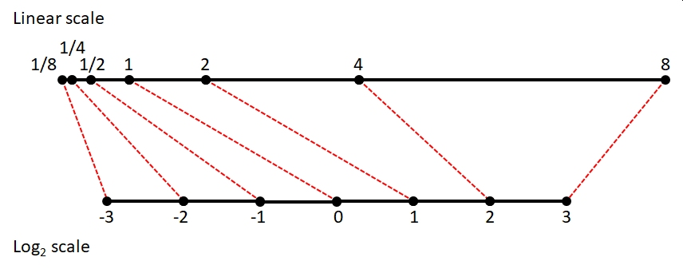
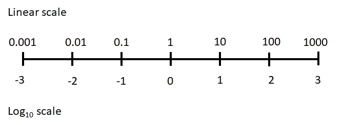

# Data transformation and rescaling {#sec-trans}

## Data transformations {#sec-trans-trans}

Data transformation is the process of changing the values in your data according to a function. This is usually done to make the data better conform to the assumptions of a statistical test, or to make graphs easier to interpret. Transformation is done to make patterns easier to detect. In many fields transformations may be standard practice, and with good reason. Just make sure that you understand what the transform function is doing, and most importantly, why you are transforming your data.

## Why transform? {#sec-trans-why}

**Data transformation** is the process of applying a function to your data to change their values. This is usually done so that the data better conform to the assumptions of a statistical test, or to make graphs of your data more interpretable. The functions that transform data are usually called “transforms”. There are many transforms out there, but only a few are very common in biology. All convert values on the **original scale** to values on the **transformed scale**. Variables often have different properties after a transformation, such as normality, or a different domain, or a different distribution shape. A function for transforming data must be both **deterministic** and **invertible**:

- **Deterministic:** the function always returns the same transformed value for a given input.
- **Invertible:** values on the transformed scale can be converted unambiguously to values on the original scale.

Data transformations are commonly used to make data fit certain distributions. For example, consider the figure below:

```{r, fig.width=8, fig.height=4, fig.align="center"}
a <- rlnorm(1000, 1.5, 2)
par(mfrow=c(1,2))
hist(a, main="Values on original scale")
hist(log(a), main="Values on transformed scale")
```

The left panel shows data with mostly small values and a strong positive skew. The right panel shows the same data on the log scale. Notice how the log-transformed values look much more like a normal distribution. This is very important for many statistical methods, which require normality in the residuals. The log-transformed plot also lets us see more details about the distribution that are obscured on the original scale.

## Transforms vs. link functions {#sec-trans-link}

In [generalized linear models (GLM)](@sec-glm1) the response variable is modeled on a scale defined by a **link function**. That link function can look like a transform, and is often confused with a transform, but there is an important difference. 

- A **transform** changes the observed response variables themselves: $Y\rightarrow g\left(Y\right)$, and the model is fit to the transformed observations.
- A **link function** changes the scale on which the expected value of the response is modeled: $g\left(E\left[Y\right]\right)=g\left(\mu\right)$.

For example, in a binomial GLM with a logit link,

$$logit\left(p\right)=X\beta$$

you are not literally taking the logit of observed proportions and fitting a linear regression to those transformed values. The observations remain binomial, and their variance follows a binomial distribution.

Thus, fitting `lm(log(y) ~ x)` actually transforms the observed values of `y`, whereas fitting `glm(y ~ x, family=poisson(link="log"))` does not take the logarithm of the observed values of `y`.

The figure below shows an example of this: the response variable on its original scale (left panel), a proportion, is analyzed on the logit scale (right panel). The deterministic part of the model (the relationship between the predictors and the response) is linear on the logit scale, while the stochastic part (the variance) still follows a binomial distribution on the original scale. 

```{r}
#| echo: false
#| fig.width: 8
#| fig.height: 4


set.seed(123)

n <- 50
x <- runif(n, 0, 10)

# expected probability follows a logistic relationship
eta <- -3 + 0.75*x
p <- plogis(eta)

# observed successes out of 20 trials
N <- rep(20, n)
success <- rbinom(n, N, p)

# fit binomial GLM
mod1 <- glm(cbind(success, N-success) ~ x,
            family=binomial(link="logit"))

# values for fitted relationship
px <- seq(min(x), max(x), length=100)

# predictions on response and link scales
pred.response <- predict(mod1,
                         newdata=data.frame(x=px),
                         type="response")

pred.link <- predict(mod1,
                     newdata=data.frame(x=px),
                     type="link")

par(mfrow=c(1,2),
    mar=c(5.1, 5.1, 1.1, 1.1),
    las=1, lend=1, bty="n",
    cex.axis=1.3, cex.lab=1.3)

# observed response
plot(x, success/N,
     pch=16, cex=1.1,
     xlab="Predictor variable",
     ylab="Response scale (probability)",
     main="Data on original scale")

points(px, pred.response,
       type="l", lwd=3, col="red")

# fitted expectation on link scale
plot(px, pred.link,
     type="l", lwd=3, col="red",
     xlab="Predictor variable",
     ylab="Link scale (logit)",
     main="E(y) modeled on link scale")
```

Let's look at this in another context, because this distinction is important. **A GLM link function is not a transformation of the response variable.** When a response is transformed before fitting a linear model, the transformed values themselves are modeled, including their residual variation. In a GLM, the response retains its specified probability distribution on its original scale; the link function instead relates the expected value of that distribution to the linear predictor. The equations below illustrate the difference using two models that both involve a logarithm.

**Linear model (LM) with transformation**

In a linear model on transformed data, both the deterministic part of the model ($\eta_i = X\beta$) and the variance ($\sigma^2_{residual}$) are on the transformed scale.

$$y_i = e^{\eta_i}$$

$$\eta_i = X\beta+\varepsilon_i$$

$$\varepsilon_i\sim{Normal}\left(0,\sigma^2_{residual}\right)$$

**Generalized linear model (GLM) with link function**

In a GLM with a link function, the deterministic part of the model ($\eta_i = X\beta$), while the variance is on the original scale.

$$y_i \sim Normal\left(z_i,\sigma^2_{residual}\right)$$

$$\log{\left(z_i\right)} = \eta_i$$

$$\eta_i = X\beta$$

Notice where the stochasticity appears. In the transformed LM, normally distributed residual variation is added to $\log{\left(y_i\right)}$. In the GLM, observations $y_i$ are drawn from a normal distribution with mean $\mu_i$, variance $\sigma^2$, and the predictors are expressed on the log scale. Thus, `lm(log(y)~x)` and `glm(y~x, family=gaussian(link="log"))` are not equivalent, even though they both involve logarithms.

## Common transformations {#sec-trans-common}

### Log transformation {#sec-trans-common-log}

The **log-transform** is one of the most common transforms in biology. It is simply the **logarithm of the values**. Recall that the logarithm is the inverse of exponentiation: if $a=b^c$, then $log_b\left(a \right)=c$. For example, $\log_2\left(8\right)=3$ because $2^3=8$. Most biologists use either the natural logarithm ($\log_e$, $\ln$ or just $\log$) or the base-10 logarithm ($\log_{10}$). The choice of base is not that important, because any log-transform will accomplish the same effect. The default in math and statistics (and in R) is the natural logarithm. The **common** or base-10 logarithm $\log_{10}$ is also very common in biology and engineering. Whatever base you use, just be consistent and make it clear to your audience what you did[^logchoice]. It is depressingly common to be unable to use values from old papers because they didn’t specify which base logarithm they used.

[^logchoice]: And whatever you do, don't call the natural logarithm "lawn".

There are usually two reasons to use a log-transform: **normalization** (i.e., variance stabilization) and **positivity**. As [seen in the last module](@sec-dist-lnorm), many variables that appear non-normal turn out to be normally distributed on a logarithmic scale. This often occurs when something about the values is multiplicative in nature. For example, body sizes, population sizes, and bank account balances are often log-normally distributed. This is because these quantities tend to grow at a rate that is proportional to their current size. Transforming to the logarithmic scale changes multiplicative changes to additive changes.

The figure below shows how values separated by a factor of 2 on the linear scale map to values separated by 1 (i.e., 20) on the log~2~ scale. Values separated by a common *scaling* factor on the original scale are mapped to values separated by a common *additive* constant on the log scale[^logscales]. 

{alt-text: "Number line showing how multiplicative changes on a linear scale (top) become additive changes on a logarithmic scale (bottom). In this example, one-eigth, one-quarter, one-half, one, two, four, and eight are mapped to their base 2 logarithms: -3, -2, -1, 0, 1, 2, and 3. Each step on the linear scale multiplies by 2, but each step on the logarithmic scale adds 1."}

[^logscales]: [This video](https://www.youtube.com/watch?v=VSi0Z04fWj0) illustrates the usefulness of logarithms in statistics ***and*** has a nice theme song.

As a side effect of this normalization, log-transformation allows researchers to work with variables that vary over several orders of magnitude. This is because scalar multiplication on the untransformed scale is the same as addition on the log-transformed scale[^logidentity]. The figure below shows how values ranging from 0.001 to 1000 (spanning 6 orders of magnitude) can be managed on the log-transformed scale.

[^logidentity]: Remember that exponential functions relate addition and multiplication. This is how exponentiation is extended to non-integer powers: $X^aX^b=X^{a+b}$. And, in some sense the *definition* of exponentiation.

{alt-text: "Number line showing how multiplicative changes on a linear scale (top) become additive changes on a logarithmic scale (bottom). In this example, 0.001, 0.01, 0.1, 1, 10, 100, and 1000 are mapped to their base 10 logarithms: -3, -2, -1, 0, 1, 2, and 3. Each step on the linear scale multiplies by 10, but each step on the logarithmic scale adds 1."}

The second reason that the log-transform is commonly used is to ensure that values are always positive. One of the properties of exponents function is that for any positive base, raising that base to a real power will always return a positive result. For this reason, it is common practice to analyze variables with a positive domain either after a log transform or with a log link function. Such variables include lengths, masses, and counts, which must be positive or non-negative. Log transformation can ensure that your analysis does not predict impossibilities like negative masses.

Values in a data frame can be log-transformed with the `log()` (natural log) or `log10()` (log~10~) function. Other bases can be used via arguments to the `log()` function (e.g., `log(8,base=2)`). It is usually a good idea to keep the transformed values in their own variable, rather than overwriting the original values. This way you can quickly access the original values without having to back-transform. It is often useful to have the original values around for making figures. Keeping the original values also means you don’t have to remember whether a variable or object contains the original or transformed values.

```{r, eval=FALSE}
# spare copy:
x <- iris

# natural log transform:
x$log.petal.len <- log(x$Petal.Length)

# log base 10 transform:
x$log.petal.wid <- log10(x$Petal.Width)
```

You can also log-transform many variables at once using the function `apply()`. In a data frame this means `apply`-ing the `log()` function to multiple columns (margin 2).

```{r}
# load the dataset from package MASS
data(crabs, package="MASS")

# make a spare copy
x <- crabs
head(x)
```

```{r}
# overwrite (transform in place)
# (ok but can cause headaches later)
x[,4:8] <- apply(x[,4:8], 2, log)
head(x)
```

```{r}
# better way:
# make new variables and 
# add to original data frame (better)
x <- crabs
z <- apply(x[,4:8], 2, log)
z <- as.data.frame(z)
names(z) <- paste(names(z), "log", sep=".")
x <- cbind(x,z)
head(x)
```

### Log transforming with 0 values {#sec-trans-common-log0}

One problem that comes up with log-transformation is what to do with values of 0. The logarithm of 0 is undefined, and returns $-\infty$ or `-Inf` in R. This is usually a problem with counts, rather than with measurements. The simplest solution is to add a small constant to the values before transforming. If the smallest nonzero value is 1, then it is easiest to just add 1 to the values:

$$y_i=\log{\left(x_i+1\right)}$$

This works just fine if the smallest nonzero is approximately 1. Values between 0 and 1 can cause problems. Adding 1 to these values before log-transforming will tend to compress the lower end of the distribution and expand the upper end of the distribution. The R commands below show this:

```{r, fig.width=6, fig.height=6, fig.align="center"}
x <- c(0, 0.003, 0.03, 0.3, 1, 1.3, 5, 10, 99)
y <- log(x+1)
plot(x,y, cex=1.3, pch=16)
```

If the smallest nonzero value differs from 1 by more than an order of magnitude (i.e., $\ge10$ or $\le0.01$), then a slightly different procedure is called for. The transformation below generalizes the $\log{\left(x+1\right)}$ method so as to result in 0 for 0 values and somewhat preserve the original orders of magnitude [@mccune2002analysis].

$$y_i=\log{\left(x_i+d\right)}-c$$

In this equation:

$$\begin{matrix}c=&Trunc\left(\log{\left(min\left(x\right)\right)}\right)\\d=&e^c\\min\left(x\right)=&smallest\ nonzero\ x\\Trunc\left(x\right)=&function\ that\ truncates\ x\ to\ an\ integer\\\end{matrix}$$

This can be implemented in R using the following custom function:

```{r, fig.width=8, fig.height=4, fig.align="center"}
mgtrans <- function(x){
	minx <- min(x[x > 0])
	cons <- trunc(log(minx))
	y <- log(x + exp(cons)) - cons
	return(y)
}

# example usage:
a <- c(0, rlnorm(9))
log(a)
```

```{r}
mgtrans(a)
```

```{r}
# count the points:
par(mfrow=c(1,2))
plot(a, log(a))     # missing one!
plot(a, mgtrans(a))
```

Note that if you use the McCune and Grace transform, you should keep the original values around for plotting because back-transforming can be tricky (if not impossible, if you don’t know *d* and *c*). If you are going to back-transform other values, such as model predictions, you will need to know *d* and *c*.

The example below shows how the McCune and Grace transform can be advantageous. First, we create 1000 random values from a lognormal distribution. Then, randomly set 100 of the values to 0. Log-transforming the data to achieve normality comes at the cost of losing 10% of the values because `log(0)` is undefined (left panel). The $\log\left(x+1\right)$ transform retains all of the values, but distorts the shape of the distribution (middle panel) because many values are between 0 and 1. The McCune and Grace method (right panel) achieves normality (mostly) *and* retains all values.

```{r, fig.width=9, fig.height=4, fig.align="center"}
set.seed(123)
n <- 1e3
x <- rlnorm(n, 0.5, 1)
x[sample(1:n, 100, replace=FALSE)] <- 0


t1 <- log(x)
t2 <- log(x+1)
t3 <- mgtrans(x)

length(which(is.finite(t1)))
```

```{r}
par(mfrow=c(1,3), cex.main=1.2)
hist(t1, main=expression(Log~transform~(italic(n)==900)))
hist(t2, main=expression(Log~(italic(x)+1)~transform~(italic(n)==1000)))
hist(t3, main=expression(McCune-Grace~transform~(italic(n)==1000)))
```

The spike in the right histogram comes from the fact that the McCune and Grace method maps values of 0 to 0.

### Rank transformation {#sec-trans-common-rank}

The **rank transform** replaces values with their ranks. The R function for this is `rank()`. Smaller values having smaller ranks and greater values having greater ranks. The smallest value has rank = 1, and the largest value has a rank equal to the number of values. That is, for any vector x `rank(x)[x==min(x)]` = 1 and `rank(x)[x==max(x)]` = `length(x)`.

```{r, fig.width=6, fig.height=6, fig.align="center"}
x <- rnorm(20, 5, 1)
y <- rank(x)

par(mfrow=c(1,1))
plot(x,y, xlab="Values", ylab="Rank(Values)")
```

Notice how the transformed variables `y` are evenly spaced while the original values are not. This can be useful if values are very “clumped” or “spread out”. Rank transforms are commonly used in nonparametric procedures. Note that the `rank()` function may return fractional or repeated ranks if there are ties:

```{r}
# make some random values
x <- runif(10)

# force a tie
x[1] <- x[2]

# fractional ranks for ties:
rank(x)
```

```{r}
# force a three-way tie:
x[3] <- x[2]

# repeated ranks:
rank(x)
```

### Logit and probit transformations {#sec-trans-common-lp}

#### Logit transformation {#sec-trans-common-lp-logit}

The **logit transformation** and **probit transformation** are used to map **proportions** to the **real number line**. Often this changes proportions into something resembling a normal distribution. The **logit** is defined as the *logarithm of the odds ratio*. For any value *x* in the open interval[^openint] (0, 1), the logit is calculated as:

[^openint]: An **open interval** is an interval $\left(a,b\right)$ that contains values $>a$ and $<b$, but never $a$ or $b$. Open intervals are denoted by parentheses (). Intervals that contain their limits are called **closed intervals**, denoted with brackets []: $\left[a,b\right]$.

$$logit\left(x\right)=\log{\left(\frac{x}{1-x}\right)}$$

The inverse of the logit function is the **logistic function**. 

$$logistic\left(x\right)=\frac{e^x}{e^x+1}=\frac{1}{1+e^{-x}}$$

If *x* is a probability or proportion, then logit(*x*) is the logarithm of the odds ratio. For this reason, the logit is also called the “log-odds”. The logit function is also the inverse of the logistic function.

The figure below shows the relationship between the logit and logistic functions:

{fig-alt: "Two plots illustrating inverse functions. The logit function increases from negative infinity as X approaches 0 to positive infinity as X approaches 1, crossing zero at X=0.5. The logistic function is an S-shaped curve increasing from 0 to 1 as X ranges from negative to positive infinity, crossing 0.5 at X=0."}

The logit transformation has the effect of stretching out the ends of a distribution, while keeping the relationship between the original and transformed values roughly linear near the middle of the distribution. The logit transformation can be accomplished in R using the function `qlogis()`; its inverse, the logistic function, is `plogis()`.

```{r, fig.width=8, fig.height=4, fig.align="center"}
x <- 1:999/1000
y <- qlogis(x)

# compare:
par(mfrow=c(1,2))
hist(x)
hist(y)
```

Why is this useful? The logistic function takes any real input and outputs a value between 0 and 1. This means that the logit function takes values between 0 and 1 and outputs a real number. The example below shows how this can be applied to analyze proportions:

The first figure below shows how analyzing proportions with linear models leads to clearly inappropriate results. The predicted values of the model extend well outside the possible range of a probability.

```{r, fig.width=6, fig.height=6, fig.align="center"}
set.seed(123)
n <- 50
x <- runif(n, 0, 10)
z <- -3 + 0.75*x + rnorm(n, 0, 1)
y <- plogis(z)

mod1 <- lm(y~x)
px <- seq(min(x), max(x), length=100)
pred <- predict(mod1, newdata=data.frame(x=px), se.fit=TRUE)
mn <- pred$fit
lo <- qnorm(0.025, mn, pred$se.fit) 
up <- qnorm(0.975, mn, pred$se.fit)

par(mfrow=c(1,1))
plot(x, y, ylim=c(0, 1.3))
segments(0, 1, 10, 1, lty=2)
segments(0, 0, 10, 0, lty=2)
points(px, mn, type="l", lwd=2, col="red")
points(px, lo, type="l", lwd=2, lty=2, col="red")
points(px, up, type="l", lwd=2, lty=2, col="red")
```

The linear model predicts probabilities (`y`) less than 0 and greater than 1, so clearly it is inappropriate for analyzing probabilities. However, applying a logit transform to the data for analysis (and later back-transforming using the logistic function) can allow you to analyze proportions. Another (and sometimes better way) to accomplish this is to use a [GLM with binomial family and logit link](@sec-glm4-binom).

```{r, fig.width=6, fig.height=6, fig.align="center"}
y2 <- qlogis(y)
mod2 <- lm(y2~x)
pred2 <- predict(mod2, newdata=data.frame(x=px), se.fit=TRUE)
mn2 <- pred2$fit
lo2 <- qnorm(0.025, mn2, pred2$se.fit) 
up2 <- qnorm(0.975, mn2, pred2$se.fit)
# backtransform
mn2 <- plogis(mn2)
lo2 <- plogis(lo2)
up2 <- plogis(up2)

par(mfrow=c(1,1))
plot(x, y, ylim=c(0, 1.3))
segments(0, 1, 10, 1, lty=2)
segments(0, 0, 10, 0, lty=2)
points(px, mn, type="l", lwd=2, col="red")
points(px, lo, type="l", lwd=2, lty=2, col="red")
points(px, up, type="l", lwd=2, lty=2, col="red")
points(px, mn2, type="l", lwd=2, col="blue")
points(px, lo2, type="l", lwd=2, lty=2, col="blue")
points(px, up2, type="l", lwd=2, lty=2, col="blue")
legend("bottomright", 
       legend=c("Linear", "Logit-transformed"),
       lwd=2, col=c("red", "blue"), bg="white")
```

The downside of the logit transform is that it is undefined at at 0 and 1 (it approaches $-\infty$ and $+\infty$ as the inputs approach 0 and 1). One workaround is to add a small constant to avoid taking $\log{\left(0\right)}$ or dividing by 0 [@mccune2002analysis; @warton2011]. The latter reference suggests adding the minimum non-zero value. You could also censor the values to be arbitrarily close to 0 or 1: for example, set all values $<0.001$ to 0.001 and all values $>0.999$ to 0.999. This practice is sometimes called “stabilizing the logit” [@kery2010].

```{r}
# change some values in y to 1 and 0
y[which.max(y)] <- 1
y[which.min(y)] <- 0

# logit transformed values include infinities!
qlogis(y)
```

```{r}
# stabilize logit by setting max to 0.999 and min to 0.001
y <- pmin(0.999, y)
y <- pmax(0.001, y)
qlogis(y)
```

#### Probit transformation {#sec-trans-common-lp-probit}

Like the logit function, the probit function maps probabilities to the real number line. However, the probit function uses the CDF of the standard normal distribution instead of the logit function. The logit and the probit can be used in many of the same situations. Whereas the logit maps a probability using the log-odds, the probit maps a probability to the corresponding quantile of the standard normal distribution:

$$probit\left(x\right)=\Phi^{-1}\left(x\right)$$
where $\Phi$ is the CDF of the standard normal distribution (i.e., $Normal\left(\mu=1,\sigma=1\right)$). For example, a probability of 0.5 corresponds to a probit of 0, while probabilities of 0.025, and 0.975 correspond to probits of -1.96 and +1.96.

The R command for the probit function is `qnorm()`. As you might suspect from [the previous module](@sec-dist-norm-r), the inverse function is `pnorm()`.

```{r, label='chunkx460', fig.width=6, fig.height=6, fig.align="center"}
x <- 1:99/100
x.log <- qlogis(x)
x.prb <- qnorm(x)

plot(x, x.log, type="l",
    lwd=3, xlab="x", ylab="f(x)")
points(x, x.prb, type="l", lwd=3,
    col="red", lty=2)
abline(h=0, lty=3, col="blue")
abline(v=0.5, lty=3, col="blue")
legend("topleft",
    legend=c("Logit(x)", "Probit(x)"),
    lwd=3, col=c("black", "red"), lty=1:2)
```

The figure above shows a logit and probit transform of probabilities from 0.01 to 0.99. The blue dashed lines show that both functions map $p=0.05$ to 0. The logit and probit functions are similar near the center of the probability range but differ increasingly near 0 and 1. The logit approaches $\pm\infty$ more rapidly because the corresponding logistic distribution has heavier tails than the normal distribution. Despite this difference, logit and probit GLMs usually produce very similar fitted probabilities except when probabilities are extreme.

In practice, logit and probit links or transforms usually produce very similar fitted probabilities, and the choice between them often has little effect on the biological conclusions. The logit is particularly convenient because its coefficients can be interpreted using odds ratios (see @sec-glm4-logistics-or). The probit can be useful when there is a reason to imagine an underlying normally distributed continuous variable that produces a binary outcome when it crosses a threshold. For example, an organism might die when an unobserved physiological stress exceeds some threshold, or an animal might choose one habitat when an underlying preference exceeds a threshold. This latent-variable interpretation is one reason probit models are used in some fields.

Probit models have historically been especially common in toxicology and dose-response studies. If individuals differ in their tolerance to a toxin and those tolerances are approximately normally distributed, the proportion responding at a given dose can be modeled using the normal CDF. This approach was historically known as probit analysis and has been widely used to estimate quantities such as LD50.

## Uncommon transformations {#sec-trans-uncommon}

### Square-root transformation {#sec-trans-uncommon-sqrt}

**Square-root transforms** map values to their square roots. This is sometimes used as a variance-stabilizing transformation, similar to the log transform. Square-root transforms are useful when a response variable is proportional to the square of the explanatory variable, or when the data show heteroscedasticity (non-constant variance). Counts are sometimes analyzed using a square-root transform. The square-root transform is a special case of the **power transform** (where values are raised to a power) and a special case of the Box-Cox transform (see @sec-trans-uncommon-boxcox). The square-root function in R is `sqrt()`. There are several ways to accomplish a square-root transform in R:

```{r, eval=FALSE}
x <- rnorm(20, 5, 1)
y <- sqrt(x)
z <- x^0.5
```

Higher roots (cube root, fourth root, etc.) are sometimes used as transforms, but this is not very common.

```{r, eval=FALSE}
w <- x^(1/3) # cube root
```

Here is an example of using the square root transform on right-skewed data:

```{r, fig.width=8, fig.height=4}
set.seed(123)
x <- rlnorm(100, 2, 1)
par(mfrow=c(1,3), cex.lab=1.4)
hist(x, main="Original values")
hist(sqrt(x), main="Square root transform", xlab=expression(sqrt(x)))
hist(x^(1/3), main="Cube root transform", xlab=expression(root(x,3)))
```

Notice how the square- and cube-root transformed data appear much more normally-distributed than the original data.

```{r}
# reset plot layout
par(mfrow=c(1,1))
```

### Arcsine square root transformation {#sec-trans-uncommon-asin}

Another transformation historically used for proportional data is to use the **arcsine square root transform**, or **arcsine transform** for short:

$$y_i=\frac{2}{\pi}arcsin\left(\sqrt{x_i}\right)$$

Some sources omit the coefficient $2/\pi$; others do not. Including the $2/\pi$ rescales the function so that the transformed values range from 0 to 1 [@mccune2002analysis]. Without this factor, the function maps probabilities to $\left[0,\pi/2\right]$ instead of $\left[0,1\right]$.

For a binomial proportion, variance depends on the underlying probability $p$, with proportions near 0 or 1 having different variance than those near 0.5. The arcsine transform was used as a variance-stabilizing transformation to reduce the dependence of the variance on the mean.

Although historically common in biology, the arcsine square-root transform is generally not recommended when proportions arise from an identifiable binomial process. A binomial GLM (@sec-glm4-binom) models the mean-variance relationship directly while respecting the bounded nature of the response, and is usually preferable to transforming the proportions. The transformation has also been criticized for ecological proportional data more generally [@warton2011]. Thus, its main importance today may be in understanding older literature rather than as a default method for analyzing new data.

If you insist on using the arcsine transform, you can do it in R using `asin()` function. In the examples below, `asin()` is embedded inside custom functions that perform the other parts of the arcsine transform.

```{r, fig.width=6, fig.height=6, fig.align="center"}
# unscaled version:
asin.trans1 <- function(p) {asin(sqrt(p))}

# scaled version:
asin.trans2 <- function(p) {2/pi*asin(sqrt(p))}

# example of use
x <- seq(0.001, 0.999, by=0.001)
y1 <- asin.trans1(x)
y2 <- asin.trans2(x)

# compare with and without 2/pi coefficient:
plot(x,y1, ylim=c(0, 1.6), type="l", lwd=3)
points(x, y2, col="red", type="l", lwd=3, lty=2)
legend("topleft",
       legend=c("Unscaled version", "Scaled version"),
       lwd=3, lty=1:2, col=c("black", "red"), 
       cex=1.4)
```

The plot below compares the arcsine to the logit transformation for proportional data.

```{r, fig.width=6, fig.height=6, fig.align="center"}
# compare to logit transform:
y3 <- qlogis(x)
plot(x,y1, ylim=c(-5, 5), xlim=c(0,1), type="l")
points(x, y2, col="red", type="l", lwd=3, lty=2)
points(x, y3, col="blue", type="l", lwd=3, lty=3)
legend("topleft", 
       legend=c("Unscaled arcsine",
                "Scaled arcsine",
                "Logit"),
       lty=1:3, lwd=3, col=c("black", "red", "blue"), cex=1.4)
```

Unlike the logit, the arcsine transform remains bounded at $p=0$ and $p=1$. Consequently, it can transform observed proportions of exactly 0 or 1 without adjustment, whereas logit is undefined at those values.

### Box-Cox transformation {#sec-trans-uncommon-boxcox}

The Box-Cox transformation is a family of power transformations used to identify a useful transformation of a positive response variable in a statistical model [@box1964]. Rather than choosing a transformation such as square root or logarithm by hand, the Box-Cox procedure estimates a parameter $\lambda$ that determines the transformation.

$$
y_i^{(\lambda)}=
\begin{cases}
\log(y_i), & \lambda=0 \\[4pt]
\dfrac{y_i^\lambda-1}{\lambda}, & \lambda\ne0
\end{cases}
$$

Thus, Box-Cox includes many familiar transformations as special cases. A value of $\lambda=1$ corresponds essentially to no transformation, $\lambda=0.5$ to a square-root transformation, $\lambda=0$ to a logarithmic transformation, and $\lambda=-1$ to a reciprocal transformation.

| $\lambda$ | Approximate transformation |
|---:|:---|
| $2$ | $y^2$ |
| $1$ | $y$ (no transformation) |
| $0.5$ | $\sqrt{y}$ |
| $0$ | $\log(y)$ |
| $-0.5$ | $1/\sqrt{y}$ |
| $-1$ | $1/y$ |

: Common values of $\lambda$ and their approximate corresponding transformations in the Box-Cox family. {#tbl-boxcox-transform}

Here the parameter $\lambda$ is some constant that must be optimized for a given variable. When $\lambda=0$, the transformation is defined as $y_i=\log{\left(x_i\right)}$. 

Unlike the transformations considered above, Box-Cox is usually applied in the context of a statistical model. A model is fitted repeatedly using different values of $\lambda$, and the likelihood is calculated for each. The value of $\lambda$ that maximizes the likelihood is the estimated optimal transformation.

The Box-Cox transformation is available in several packages, but not base R. Here is an example using the functions in package MASS:

```{r, fig.width=6, fig.height=6, fig.align="center"}
set.seed(123)

n <- 100
x <- runif(n, 0, 5)

# relationship is linear with normal errors on log scale
logy <- 1 + 0.4*x + rnorm(n, 0, 0.3)
y <- exp(logy)

# but on linear scale, relationship appears nonlinear
plot(x, y, pch=16)
```

```{r}
# fit a linear model
m1 <- lm(y ~ x)

# some model diagnostics
par(mfrow=c(1,2))
plot(m1, which=1)
plot(m1, which=2)
```

Notice how the diagnostic plots show some patterns in the residuals, violating the assumptions of the linear regression model. A Box-Cox transformation might help here.

```{r}
library(MASS)

bc <- boxcox(m1)
```

The Box-Cox function estimated an optimal $\lambda$ near 0, which corresponds to the log transformation that actually generated the data (see @tbl-boxcox-transform).

Then, we extract the optimal $\lambda$:

```{r}
use.lambda <- bc$x[which.max(bc$y)]
use.lambda
```

You don't need to use the estimated value blindly. In this case, it is close to 0, suggesting a log transform ().

```{r}
#| fig.width: 8
#| fig.height: 8


# refit the model with the log transform
m2 <- lm(log(y) ~ x)

# compare diagnostic plots
par(mfrow=c(2,2), mar=c(5.1, 5.1, 2.1, 1.1))
plot(m1, which=1)
plot(m1, which=2)
plot(m2, which=1)
plot(m2, which=2)
```

The Box-Cox transformation requires positive response values. In practice, its estimated value of $\lambda$ is often most useful as a guide to choosing a simple, interpretable transformation rather than as a requirement to use the exact estimated value. As with any transformation, its success should ultimately be evaluated by examining the fitted model and its diagnostic plots.

The Box-Cox procedure was developed when transforming data to satisfy the assumptions of linear models was a common solution to non-normality, nonlinearity, and non-constant variance. It remains useful for identifying appropriate power transformations, but many problems that once motivated Box-Cox transformations can now be addressed more directly using generalized linear models or other models that explicitly represent the distribution and mean-variance relationship of the response. 

## Transformations closing thoughts  {#sec-trans-close}

A transformation should not be chosen simply because it makes a scatterplot look more linear or a histogram look more normal. Before transforming a variable, consider **why** the observed pattern has its shape. A curved relationship may arise because the variables are related on a multiplicative scale, in which case a transformation may be useful. It may instead reflect the mean-variance relationship or support of a particular probability distribution, which may be better handled using a GLM. Alternatively, the curvature may reflect a genuinely nonlinear biological process, in which case a nonlinear model may provide a more meaningful description. The goal is not to make the data fit the model; it is to choose a model and scale that appropriately represent the data and the biological process that generated them.
