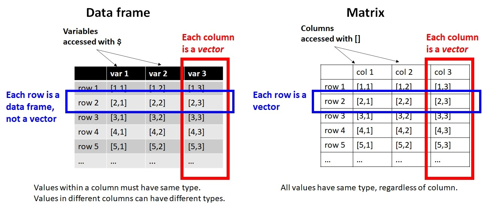

# Introductory statistics with R {#sec-review}

In this module, we will review some basic statistical methods that are usually covered introductory statistics or biostatistics course.
These tests are classics for a reason: they are powerful and
collectively can be applied to many situations. However, as we shall
see, these tests have a lot of assumptions and conditions that must be
met in order to use them...and those conditions are not always easy to
meet.

First, we'll review the basics of how biological data are stored, then
what a frequentist statistical test really is--including what *P*-values
are and what they represent. Then we'll review the classic frequentist
tests in 4 categories:

1. Tests for differences in mean or location.
2. Tests for patterns in continuous data.
3. Tests for proportions and contingency (aka: tests for independence)
4. Classification.

Most biological problems fall into one of those four categories. Most
introductory statistical courses cover the first 3 categories pretty
well. Classification can be more complicated. When your problem does
not, you’ll need to move on to one of the more advanced analyses we’ll
cover later this semester.

## Datasets and variables {#sec-review-data}

When biologists collect data in an experiment, they create a
**dataset**. This often takes the form of a table. Different software
packages may refer to this as a spreadsheet, data frame, or matrix.
Whatever you call them, a typical biological dataset usually looks like
this:

{fig-alt: "Structure of a typical biological dataset. Observations are stored on rows, and variables that describe those observations are stored in columns. All information about an observation is contained in 1 row. All observations of one variable are contained in 1 column."}

- Each row of the dataset is called an **observation**, or sometimes    **record**. Each entity about which data is collected corresponds to    1 row of the dataset. For example, the dataset for a study of limb    morphology in bats might have one row for each species.
  - If someone asks what your "sample size" or "number of samples" is, the answer is likely the number of rows in your dataset (minus any blanks or missing values, of course).
- Each column is called a **variable**, or sometimes a **feature**.
  - Each variable contains 1 and [***only***]{.underline} 1 kind of value. For example, a cell entry like “12.2 cm” is not legitimate, because it contains 2 kinds of values: a measurement (12.2) and a unit (cm). If the units need to be recorded, they should be in a separate column.

In R, datasets are almost always stored as objects called **data
frames**. Data frames have rows and columns, and function a bit like a
spreadsheet. Unlike a **matrix**, rows and columns are not
interchangeable: a row of a data frame is a data frame with 1 row, while
a column is really a vector (i.e., not a data frame).

{fig-alt: ""}

Variables in a dataset come in three varieties. Understanding these is
crucial to being able to think about the structure of your dataset and
what kind of statistical test you need.

-   **Response:** outcomes that you want to explain or predict using
    other variables. AKA: dependent variables.
-   **Predictor:** variables that are used to model, or predict,
    response variables. AKA: independent or explanatory variables.
-   **Key:** values which are used to relate 2 or more data tables to each
    other. Fundamental in database design.

In this course, every analysis will have have at least 1 response
variable and at least 1 predictor variable. Understanding the nature of
your response variable and predictor variable(s) is key to choosing an
appropriate analysis.

Variables can be either **categorical** or **numeric**:

- **Categorical:** defines group membership; can be encoded as numbers, dummy values, or text. Also called **qualitative** variables. E.g., "control" vs. "treated", "group 1" vs. "group 2", "herbivore" vs. "carnivore", and so on.
- **Numeric**: numbers. Also called **quantitative** variables. E.g., 1, 2, 3, and so on.

When categorical variables are used as explanatory variables, they are
called **factors**. Each unique value of a factor is called a **level**.
For example, the factor "treatment" might have two levels, "control" and
"exposed". Or, the factor "diet" might have 3 levels: "herbivore",
"omnivore", and "carnivore".

Numeric variables can be **continuous** or **discrete**:

- **Continuous** variables can take on any real value within their domain. Just because a value is rounded off to integers, does not mean they are not continuous. For example, if mice are weighed on a scale with precision of 1 g, then all measured weights will be postive whole numbers. These should be treated as continuous in the analysis.
- **Discrete** variables can take on only integer values, and in most cases only positive or non-negative integers. Counts are a common example of a discrete value.

Some kinds of numeric variables need to be treated with care, because
they have a particular domain and set of possible values. Most of these
should probably not be modeled (i.e., treated as the response variable)
using the basic statistical methods in this module. We'll explore models
in [Module 18](@sec-glm1) for these variables.

| Type of data | Domain | How to model |
|---|---|---|
| Counts | Non-negative integers | GLM or GLMM |
| Proportions | The closed interval $[0,1]$, or possibly the open interval $(0,1)$ depending on the context | GLM or GLMM; possibly a $\chi^2$ test or other test for independence |
| Measurements (mass, length, volume, etc.) | Positive real numbers for dimensions; real values for temperature (except Kelvin) | Linear model; transformation or an appropriate GLM/GLMM if needed |
| Censored or truncated data | Usually real numbers with a well-defined upper or lower limit, often related to limits of detection or measurement | Special methods such as Tobit models (beyond the scope of this course...for now) |
| Categorical outcomes | One of a set of possible categories. Categories may be binary, ordered, or unordered. Although often coded as numbers, they should not generally be treated as numerical measurements | Logistic, ordinal, or multinomial regression; GLMMs for non-independent observations; classification trees (CART) |

## Frequentist statistics {#sec-review-freq}

Classical statistics, such as those taught in introductory statistics or
biostatistics courses, are also **frequentist** statistics. This means
that these methods rely on probability distributions (also called
frequency distributions) of derived values called **test statistics**,
and make assumptions about the applicability of those test statistics.
These assumptions can be quite strong, and possibly restrictive, so you
need to be careful when using frequentist tests.

**If your data do not meet the assumptions of a test, the test might be
invalid.**

The basic procedure of any frequentist test is as follows:

1.  Collect data.
2.  Calculate a summary of the effect size (aka: quantity of interest,
    such as difference in means between groups), which scales the effect
    size by other considerations such as sample size or variability.
    This summary is the **test statistic**.
3.  Compare the test statistic to the distribution of test statistics
    expected given the sample size and assuming a true effect size of 0.
    The probability of a test statistic that extreme given a true effect
    size of 0 is the ***p*****-value**.
4.  If the value of the test statistic is rare enough (i.e., the
    *p*-value is small enough), assume that it was not that large due to
    chance alone, and reject the null hypothesis of no effect. I.e.,
    declare a "significant" test result.

Frequentist tests vary wildly in their assumptions, the nature of their
test statistics, and so on, but the procedure above describes most of
them.

Another way to think of frequentist statistics is the problem of distinguishing **signal** from **noise**. The biological patterns we want to discover are the signal. Everything else that we measure that is influenced by random variation in the subject or the environment or the measurement process is the noise. Humans are very good at [detecting patterns in noise](https://en.wikipedia.org/wiki/Pareidolia), even if there isn't one.

A real biological pattern should be reliably produce a signal that we can detect. Noise, on the other hand, can produced apparent signals but not reliably or repeatedly. Frequentist statistics is a formalized way of asking the question "How likely is it that this pattern is due to noise?". If the answer is a sufficiently low probability, then the inference is that the pattern is a signal.

### *p*-values and NHST {#mod-09-pvalues}

When scientists design experiments, they are testing one or more
**hypotheses**: proposed explanations for a phenomenon. Contrary to
popular belief, the statistical analysis of experimental results usually
does not test a researcher’s hypotheses directly. Instead, statistical
analysis of experimental results focuses on comparing experimental
results to the results that might have occurred if there was no effect
of the factor under investigation. This paradigm is called **null
hypothesis significance testing (NHST)** and, for better or worse, is
the bedrock of modern scientific inference.

In other words, traditional statistics sets up the following:

-   **Null hypothesis ($H_0$):** default assumption that some effect
    (or quantity, or relationship, etc.) is zero and does not affect the
    experimental results

-   **Alternative hypothesis ($H_a$ or $H_1$):** assumption that the
    null hypothesis is false. Usually this is the researcher’s
    scientific hypothesis, or proposed explanation for a phenomenon.

In (slightly) more concrete terms, if researchers want to test the
hypothesis that some factor X has an effect on measurement Y, then they
would run an experiment comparing observations of Y across different
values of X. They would then have the following set up:

-   **Null hypothesis:** Factor X does not affect Y.

-   **Alternative hypothesis:** Factor X affects Y.

Notice that alternative hypothesis is the **logical negation** of the
null hypothesis, not a statement about another variable (e.g., “Factor Z
affects Y”). This is an easy mistake to make and one of the weaknesses
of NHST: the word “hypothesis” in the phrase “null hypothesis” is not
being used in the sense that scientists usually use it. This unfortunate
choice of vocabulary is responsible for generations of confusion among
researchers and statistics learners.

In order to test an “alternative hypothesis”, what researchers usually
do is estimate how likely the data would be if the null hypothesis were
true. If a pattern seen in the data is highly unlikely, this is taken as
evidence that the null hypothesis should be rejected in favor of the
alternative hypothesis. This is not the same as “accepting” or “proving”
the alternative hypothesis. Instead, we “reject” the null hypothesis. In
the other case, we do not “accept” the null hypothesis, we “fail to
reject” it.

The null hypothesis is usually translated to a prediction like one of
the following:

-   The mean of Y is the same for all levels of X.

-   The mean of Y does not differ between observations exposed to X and
    observations not exposed to X.

-   Outcome Y is equally likely to occur when X occurs as it is when X
    does not occur.

-   Rank order of Y values does not differ between levels of X.

All of these predictions have something in common: **Y is independent of
X**. That’s what the null hypothesis means. To test the predictions of
the null hypothesis, we need a way to calculate what the data might have
looked like if the null hypothesis was correct. Once we calculate that,
we can compare the data to those calculations to see how “unlikely” the
actual data were. Data that are sufficiently unlikely under the
assumption that the null hypothesis is correct—a “significant
difference”—are a kind of evidence that the null hypothesis is false.

Most classical statistical tests calculate a summary statistic called a
***p*****-value** to estimate how likely some observed pattern in the
data would be if the null hypothesis was true. This is the value that
researchers often use to make inferences about their data. The *p*-value
depends on many factors, as we’ll see, but the most important are:

-   The magnitude of some **test statistic**: a summary of the pattern
    of interest.
-   Sample size, usually expressed as degrees of freedom (DF)
-   The variability of the data
-   The consistency, sign, and magnitude of the observed pattern

When I teach statistics to biology majors, I try to avoid the terms
“null hypothesis” and “alternative hypothesis” at first, because most of
my students find them confusing. Instead, I instruct students to ask two
questions about a hypothesis:

1.  What should we observe if the hypothesis is not true?

2.  What should we observe if the hypothesis is true?

In order to be scientific hypothesis, both of those questions have to be
answerable. Otherwise, we have no way of distinguishing between a
situation where a hypothesis is supported, or a situation where it is
not, because experimental results could always be due to random chance
(even if the probability of that is very small). All we can really do is
estimate how likely it is that random chance drove the outcome.

When interpreting *p*-values, there are ***3 extremely important things
to remember***:

1.  When $p<0.05$, the hypothesis is “supported”. When $p\ge0.05$,
    the hypothesis is “not supported”. Notice that the terms are
    “supported” or “not supported”. Words like “proven” or “disproven”
    are not appropriate when discussing *p*-values.

2.  The *p*-value is ***not*** the probability that your
    hypothesis is false, or the probability that a hypothesis is true.
    It is a heuristic for assessing how well data support or do not
    support a hypothesis.

3.  *p*-values depend on many factors, including sample size, effect
    size, variation in the data, and how well the data fit the
    assumptions of the statistical test used to calculate the *p*-value.
    This means that *p*-values should not be taken at face value and
    ***never*** used as the sole criterion by which a
    hypothesis is accepted or rejected.

When a statistical test returns a *p*-value less than 0.05, we say that the
results are “statistically significant” and we "reject the null hypothesis". For example, a “statistically significant difference” in means between two groups, or a “statistically significant correlation” between two numeric variables.

When a statistical test returns a *p*-value of 0.05 or greater, we say that the test (or difference, or whatever) is "not statistically significant" and we "fail to reject the null hypothesis". Notice that we do not "accept the null hypothesis"--that would require a different kind of analysis.

## Alternatives to frequentist statistics {#sec-review-alt}

### Information-theoretic methods {#sec-review-alt-it}

### Bayesian inference {#sec-review-alt-bayes}

## Linear models {#sec-review-lin}

### What is "linear"? {#sec-review-lin-def}

### Linear models and sums of squares {#sec-review-lin-ss}

### Analysis of variance (ANOVA) {#sec-review-lin-anova}

The term **analysis of variance (ANOVA)** is used in two related ways. In introductory statistics, ANOVA usually refers to a linear model used to compare means among groups, such as comparing mean body mass among three species of frog. If someone says something like, "we compared the treatments using ANOVA", this is the sense they mean. We will explore this sense of ANOVA in @sec-groups-more-anova.

More generally, ANOVA refers to a framework for evaluating how variation is attributed to different components of a statistical model. This is called "partitioning the variance" or "partitioning sums of squares". For example, an ANOVA table can be used to test a linear regression even when the predictor is continuous and there are no groups to compare. The function of ANOVA in that case is to determine how much variation is explained by the different predictors--be they continuous or factors--in the model and how much variation is left over (residual). We will explore this sense of ANOVA in @sec-groups-more-anova-table.

This broader usage is reflected in R's `anova()` function, which can be applied to many kinds of models. For ordinary linear models, ANOVA tests are based on partitioning sums of squares. For generalized linear models, analogous tests are commonly based on changes in **deviance** rather than sums of squares. Deviance is a generalization of variance (which is calculated from sums of squares), so sums of squares are a special case of deviance. This reflects the fact that linear models based on sums of squares are a special case of generalized linear models (@sec-).