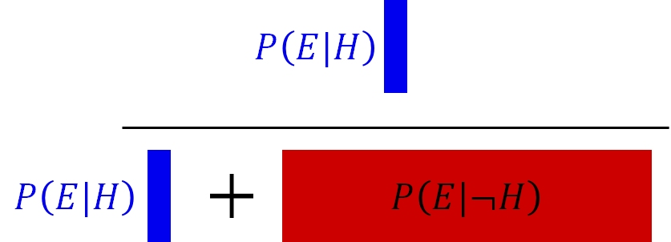

# Introductory statistics with R {#sec-review}

In this module, we will review some basic statistical methods that are usually covered introductory statistics or biostatistics course.
These tests are classics for a reason: they are powerful and
collectively can be applied to many situations. However, as we shall
see, these tests have a lot of assumptions and conditions that must be
met in order to use them...and those conditions are not always easy to
meet.

First, we'll review the basics of how biological data are stored, then
what a frequentist statistical test really is--including what *P*-values
are and what they represent. Then we'll review the classic frequentist
tests in 4 categories:

1. Tests for differences in mean or location.
2. Tests for patterns in continuous data.
3. Tests for proportions and contingency (aka: tests for independence)
4. Classification.

Most biological problems fall into one of those four categories. Most
introductory statistical courses cover the first 3 categories pretty
well. Classification can be more complicated. When your problem does
not, you’ll need to move on to one of the more advanced analyses we’ll
cover later this semester.

## Datasets and variables {#sec-review-data}

When biologists collect data in an experiment, they create a
**dataset**. This often takes the form of a table. Different software
packages may refer to this as a spreadsheet, data frame, or matrix.
Whatever you call them, a typical biological dataset usually looks like
this:

{fig-alt: "Structure of a typical biological dataset. Observations are stored on rows, and variables that describe those observations are stored in columns. All information about an observation is contained in 1 row. All observations of one variable are contained in 1 column."}

- Each row of the dataset is called an **observation**, or sometimes    **record**. Each entity about which data is collected corresponds to    1 row of the dataset. For example, the dataset for a study of limb    morphology in bats might have one row for each species.
  - If someone asks what your "sample size" or "number of samples" is, the answer is likely the number of rows in your dataset (minus any blanks or missing values, of course).
- Each column is called a **variable**, or sometimes a **feature**.
  - Each variable contains 1 and [***only***]{.underline} 1 kind of value. For example, a cell entry like “12.2 cm” is not legitimate, because it contains 2 kinds of values: a measurement (12.2) and a unit (cm). If the units need to be recorded, they should be in a separate column.

In R, datasets are almost always stored as objects called **data
frames**. Data frames have rows and columns, and function a bit like a
spreadsheet. Unlike a **matrix**, rows and columns are not
interchangeable: a row of a data frame is a data frame with 1 row, while
a column is really a vector (i.e., not a data frame).

{fig-alt: ""}

Variables in a dataset come in three varieties. Understanding these is
crucial to being able to think about the structure of your dataset and
what kind of statistical test you need.

-   **Response:** outcomes that you want to explain or predict using
    other variables. AKA: dependent variables.
-   **Predictor:** variables that are used to model, or predict,
    response variables. AKA: independent or explanatory variables.
-   **Key:** values which are used to relate 2 or more data tables to each
    other. Fundamental in database design.

In this course, every analysis will have have at least 1 response
variable and at least 1 predictor variable. Understanding the nature of
your response variable and predictor variable(s) is key to choosing an
appropriate analysis.

Variables can be either **categorical** or **numeric**:

- **Categorical:** defines group membership; can be encoded as numbers, dummy values, or text. Also called **qualitative** variables. E.g., "control" vs. "treated", "group 1" vs. "group 2", "herbivore" vs. "carnivore", and so on.
- **Numeric**: numbers. Also called **quantitative** variables. E.g., 1, 2, 3, and so on.

When categorical variables are used as explanatory variables, they are
called **factors**. Each unique value of a factor is called a **level**.
For example, the factor "treatment" might have two levels, "control" and
"exposed". Or, the factor "diet" might have 3 levels: "herbivore",
"omnivore", and "carnivore".

Numeric variables can be **continuous** or **discrete**:

- **Continuous** variables can take on any real value within their domain. Just because a value is rounded off to integers, does not mean they are not continuous. For example, if mice are weighed on a scale with precision of 1 g, then all measured weights will be postive whole numbers. These should be treated as continuous in the analysis.
- **Discrete** variables can take on only integer values, and in most cases only positive or non-negative integers. Counts are a common example of a discrete value.

Some kinds of numeric variables need to be treated with care, because
they have a particular domain and set of possible values. Most of these
should probably not be modeled (i.e., treated as the response variable)
using the basic statistical methods in this module. We'll explore models
in [Module 18](@sec-glm1) for these variables.

| Type of data | Domain | How to model |
|---|---|---|
| Counts | Non-negative integers | GLM or GLMM |
| Proportions | The closed interval $[0,1]$, or possibly the open interval $(0,1)$ depending on the context | GLM or GLMM; possibly a $\chi^2$ test or other test for independence |
| Measurements (mass, length, volume, etc.) | Positive real numbers for dimensions; real values for temperature (except Kelvin) | Linear model; transformation or an appropriate GLM/GLMM if needed |
| Censored or truncated data | Usually real numbers with a well-defined upper or lower limit, often related to limits of detection or measurement | Special methods such as Tobit models (beyond the scope of this course...for now) |
| Categorical outcomes | One of a set of possible categories. Categories may be binary, ordered, or unordered. Although often coded as numbers, they should not generally be treated as numerical measurements | Logistic, ordinal, or multinomial regression; GLMMs for non-independent observations; classification trees (CART) |

## Frequentist statistics {#sec-review-freq}

Classical statistics, such as those taught in introductory statistics or
biostatistics courses, are also **frequentist** statistics. This means
that these methods rely on probability distributions (also called
frequency distributions) of derived values called **test statistics**,
and make assumptions about the applicability of those test statistics.
These assumptions can be quite strong, and possibly restrictive, so you
need to be careful when using frequentist tests.

**If your data do not meet the assumptions of a test, the test might be
invalid.**

The basic procedure of any frequentist test is as follows:

1.  Collect data.
2.  Calculate a summary of the effect size (aka: quantity of interest,
    such as difference in means between groups), which scales the effect
    size by other considerations such as sample size or variability.
    This summary is the **test statistic**.
3.  Compare the test statistic to the distribution of test statistics
    expected given the sample size and assuming a true effect size of 0.
    The probability of a test statistic that extreme given a true effect
    size of 0 is the ***p*****-value**.
4.  If the value of the test statistic is rare enough (i.e., the
    *p*-value is small enough), assume that it was not that large due to
    chance alone, and reject the null hypothesis of no effect. I.e.,
    declare a "significant" test result.

Frequentist tests vary widely in their assumptions, the nature of their
test statistics, and so on, but the procedure above describes most of
them.

Another way to think of frequentist statistics is the problem of distinguishing **signal** from **noise**. The biological patterns we want to discover are the signal. Everything else that we measure that is influenced by random variation in the subject or the environment or the measurement process is the noise. Humans are very good at [detecting patterns in noise](https://en.wikipedia.org/wiki/Pareidolia), even if there isn't one.

A real biological pattern should be reliably produce a signal that we can detect. Noise, on the other hand, can produced apparent signals but not reliably or repeatedly. Frequentist statistics is a formalized way of asking the question "How likely is it that this pattern is due to noise?". If the answer is a sufficiently low probability, then the inference is that the pattern is a signal.

### *p*-values and NHST {#mod-09-pvalues}

When scientists design experiments, they are testing one or more
**hypotheses**: proposed explanations for a phenomenon. Contrary to
popular belief, the statistical analysis of experimental results usually
does not test a researcher’s hypotheses directly. Instead, statistical
analysis of experimental results focuses on comparing experimental
results to the results that might have occurred if there was no effect
of the factor under investigation. This paradigm is called **null
hypothesis significance testing (NHST)** and, for better or worse, is
the bedrock of modern scientific inference.

In other words, traditional statistics sets up the following:

-   **Null hypothesis ($H_0$):** default assumption that some effect
    (or quantity, or relationship, etc.) is zero and does not affect the
    experimental results

-   **Alternative hypothesis ($H_a$ or $H_1$):** assumption that the
    null hypothesis is false. Usually this is the researcher’s
    scientific hypothesis, or proposed explanation for a phenomenon.

In (slightly) more concrete terms, if researchers want to test the
hypothesis that some factor X has an effect on measurement Y, then they
would run an experiment comparing observations of Y across different
values of X. They would then have the following set up:

-   **Null hypothesis:** Factor X does not affect Y.

-   **Alternative hypothesis:** Factor X affects Y.

Notice that alternative hypothesis is the **logical negation** of the
null hypothesis, not a statement about another variable (e.g., “Factor Z
affects Y”). This is an easy mistake to make and one of the weaknesses
of NHST: the word “hypothesis” in the phrase “null hypothesis” is not
being used in the sense that scientists usually use it. This unfortunate
choice of vocabulary is responsible for generations of confusion among
researchers and statistics learners.

In order to test an “alternative hypothesis”, what researchers usually
do is estimate how likely the data would be if the null hypothesis were
true. If a pattern seen in the data is highly unlikely, this is taken as
evidence that the null hypothesis should be rejected in favor of the
alternative hypothesis. This is not the same as “accepting” or “proving”
the alternative hypothesis. Instead, we “reject” the null hypothesis. In
the other case, we do not “accept” the null hypothesis, we “fail to
reject” it.

The null hypothesis is usually translated to a prediction like one of
the following:

-   The mean of Y is the same for all levels of X.

-   The mean of Y does not differ between observations exposed to X and
    observations not exposed to X.

-   Outcome Y is equally likely to occur when X occurs as it is when X
    does not occur.

-   Rank order of Y values does not differ between levels of X.

All of these predictions have something in common: **Y is independent of
X**. That’s what the null hypothesis means. To test the predictions of
the null hypothesis, we need a way to calculate what the data might have
looked like if the null hypothesis was correct. Once we calculate that,
we can compare the data to those calculations to see how “unlikely” the
actual data were. Data that are sufficiently unlikely under the
assumption that the null hypothesis is correct—a “significant
difference”—are a kind of evidence that the null hypothesis is false.

Most classical statistical tests calculate a summary statistic called a
***p*****-value** to estimate how likely some observed pattern in the
data would be if the null hypothesis was true. This is the value that
researchers often use to make inferences about their data. The *p*-value
depends on many factors, as we’ll see, but the most important are:

-   The magnitude of some **test statistic**: a summary of the pattern
    of interest.
-   Sample size, usually expressed as degrees of freedom (DF)
-   The variability of the data
-   The consistency, sign, and magnitude of the observed pattern

When I teach statistics to biology majors, I try to avoid the terms
“null hypothesis” and “alternative hypothesis” at first, because most of
my students find them confusing. Instead, I instruct students to ask two
questions about a hypothesis:

1.  What should we observe if the hypothesis is not true?

2.  What should we observe if the hypothesis is true?

In order to be scientific hypothesis, both of those questions have to be
answerable. Otherwise, we have no way of distinguishing between a
situation where a hypothesis is supported, or a situation where it is
not, because experimental results could always be due to random chance
(even if the probability of that is very small). All we can really do is
estimate how likely it is that random chance drove the outcome.

When interpreting *p*-values, there are ***3 extremely important things
to remember***:

1.  When $p<0.05$, the hypothesis is “supported”. When $p\ge0.05$,
    the hypothesis is “not supported”. Notice that the terms are
    “supported” or “not supported”. Words like “proven” or “disproven”
    are not appropriate when discussing *p*-values.

2.  The *p*-value is ***not*** the probability that your
    hypothesis is false, or the probability that a hypothesis is true.
    It is a heuristic for assessing how well data support or do not
    support a hypothesis.

3.  *p*-values depend on many factors, including sample size, effect
    size, variation in the data, and how well the data fit the
    assumptions of the statistical test used to calculate the *p*-value.
    This means that *p*-values should not be taken at face value and
    ***never*** used as the sole criterion by which a
    hypothesis is accepted or rejected.

When a statistical test returns a *p*-value less than 0.05, we say that the
results are “statistically significant” and we "reject the null hypothesis". For example, a “statistically significant difference” in means between two groups, or a “statistically significant correlation” between two numeric variables.

When a statistical test returns a *p*-value of 0.05 or greater, we say that the test (or difference, or whatever) is "not statistically significant" and we "fail to reject the null hypothesis". Notice that we do not "accept the null hypothesis"--that would require a different kind of analysis.

## Alternatives to frequentist statistics {#sec-review-alt}

### Information-theoretic methods {#sec-review-alt-it}

One of the main alternatives to NHST is information-theoretic (IT) modeling. IT methods borrow insights from information theory to draw conclusions about the extent to which statistical models describe data [@burnham2002]. Rather than evaluating individual hypotheses primarily using *p*-values, IT methods can be used to compare different models in terms of how much information is expected to be lost by using each model to represent the underlying process [@hobbs2006]. In other words, whereas NHST often asks whether particular effects are supported by the data, IT methods emphasize comparing the relative support for entire models.

There are several information criteria in use, but many balance two components: one representing how well the model fits the observed data, based on its likelihood, and another that penalizes the model for complexity (i.e., number of parameters). These information criteria are used to compare models to each other, not to determine whether any particular model is "significant" or whether any of its terms are significant. The complexity penalty is important because adding parameters will generally improve, or at least not worsen, the fit of a model to the observed data, even when those additional parameters have little value for describing the underlying process. Without such a penalty, model selection would therefore tend to favor overly complex models...a phenomenon called **overfitting**.

The most common information criterion is Akaike's Information Criterion ($AIC$) [@burnham2002]:

$$AIC=-2\log{\left(\hat{L}\right)+2K}$$

where $\hat{L}$ is the maximum value of the likelihood function and $K$ is the number of estimated parameters in the model (e.g., slopes and intercepts). Lower values of AIC indicate a better balance between model fit and model complexity. The multiplier of 2 on the $K$ term is the penalty for complexity (i.e., adding additional parameters). This makes adding another parameter supported only if it improves the likelihood enough to overcome the penalty.

Other information criteria exist, such as the $AIC$ corrected for small sample sizes, $AIC_C$:

$${AIC}_C=AIC+\frac{2K\left(K+1\right)}{n-K-1}$$

Where $n$ is the number of observations used to fit the model. The correction becomes smaller as smaple size increases relative to the number of parameters, so $AIC_C$ converges toward $AIC$ as sample size increases.  Exactly what constitutes a "small" sample size is subjective, but @burnham2002 suggest that $AIC_C$ should be used when $n/K<40$.

Many other information criteria exist, such as $QAIC$ and $QAIC_C$ for use when overdispersion in suspected [@lebreton1992], Bayesian information criterion (*BIC*) which has a stronger complexity penalty; and deviance information criterion (*DIC*) which is often used in Bayesian inference.

#### Likelihood?

Before we jump into an example IT data analysis, we also need to understand the concept of the **likelihood function**. A likelihood function describes how well different possible parameter values are supported by the observed data under a particular statistical model. A statistical model specifies the mathematical relationships among variables and the probability distribution of the observations; examples include a linear regression model or a Poisson GLM.

In symbols, we can write the likelihood function as:

$$\mathcal{L}\left(\theta|x\right)$$

where $x$ represents the observed data and $\theta$ represents one or more unobserved parameters. For the data we actually observed, the likelihood function asks: which possible values of $\theta$ would make these data more or less plausible?

Importantly, likelihood is ***not*** the probability that a particular parameter value or model is correct. Although $\mathcal{L}\left(\theta|x\right)$ is written with the parameters to the left of the vertical bar, it is based on the probability of the data given the parameters, $p\left(x|\theta\right)$, not the probability of the parameters given the data, $p\left(\theta|x\right)$. The latter is a Bayesian posterior probability (see @sec-review-alt-bayes).

The takeaway is that probability askes about data when the model is known, while likelihood asks about parameter values after the data have been observed.

Likelihoods are most famously used in modern data analysis as **maximum likelihood explanation (MLE)**. This procedure attempts to estimate the parameters of a model most likely to produce the observed data. 

Here's a quick example: imagine you have measured 5 squirrel femurs and found lengths of 63.6, 66.5, 64.2, 67.6, and 68.3 mm, yielding an observed sample mean and SD of $66.0\pm2.1$ mm. What estimate of the population mean $\mu$ that makes this set of measurements most plausible?

```{r}
a <- c(63.6, 66.5, 64.2, 67.6, 68.3)
mean(a)
```

```{r}
sd(a)
```

Consider 3 candidates for $\mu$: 64, 66, and 68. For any proposed value of $\mu$, `dnorm()` tells us the probability density of observing each femur length under a normal distribution with that mean:

```{r}
samp.sd <- 2.1
dnorm(a, mean=64, sd=samp.sd)
```

```{r}
dnorm(a, mean=66, sd=samp.sd)
```

```{r}
dnorm(a, mean=68, sd=samp.sd)
```

Because we observed more than 1 measurement, and assume that they are independent, the joint likelihood is the product of their densities:

```{r}
prod(dnorm(a, mean=64, sd=samp.sd))
```
```{r}
prod(dnorm(a, mean=66, sd=samp.sd))
```
```{r}
prod(dnorm(a, mean=68, sd=samp.sd))
```

It looks like 66 has the greatest joint likelihood across all observed data. But we can get a fuller picture if we test more values:

```{r}
#| fig.width: 8
#| fig.height: 7

# series of possible mu to test
test.mu <- seq(60, 72, by=0.01)

# number of possible mu
n <- length(test.mu)

# set up vector to hold likelihood
# function of each candidate mu
lik <- numeric(n)

# calculate likelihoods of mu's in a loop
for(i in 1:n){lik[i] <- prod(dnorm(a, test.mu[i], sd=samp.sd))}#i

# now plot the likelihood function vs. mu
plot(test.mu, lik, type="l", lwd=3,
     xlab=expression(mu),
     ylab="Likelihood")
abline(v=mean(a), lwd=2, lty=2, col="red")
text(66.2, 0.5e-5, expression(bar(x)==66.04), adj=0, col="red")
abline(h=lik[which.max(lik)], lty=2, lwd=2, col="blue")
text(67.5, 3.4e-5, expression(hat(mu)==66.04), adj=0, col="blue")
```

In this case, the sample mean $\bar{x}=66.04$ (`mean(a)`) is the same as the $\mu$ value that maximized the joint likelihood of the 5 observed values, $\hat{\mu}=66.04$ (`test.mu[which.max(lik)]`). But, the code above only worked because we held the SD to be known and the same as the sample SD. If we didn't, we would have to search over a range of possible SD values, and find the combination of $\hat{\mu}$ and $\hat{\sigma}$ that maximized the likelihood. In that case, the profile of likelihoods would have been a surface, not a line. The maximum likelihood estimates for something like a linear regression model, or a Poisson GLM, are found by similar procedure, only with multiple parameters making the profiling much more complicated.

### Bayesian inference {#sec-review-alt-bayes}

**Bayesian inference** is a framework for evaluating evidence and *updating beliefs based on evidence*. When conducting Bayesian inference, researchers start with some initial idea about their model system: a **prior**. They then collect evidence (data), and update their idea based on the evidence. The updated idea is called the **posterior**.

- When the prior is strong, or the evidence weak, their ideas will not be updated much and the posterior will be strongly influenced by the prior.
- When the evidence is strong, or the prior weak, the posterior will be updated more and thus less influenced by the prior.

Some researchers prefer to use naïve or uninformative priors, so that their conclusions are influenced mostly by the evidence. Bayesian statistical methods will return essentially the same parameter estimates (e.g., differences in means or slopes) as other methods when uninformative priors are used. This means that almost any traditional statistical analysis can be replaced with an equivalent Bayesian one. The statistical models that are fit, such as linear regression or ANOVA, are the same. All that really changes is how the researcher interprets the relationship between the model and the data. 

In frequentist inference, researchers consider parameters like slopes, intercepts, effect sizes, etc., as fixed, unknown parameters and consider the data to occur stochastically following probability distributions. Bayesian inference flips that script, treating the data as fixed, and assuming that the model parameters are unknown quantities following probability distributions.

Bayesian inference depends on **Bayes' theorem**:

$$p\left(H|E\right)=\frac{P\left(E|H\right)P\left(H\right)}{P\left(H\right)P\left(E|H\right)+P\left(\lnot H\right)P\left(E|\lnot H\right)}=\frac{P\left(E|H\right)P\left(H\right)}{P\left(E\right)}$$

where

-   $H$ is a hypothesis that can be true or false
-   $p\left(H\right)$ is the prior, an estimate of the probability of the hypothesis being true before any new data ($E$) are observed
-   $E$ is evidence, specifically new data used to update the prior
-   $p\left(H|E\right)$ is the probability of $H$ given $E$. I.e., the probability of the hypothesis being true after new evidence is observed. This is also called the **posterior probability**.
-   $p\left(E\right)$ is the probability of $E$ regardless of $H$. I.e., the probability of observing the evidence whether or not the hypothesis is true. $p\left(E\right)$ is called the **marginal likelihood**.
-   $p\left(E|H\right)$ is the probability of observing the evidence $E$ given $H$. I.e., the probability of observing the evidence if the hypothesis is true. $p\left(E|H\right)$ is also called the **likelihood**.

Bayes' theorem is powerful because it is very general. The precise nature of $E$ and $H$ do not matter. All that matters is that one could sensibly define an experiment or set of observations in which $E$* might depend on $H$ and vice versa.

Bayesian inference is attractive to many biologists because it mimics the way that scientists actually think: starting with one idea (a prior), collecting evidence, then updating that idea (posterior). Part of the Bayesian calculation is $p\left(H|E\right)$, or the probability of the hypothesis being true given the evidence that is observed. Contrast this with the frequentist *p*-value, which is $p\left(E|\lnot H\right)$. Most people instinctively want the first, but have to settle with the almost backwards logic of the *p*-value.

Here is a quick example of Bayesian reasoning. Imagine you go to the doctor and get tested for a rare condition, [Niemann-Pick disease](https://medlineplus.gov/genetics/condition/niemann-pick-disease/). Your doctor tells you that this disease affects about 1 in 250000 people. Unfortunately, you test positive. But, the doctor tells you not to worry because the test is only 99% reliable. Why is the doctor so sanguine, and what is the probability that you have Niemann-Pick disease?

The probability of having this disease can be estimated using Bayes' theorem. First, use what you know to assemble the terms:

- The overall incidence is 1 in 250000 people, or 0.0004%. So, the prior probability $P\left(H\right)$ is 0.000004.
- The probability of a positive test given that you have the disease, $P\left(E|H\right)$, is 0.99 because the test is 99% reliable.
- The denominator, $P\left(E\right)$, is the unconditional probability of a positive test.

The denominator includes two possibilities: either a positive test when someone has the disease, or a positive test when someone doesn't have the disease. That is, the probability of a true positive *or* a false positive. This can be calculated as:

$$p\left(H\right)\left(E|H\right)+p\left(\lnot H\right)p\left(E|\lnot H\right)$$.

The first term is the probability of a true positive ($p\left(E|H\right)$) scaled by the probability of having the disease ($p\left(H\right)$). The second is the probability of a false positive ($p\left(E|\lnot H\right)$) scaled by the probability of not having the disease ($p\left(\lnot H\right)$). We can simplify a bit by reasoning that $p\left(\lnot H\right)$ is really $1-p\left(H\right)$.

Plug every thing into Bayes' rule:

$$p\left(H|E\right)=\frac{P\left(E|H\right)P\left(H\right)}{P\left(H\right)P\left(E|H\right)+\left(1-P\left(H\right)\right)P\left(E|\lnot H\right)}=p\left(H|E\right)=\frac{\left(0.99\right)\left(0.000004\right)}{\left(0.000004\right)\left(0.99\right)+\left(0.999996\right)\left(0.01\right)}$$
and simplify:

$$p\left(H|E\right)=\frac{0.00000396}{0.01000392}=0.000396$$

That's not very worrying! In this example, the test evidence can't overcome the fact that the disease is so rare. In other words, even among people who get a positive test, it's far more likely that you don't have the disease but got a false positive than that you have the disease and got a true positive. This is an example of a very strong prior being more influential than the evidence.

There's an issue with this calculation, though. The prior probability of 0.000004 was based on the assumption that the test was conducted on a random person from the population. Do physicians conduct tests for vanishingly rare diseases on random people? Of course not. Maybe this physician only orders this test if they think that there is a 10% chance that you really have the disease. This might be because, in their experience, 10% of people with your symptoms turn out to have the disease. In that case, the calculation becomes:

$$\left(H|E\right)=\frac{\left(0.99\right)\left(0.1\right)}{\left(0.1\right)\left(0.99\right)+\left(0.9\right)\left(0.01\right)}$$

which simplifies to:

$$p\left(H|E\right)=\frac{0.099}{0.108}=0.916$$

91.6% is a lot more worrying than 0.0004%. This example shows that the prior probability can have a huge effect on the posterior probability.

One way to visualize Bayes' rule is to think of the entire probability space as occupying a square with area 1. The square has 4 sections:

{}

Notice that the prior probability $p\left(H\right)$ (the two left, blue sections) is much smaller than the probability of $\lnot H$. Bayes' rule restricts our focus to the cases where we observe the evidence--the bottom two sections. Given that the evidence was observed, the sections with $\lnot E$ are irrelevant. The calculation then becomes:

{}
Besides its epistemological neatness, another advantage of Bayesian inference in practice is that parameters in Bayesian models (e.g, slopes, intercepts, etc.) are estimated with **credible intervals (CRI)**, not **confidence intervals (CI)**. 

- A frequentist 95% confidence interval is a statement about the long run performance of a series of repeated experiments. If we repeatedly collected new samples and calculated intervals the same way, about 95% of those intervals would contain the true parameter. This is not the same as saying that there is a 95% probability that the true parameter value lies within out estimated CI.
- A Bayesian 95% credible interval is a statement about the parameter itself. Given the data, model, and prior, there is a 95% probability that the parameter lies within the interval. That is, a credible interval does what most people mistakenly think the confidence interval does!

I'm a big fan of Bayesian inference. But, I'll admit that there is a downside: Bayesian model-fitting is not available in base R, and requires specialized packages and sometimes external software. Should you go through all of this Bayesian trouble? There are a few reasons where Bayesian inference might be preferable to traditional frequentist statistics.

1. The model to be fit is very complex. Because the user can specify any model they want, they can fit any model they want.
1. Maximum-likelihood methods often require explicit derivations of model likelihoods, whereas an MCMC approach does not (MCMC, or Markov-chain Monte Carlo, is a common method for fitting Bayesian models). This means that models whose likelihoods have no closed form solution, or have computationally difficult solutions, can be estimated more easily with Bayesian methods than maximum likelihood (sometimes).
1. The researcher has prior information that they would like to incorporate into the analysis. This can reduce the amount of data needed to reach certain conclusions.
1. Maximum likelihood methods are not effective in some situations.
1. Error propagation is very easy under Bayesian inference (especially MCMC).
1. The researcher prefers the philosophy of Bayesian inference.

Bayesian inference is beyond the scope of this course, but if you're interested head on over to my course notes for [BIOL 7950: Bayesian Inference for Biologists]().

## Linear models {#sec-review-lin}

### What is "linear"? {#sec-review-lin-def}

### Linear models and sums of squares {#sec-review-lin-ss}

### Analysis of variance (ANOVA) {#sec-review-lin-anova}

The term **analysis of variance (ANOVA)** is used in two related ways. In introductory statistics, ANOVA usually refers to a linear model used to compare means among groups, such as comparing mean body mass among three species of frog. If someone says something like, "we compared the treatments using ANOVA", this is the sense they mean. We will explore this sense of ANOVA in @sec-groups-more-anova.

More generally, ANOVA refers to a framework for evaluating how variation is attributed to different components of a statistical model. This is called "partitioning the variance" or "partitioning sums of squares". For example, an ANOVA table can be used to test a linear regression even when the predictor is continuous and there are no groups to compare. The function of ANOVA in that case is to determine how much variation is explained by the different predictors--be they continuous or factors--in the model and how much variation is left over (residual). We will explore this sense of ANOVA in @sec-groups-more-anova-table.

This broader usage is reflected in R's `anova()` function, which can be applied to many kinds of models. For ordinary linear models, ANOVA tests are based on partitioning sums of squares. For generalized linear models, analogous tests are commonly based on changes in **deviance** rather than sums of squares. Deviance is a generalization of variance (which is calculated from sums of squares), so sums of squares are a special case of deviance. This reflects the fact that linear models based on sums of squares are a special case of generalized linear models (@sec-glm1).