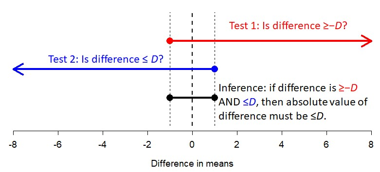

# Tests for differences in mean or location {#sec-groups}

In a test for difference in mean or location, we are interested in
whether observations differ between groups. Most of the time we are testing whether the central tendency differs between groups. A test of this kind evaluates a prediction like, "a typical value in group A is different from a typical value in group B".

Alternatively, we can test for a difference in **location**: the
relative position of random values from 2 or more groups. This is a
slightly different statement: "values in group A tend to be greater than
(or less than) values in group B". Put another way: "If we pick a random
value from group A, it will be reliably greater (or less than) than a
random value from group B". Tests for location are performed on the **rank order** of the values, not the values themselves.

When comparing groups, the data are usually best shown using a
**boxplot**, also known as a **box-and-whiskers** plot. The exact
implementation varies between software packages, but boxplots usually
show the median, interquartile range (approximately), extreme values,
and possible outliers (if any) Run the command `?boxplot.stats` to see a description of how boxplots are calculated in R.

## Tests for 1 group {#sec-groups-1samp}

When all of the values come from the same set of observations, we can
ask questions such as:

- Is the mean in this group equal to, or different from, some arbitrary value?
- Is the mean in this group greater than, or not greater than, some arbitrary value?

These questions are the domain of **one-sample tests**. The most important is the **one-sample *t*-test**, which comes in two varieties: **one-tailed** and **two-tailed**. All one-sample tests compare the mean of a set of values to some quantity (hypothetical mean) of interest, called $\mu$ (the Greek letter "mu"). In a one-tailed test, the null hypothesis is that the underlying population mean is either $\le\mu$ or $\ge\mu$. In a two-tailed test, the null hypothesis is that the population mean is equal to $\mu$.

:::{.tip}
**A note on symbology: sample vs. population parameters**

In statistics, we analyze **samples** (randomly-selected subsets of
observed entities) to make inferences about **populations** (the
hypothetical set of all possible entities which could be included in a
sample). For example, if you wanted to know how the population of a
nation of 100 million citizens felt about some political issue, it would
be time-consuming and expensive to ask each citizen what they thought.
Instead, you would sample a randomly selected set of 1000 citizens
and then assume that those results reflected the opinion of the entire
citizenry. For this assumption to work, your sample must be both random
and representative of the entire population.

Similarly, in science we cannot collect a infinite amount of data, or
measure every squirrel in the forest, or any other type of exhaustive
and comprehensive data collection. We instead take representative
samples of all the possible samples–i.e., the population–and rely on
good practices in experimental design to enable us to assume that our
sample represents the population.

The reason I bring this up here is that we need to keep in mind the
difference between sample statistics and population statistics. **Sample
statistics** are calculated from your data. **Population statistics**
are **inferred** from your data using statistical models. This is why
statistical tests are commonly referred to as **inferential
statistics**, and why simple calculations from data are referred to as
**descriptive statistics**.

The most common descriptive statistics are shown below:

| Parameter          |  Sample   |  Population  |
|--------------------|:---------:|:------------:|
| Mean               | $\bar{x}$ |    $\mu$     |
| Variance           |  $s^{2}$  | $\sigma^{2}$ |
| Standard deviation |    $s$    |   $\sigma$   |
:::


### One-sample, one-tailed *t*-test {#sec-groups-1samp-1t}

In a one-tailed one-sample test, we are interested in whether the
underlying population mean ($\mu$) of a set of values is not equal to
some value of interest...either at most some value, or at least some
value.

**Question:** Is the mean value less than OR greater than some value
$x$?

**Null hypothesis:** True mean is $=x$.

**Alternative hypothesis:** True mean is $<x$ or true mean is $>x$.

**Example use case:**Fred needs to check whether the mean measurement
error across his 12 technicians is less than 0.5 mm.

Here is an example where we simulate some data in R and run a one-tailed
one-sample *t*-test.

```{r}
# simulate some values with nominal mean 5 and sd 3
set.seed(123)
a <- rnorm(20, 5, 3)

# 1 sample 1 tailed t-test
# Example 1: Is the underlying mean <= 0?
t.test(a, alternative="greater")
```

```{r}
# Example 2: Is the underlying mean <= 4?
t.test(a, alternative="greater", mu=4)
```

Interpretation: In the example above, the researcher can reject the null
hypothesis that the true mean is $\leq4$, and conclude that the true
mean is $>4$.

```{r}
# Example 3: Is the underlying mean >= 5.5?
t.test(a, alternative="less", mu=5.5)
```

Interpretation: In example 3, the researcher cannot reject the null
hypothesis that $\mu\geq5.5$. This makes sense, because the true mean is
about $5.4\pm2.9$ (verify with `mean(a);sd(a)`).


### One-sample, two-tailed *t*-test {#sec-groups-1samp-2t}

In a two-tailed test, we are interested in whether the underlying
population mean of a set of values is **equal** to some value of
interest.

**Question:** Is the underlying true mean equal to, or different from,
some value $\mu$?

**Null hypothesis:** True mean $=\mu$.

**Alternative hypothesis:** True mean $\neq\mu$

**Example use case:** Wilma needs to test whether the mean pH of her
prepared stock solution is equal to, or different from, the target pH of
7.7.

Here is an example where we simulate some data and conduct a one-sample,
two-tailed *t*-test.

```{r}
# simulate data
set.seed(123)
a <- rnorm(20, 3, 1)

# 1 sample 2-tailed t-test:
## Example 1: mu = 0 (default)
t.test(a)
```

Interpretation: In the example above, the researcher can reject the null
that the true mean = 0, and conclude that the true mean is significantly
different from 0.

Here's another example with a different dataset and test.

```{r}
# simulate data
set.seed(123)
a <- rnorm(20, 3, 1)

# 1 sample 2-tailed t-test:
## Example 2: mu = 5
t.test(a, mu=5)
```

Interpretation: The researcher can reject the null hypothesis that the
mean = 5, and conclude that the true mean is not 5. Note that this
includes both $<5$ and $>5$ as possibilities, but the direction is obvious
from the sample mean.

## Tests for 2 groups {#sec-groups-2samp}

### Student's *t*-test (Welch) (2-tail, 2-sample) {#sec-groups-2samp-2t}

When most people say “*t*-test”, what they usually mean is a two-sample,
two-tailed *t*-test that tests for a **difference in means between two
groups**. The original version was introduced as the
**Student’s *t*-test** by William Sealy Gosset in 1908[^gosset];
modern software uses a modified version called the **Welch *t*-test**
(or sometimes the “**Welch-Satterthwaite *t*-test**”, but this is not
quite correct). The newer version is better at accounting for
non-normality and unequal variances.

[^gosset]: Gosset published his work under the pen name “Student” because his employer at the time, the Guinness Brewery, didn’t want their competitors to know that they used the *t*-test in their quality control procedures.

The test statistic, *t*, is basically the difference in sample means scaled by the variance in each group and the sample size in each group. It is calculated as:

$$
t = \frac{\bar{x}_1-\bar{x}_2}
{\sqrt{\frac{s_1^2}{n_1}+\frac{s_2^2}{n_2}}}
$$

where $\bar{x_1}$ and $\bar{x_2}$ are the sample means, $s_1^2$ and $s_2^2$ are the sample variances, and $n_1$ and $n_2$ are the sample sizes. Think through that equation...what would increasing the difference in means (the numerator) do to *t*? What about increasing one or both sample sizes? One or both sample variances?

Basically, the numerator of *t* is the quantity of interest: the difference in means between two groups. The denominator is the standard error (SE) of that estimate.

A *t* value by itself doesn't tell you much, though, because what we're interested in is how likely that *t* score is relative to the number of degrees of freedom (DF) in the dataset. While the early users would simply use *n-1* as the DF, modern *t*-statistics and *t* distributions are defined by a newer version of the degrees of freedom calculation:

$$
df =
\frac{
\left(
\frac{s_1^2}{n_1}+\frac{s_2^2}{n_2}
\right)^2
}{
\frac{\left(s_1^2/n_1\right)^2}{n_1-1}
+
\frac{\left(s_2^2/n_2\right)^2}{n_2-1}
}
$$

Say you perform a test comparing groups A and B, and the *t* statistic comes out to be 1.95. We have to compare that to the *t* distribution with the number of DF contained in the data, which might be 31.2:

```{r}
#| echo: false
#| fig.width: 8
#| fig.height: 6
x <- seq(-5, 5, by=0.01)
y <- dt(x, 31.2)
par(mar=c(5.1, 5.1, 1.1, 1.1), bty="n")
plot(x,y, type="l", lwd=3,
     ylab="Probability density", xlab="t statistic")
segments(1.95, 0, 1.95, dt(1.95, 31.2), lwd=3, col="red")
text(2.2, 0.08, expression(italic(t)==1.95), adj=0, col="red", cex=1.6)
```

The question for the hypothesis test is: in a dataset with 31.2 DF, how often should we observe *t* values at least as large as 1.95 (i.e., $\left|t\right|\ge1.95$)? That proportion is the area shaded below:

```{r}
#| echo: false
#| fig.width: 8
#| fig.height: 6

x1 <- seq(-5, -1.95, length=200)
x2 <- seq(1.95, 5, length=200)
y1 <- dt(x1, 31.2)
y2 <- dt(x2, 31.2)
y0 <- rep(0, 200)

par(mar=c(5.1, 5.1, 1.1, 1.1), bty="n")
plot(x,y, type="l", lwd=3,
     ylab="Probability density", xlab="t statistic")
polygon(x=c(x1, rev(x1)), y=c(y1, y0), border=NA, col="red")
polygon(x=c(x2, rev(x2)), y=c(y2, y0), border=NA, col="red")
points(x,y, type="l", lwd=3)
```

The area of the left shaded area is `pt(-1.95, 31.2)`, which is `0.0301`. The distribution is symmetrical, so $p\left(\left|t\right|\ge1.95\right)=0.0301\times2=0.0602$. Thus, the test was not significant (*t* = 1.95, 31.2 d.f., *p* = 0.06).

**Question:** Do two groups have the same underlying population mean?

**Null hypothesis:** The true difference in means = 0. I.e.,
$\mu_1=\mu_2$.

**Alternative hypothesis:** True difference in means is $\neq0$. I.e.,
$\mu_1\neq\mu_2$.

**Example use case:** Barney needs to test whether tomato plants treated
with a new pesticide have a different yield (g tomato / plant) than
plants in the untreated control group.

Below is an example where we simulate some data and run a two-sample,
two-tailed test to compare the means of two groups.

```{r}
# simulate data
set.seed(42)
a <- rnorm(100, 5, 2)
b <- rnorm(100, 3, 2)

# example 1: difference in means
t.test(a,b)
```

Interpretation: The researcher should conclude that there is a
statistically significant difference between the means of groups a and
b. In a manuscript, you should report the test statistic, the DF, and
the *p*-value. E.g., "There was a significant difference in means
between group a and group b ($t=8.121$, 194.18 d.f., $p<0.001$)." Notice
that values are rounded to 2 or 3 decimal places, which is usually
enough for biology. This is especially true for the *p*-value, which can
be approximated by R down to infinitesimally small values. I always
round those to 0.001 or 0.0001.

A *t*-test can also be performed using the **formula** interface, which
is an R programming construct for specifying a response variable and its
predictors.

**Syntax note:** Formula syntax has the response variable on the left,
then a `~`, then the predictor or predictors. For predictors, `a + b`
means an additive model; while `a * b` specifies an interaction. For a
*t*-test, there can be only 1 predictor. If you want to test \>1
predictor at a time, you need to use ANOVA instead.

Here are some common formula examples:

**Formula:** `y ~ x`

**Meaning:** `y` is a function of `x`.

**Formula:** `y ~ x1 + x2`

**Meaning:** `y` is a function of `x1` and `x2`, and the effects of `x1`
and `x2` are orthogonal (i.e., independent of each other).

**Formula:** `y ~ x1 * x2`

**Meaning:** `y` is a function of `x1` and `x2`, and the effects of `x1`
and `x2` **interact**. This means that one variable alters the effect of
another variable.

The formula interface is used in several contexts in R, including
plotting, modeling, and aggregating.

```{r}
# pull some data from example dataset iris
# i.e., make a new data frame with only 2 groups
dx <- iris[which(iris$Species %in% c("setosa", "versicolor")),]

# perform the test.
t.test(Petal.Length~Species, data=dx)

```

Interpretation: The researcher should conclude that there is a
statistically significant difference between the mean petal length of
*Iris setosa* and *Iris versicolor*.

### Two-sample, one-tailed *t*-tests {#sec-groups-2samp-1t}
### Equivalence testing {#sec-groups-1samp-tost}

It is not possible to demonstrate statistically that a difference in
means is truly 0, or that the underlying mean of a set of data truly is equal to a target value $\mu$ (the converse of a one-sample, two-tailed *t*-test). With a 1-sample, 2-tailed test the best you can do is
“fail to reject” the null hypothesis that the mean is 0. However, we can
show that the difference is arbitrarily close to 0. This approach is
called **equivalence testing**, and one method is the **two one-sided
tests** (**TOST**) method. The method works like this:



Here is a worked TOST equivalence test example in R:

```{r}
# simulate data
set.seed(42)
a <- rnorm(100, 5, 1)
b <- rnorm(100, 5, 1)

# let target tolerance = 1
# note that total tolerance range is 1, so
# amount for both one-sided tests is 1/2==0.5
D <- 0.5

# test 1: is difference >-D?
t.test(a, b, alternative = "greater", mu=-D)
```

```{r}
# test 2: is difference <D?
t.test(a, b, alternative = "less", mu=D)
```

Interpretation: Test 1 showed that the difference in means is $>-0.5$.
Test 2 showed that the difference in means is $<0.5$. So, the difference
in means is in the interval $\left(-0.5,0.5\right)$, which means the difference in means is at most 0.5 in either direction.

## Tests for paired data {#sec-groups-paired}

### Paired *t*-test {#sec-groups-paired-pt}

## *t*-test summary {#sec-groups-ttests}

### Wilcoxon rank-sum test {#sec-groups-2samp-wilcoxon}

## Tests for 3 or more groups {#sec-groups-more}

### Analysis of variance {#sec-groups-more-anova}

#### One-way ANOVA without interaction {#sec-groups-more-anova-1way}

#### Two- or more way ANOVA {#sec-groups-more-anova-ways}

#### ANOVA with interaction {#sec-groups-more-anova-inter}

#### Blocking designs  {#sec-groups-more-anova-block}

#### Tukey's HSD post hoc test {#sec-groups-more-anova-tukey}

### Kruskal-Wallis test {#sec-groups-more-kw}

#### Dunn's test {#sec-groups-more-kw-dunn}

## Tests with ordered factors {#sec-groups-ord}

### Ordering factors {#sec-groups-ord-fac}

### Polynomial patterns in group data {#sec-groups-ord-poly}


