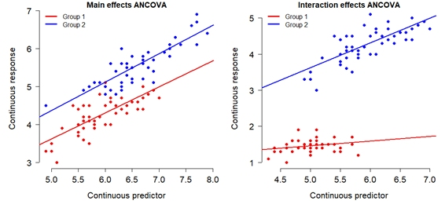

# Tests for continous patterns {#sec-lin}

This module discusses classic tests for patterns where we relate changes in one continuous variable to another continuous variable. By convention, the **response** or **dependent** variable is plotted on the y-axis, and is taken to be the "effect" being studied. The **predictor** or **independent** or **explanatory** variable the one interpreted as the cause. Predictors are plotted on the x-axis. Such a plot or model is said to be of "y versus x". 

However, as we see in the section on correlation, we can also investigate patterns between variables without assuming that one causes the other--only that they reliably change together.

## Correlation {#sec-lin-cor}

**Correlation** is a statistical relationship where changes in one variable are reliably associated with changes in another variable. This relationship need not be causal, hence the famous mantra, “correlation does not equal causation”. As such, correlation is usually a **descriptive technique**, which lets researchers characterize patterns, rather than an **inferential technique**, which lets researchers make estimates about unknown parameters (i.e., infer unobserved quantities). 

Correlations are typically expressed as a **correlation coefficient**, a value that indicates the strength of the correlation by its magnitude and the direction of the correlation by its sign.

- **Positive correlation:** as one variable gets larger, the other variable does too. Correlation coefficient approaches $+1$.

- **Negative correlation:** as one variable gets larger, the other variable gets smaller. Correlation coefficient approaches $-1$.

When a correlation coefficient is near 0, this indicates no correlation.

```{r}
#| echo: false
#| fig-width: 9
#| fig-height: 6
#| fig-cap: "Illustration of possible positive and negative relationships between pairs of variables, with different levels of consistency (*r*)."
#| fig-alt:  "Illustration of possible positive and negative relationships between pairs of variables, with different levels of consistency (r)."
#| label: fig-correlations

set.seed(777)

ad <- function(x){
  res <- x + ifelse(any(x<0), abs(min(x)), 0)
  res <- res/max(res)
  return(res)
}

n <- 24
x <- runif(n, 0, 10)
y1 <- 1 + 2.3 * x + rnorm(n, 0, 3)
y1 <- ad(y1)
y2 <- 1 + 2.3 * x + rnorm(n, 0, 16)
y2 <- ad(y2)
y3 <- 1 + 2.3 * x + rnorm(n, 0, 64)
y3 <- ad(y3)

y4 <- 20 - 2.8 * x + rnorm(n, 0, 6)
y4 <- ad(y4)

y5 <- 20 - 2.8 * x + rnorm(n, 0, 15.5)
y5 <- ad(y5)

y6 <- runif(n)

par(mfrow=c(2,3), mar=c(5.1, 5.1, 1.1, 1.1), bty="n",
    lend=1, las=1, cex.axis=1.3, cex.lab=1.3,
    mgp=c(1.5, 1, 0))
plot(x, y1, xlab="One variable", ylab="Another variable", yaxt="n", xaxt="n")
text(0, 0.9, expression(italic(r)==0.8), adj=0, cex=1.4)
title(main="Strong positive correlation", adj=0)
axis(side=1, at=c(0, 10), labels=NA)
axis(side=2, at=c(0, 1), labels=NA)

plot(x, y2, xlab="One variable", ylab="Another variable", yaxt="n", xaxt="n")
text(0, 0.9, expression(italic(r)==0.5), adj=0, cex=1.4)
title(main="Weak positive correlation", adj=0)
axis(side=1, at=c(0, 10), labels=NA)
axis(side=2, at=c(0, 1), labels=NA)

plot(x, y3, xlab="One variable", ylab="Another variable", yaxt="n", xaxt="n")
text(0, 0.9, expression(italic(r)=="0.0"), adj=0, cex=1.4)
title(main="No correlation", adj=0)
axis(side=1, at=c(0, 10), labels=NA)
axis(side=2, at=c(0, 1), labels=NA)

plot(x, y4, xlab="One variable", ylab="Another variable", yaxt="n", xaxt="n")
text(10, 0.9, expression(italic(r)==-0.8), adj=1, cex=1.4)
title(main="Strong negative correlation", adj=0)
axis(side=1, at=c(0, 10), labels=NA)
axis(side=2, at=c(0, 1), labels=NA)

plot(x, y5, xlab="One variable", ylab="Another variable", yaxt="n", xaxt="n")
text(10, 0.9, expression(italic(r)==-0.5), adj=1, cex=1.4)
title(main="Weak negative correlation", adj=0)
axis(side=1, at=c(0, 10), labels=NA)
axis(side=2, at=c(0, 1), labels=NA)

plot(x, y6, xlab="One variable", ylab="Another variable", yaxt="n", xaxt="n")
text(10, 0.9, expression(italic(r)=="0.0"), adj=1, cex=1.4)
title(main="No correlation", adj=0)
axis(side=1, at=c(0, 10), labels=NA)
axis(side=2, at=c(0, 1), labels=NA)
```

**Correlation coefficients** are often calculated when we want to see if
two values are related, without going as far as to infer a causal
relationship. Because science is all about finding explanations (i.e.,
causes) for natural phenomena, a correlation analysis is usually not
presented on its own. However, correlation analysis can be part of a
larger workflow:

- Correlations can indicate if some variables in a dataset are *redundant*—that is, any analysis of one would say the same as analyzing the other.

- Correlations can indicate association without inference—e.g., it
    might be sufficient to know that your residuals are correlated with
    some other variable, without being able to model the relationship.
- Correlations can help identify proxy variables—variables that can stand in for one another. E.g., correlation analysis may reveal that an inexpensive, easily obtainable variable is a good stand-in for an expensive, but less obtainable one.
- Correlations can screen large numbers of variables for possible patterns and inform future investigations. For example, in some analyses I will start by testing many variables for correlations, and only invest time fitting inferential models (e.g., GLMs) for the variables that show some correlation with the response variable.

### Linear correlation {#sec-lin-cor-lin}

**Question:** As values in one set change, do values in another set
change at a constant rate?

**Null hypothesis:** N/A (descriptive statistic)

**Alternative hypothesis:** N/A (descriptive statistic)

**Example use case:** Lisa is studying whether the size of a mammal’s
cecum is related to the proportion of plant material in its diet, and
suspects that the relationship is linear.

When we suspect that two variables are correlated, and that the shape of that relationship is a straight line, we can use **Pearson's product moment correlation**, also called **Pearson's *r***. This is probably the most commonly used correlation coefficient, and can be calculated in many ways. One way is this:

$$
r_{xy}=\frac{\sum_{i=1}^n\left(x_i-\bar{x}\right)\left(y_i-\bar{y}\right)}{\sqrt{\sum_{i=1}^n\left(x_i-\bar{x}\right)^2}\sqrt{\sum_{i=1}^n\left(y_i-\bar{y}\right)^2}}
$$

In this expression, $r_{xy}$ is the correlation between vectors $x$ and
$y$; $n$ is the total number of observations; $x_i$ and $y_i$ are the
*i*-th value of $x$ and $y$, respectively; $\bar{x}$ and $\bar{y}$ are the sample
means of $x$ and $y$. This expression shows that *r* gets larger as the slope of the
relationship between $x$ and $y$ gets larger, regardless of sign; and
that increasing variance decreases *r*.

The numerator is also called the **covariance** of $x$ and $y$. You might recognize the denominator as the product of the SD of $x$ and $y$. So, the formula for Pearson's *r* can be written very compactly as:

$$
r_{xy}=\frac{\text{cov}\left(x,y\right)}{s_xs_y}
$$

The base function `cor()` calculates correlation coefficients, including *r*.

```{r}
# calculate linear correlation coefficient
cor(iris$Petal.Length, iris$Petal.Width)
```

You can also request a significance test on the coefficient, although some might consider this unnecessary because correlation is inherently a descriptive technique. If you are using correlation as a hypothesis test, however, you do need a *p*-value.

```{r}
cor.test(iris$Petal.Length, iris$Petal.Width)
```

You can also get correlations between a set of variables. The result is a
correlation matrix (see @sec-desc-co-lin-pairs).

```{r}
# correlations between several variables at once:
# i.e., a correlation matrix
cor(iris[,1:4])
```

There isn’t a built-in way to check for significant correlations between many pairs of variables at once. This is because `cor.test()` only works with one pair at a time. Fortunately, it’s not hard to do in a `for()` loop:

```{r}
# data frame with just the variables we need
dx <- iris[,1:4]

# set up data frame to hold results
## get the names of the variables
var.names <- names(dx)
## get every unique combination of 2 of those names
var.pairs <- combn(var.names, 2)
## transpose the result (swap rows and columns)
## so it is oriented like a data frame, and convert
## from matrix to data frame
cor.df <- as.data.frame(t(var.pairs))
cor.df$r <- NA
cor.df$p <- NA

#### NOTE: you can create the object cor.df more      ##
####       quickly by combining commands like this:   ##
##### not run:                                        ## 
##### cor.df <- as.data.frame(t(combn(names(dx),2)))  ##

# find the r and p values in a loop
for(i in 1:nrow(cor.df)){
  # test once per iteration  
  curr <- cor.test(dx[,cor.df$V1[i]], dx[,cor.df$V2[i]])
  # pull out values we need from correlation test result
  # and round to 3 decimal places
  cor.df$r[i] <- round(curr$estimate, 3)
  cor.df$p[i] <- round(curr$p.value, 3)
}#close i loop

# print result
cor.df
```

It’s not pretty, but we can see right away that every pair is
significantly correlated except sepal width and sepal length. Remember that the *p*-values printed as `0.000` are not literally 0; report them as "<0.001".

Another way to explore correlations between many pairs of variables is to visualize them in a scatterplot matrix (see @sec-desc-co-lin-pairs).

### Nonlinear correlation {#sec-lin-cor-non}

Many processes and relationships in biology are not linear, and but we still want to study correlations in those processes. So, instead of asking whether or not the assocation is linear, we ask whether it is **monotonic**, meaning that the changes in one variable associated with changes in another tend to have the same sign. For example, as $X$ increases, $Y$ either consistently increases or consistently decreases, but does not go up and down across the domain of $X$.

Consider the figure below. The left panel clearly shows some relationship between $X$ and $Y$, but it is not linear and using a linear correlation coefficient might miss something. The right panel shows the same data points after a [rank transform](@sec-trans-common-rank).

```{r}
#| echo: FALSE
#| fig.width: 8
#| fig.height: 4

set.seed(123)
n <- 50
x <- runif(n, 0, 5)

y1 <- 1 + x*2.1 + rnorm(n, 0, 1)
y2 <- (13*x)/(1.5+x)+rnorm(n, 0, 1)
y2 <- plogis(y1-6)

par(mfrow=c(1,2), mar=c(4.1, 4.1, 1.1, 1.1),
    lend=1, las=1, bty="n", cex.lab=1.4, mgp=c(2, 1, 0))

plot(x, y2, xlim=c(0, 5), xaxt="n", yaxt="n",
    xlab="Variable 1", ylab="Variable 2")
seqx <- seq(min(x), max(x), length=100)
points(seqx, plogis(2.1*seqx-5), type="l", lwd=3, col="red")
axis(side=1, at=c(0, 5), labels=NA)
axis(side=2, at=c(0, 1), labels=NA)
title(main="Nonlinear correlation", adj=0)

plot(rank(x), rank(y2), xaxt="n",
    xlab="Variable 1", ylab="Variable 2", yaxt="n")
axis(side=1, at=c(0, 50), labels=NA)
axis(side=2, at=c(0, 50), labels=NA)
segments(0, 0, 50, 50, lwd=3, col="red")
title(main="Linear correlation", adj=0)

```

Often when two variables share a nonlinear relationship, a rank transform will make that relationship appear more linear. A "rank-transform" assigns the smallest value value "0", the second smallest value to "1", and so on. Rank-transforming these data lets us calculate a nonparametric, nonlinear correlation.

#### Spearman's $\rho$ {#sec-lin-cor-non-rho}
 
The nonparametric equivalent of Pearson’s *r* is Spearman’s $\rho$ (“rho”). Spearman's $\rho$ is calculated as the Pearson's *r* linear correlation coefficient of the rank-transformed values.

$$\rho_{xy}=\frac{cov\left(R\left[x\right],R\left[y\right]\right)}{s_{R\left[x\right]}s_{R\left[y\right]}}$$

When observations have identical values, their ranks may be tied, which creates some minor issues in the calculation of $\rho$ and its *p*-value. For this reason, R may throw a warning when calculating a Spearman correlation. You can ignore this warning.

It can be obtained using code similar to what was done for linear correlation.

```{r}
# just the coefficient
cor(iris$Petal.Length, iris$Sepal.Width, method="spearman")
```

```{r}
# confirming the connection to Pearson's r
cor(rank(iris$Petal.Length), rank(iris$Sepal.Width))
```

```{r}
# can also get a significance test for rho
cor.test(iris$Petal.Length, iris$Sepal.Width, method="spearman")
```

Just as with linear correlation, you can get a correlation matrix of nonlinear $\rho$ correlation coefficients, and a scatterplot matrix with `pairs()`. See @sec-desc-co-non-pairs.

#### Kendall's $\tau$ {#sec-lin-cor-non-tau}

There is another nonparametric rank-based correlation coefficient,
Kendall’s $\tau$ (“tau”). Kendall's $\tau$ is based not upon a correlation coefficient between ranked observations, but instead on the concordance or agreement between the rankings of $x$ and $y$. This means that for any pair of observations $\left(x_i,y_i\right)$ and $\left(x_j,y_j\right)$, the ranking order of $\left(x_i,x_j\right)$ and $\left(y_i,y_j\right)$ agree. Put another way, if both $x_i>x_j$ and $y_i>y_j$ *or* $x_i<x_j$ and $y_i<y_j$, then the pair of observations $i$ and $j$ is **concordant**. Any other finding is **discordant**. The original version of Kendall's $\tau$, now called $\tau_a$ is thus calculated:

$$\tau_{xy}=\frac{\left(\text{number of concordant pairs}\right)-\left(\text{number of discordant pairs}\right)}{\left(\text{number of pairs}\right)}$$

There is a [more modern version](https://en.wikipedia.org/wiki/Kendall_rank_correlation_coefficient#Tau-b) of $\tau$, called $\tau_b$, that can account for ties. This is what the R functions `cor()` and `cor.test()` calculate.

In practice, Kendall's $\tau$ and Spearman's $\rho$ tend to give qualitatively similar results, so you can often choose freely between them. However, there are some situations where $\tau$ might be preferable. First, the magnitude of $\tau$ has a much more intuitive meaning than that of $\rho$. It is related to the degree to which concordant pairs are more common than discordant pairs. E.g., $\tau=0.6$ indicates roughly that concordant pairs are 60% more common than discordant pairs. When $\rho=0.6$, on the other hand...well, $\rho=0.6$.

Second, $\tau$ can work better at small sample sizes because its sampling distribution and exact tests are well developed.

Finally, $\tau$ may be preferred when the data are genuinely ordinal, because of how comparison between ranks is central to the calculation of $\tau$. This is philosophical rather than computational: $\rho$ works just fine on ordinal data, too.

That last thing I'll add is that while $\rho$ and $\tau$ address the same question, they go about it in different ways and so they are on different scales. This is why they give qualitatively similar results even when the numbers are different. In fact, $\rho$ and $\tau$ have a known relationship under certain conditions:

$$\tau=\frac{2}{\pi}\arcsin\left(\rho\right)$$

You can obtain Kendall's $\tau$ in R with the `method` argument.

```{r}
# just the coefficient
cor(iris$Petal.Length, iris$Sepal.Width, method="kendall")
```

```{r}
# can also get a significance test for rho
cor.test(iris$Petal.Length, iris$Sepal.Width, method="kendall")
```

## Linear models {#sec-lin-lm}

We reviewed the definition and properties of linear models in @sec-review-lin. Linear models are an important part of classical, frequentist statistics because of their power and, historically, their ease of computation. Many methods that are taught in introductory statistics classes are just special cases of the linear model: [t-tests](@sec-groups-ttests), [ANOVA](@sec-groups-more-anova), [linear regression](@sec-lin-reg), and so on. As we will see in @sec-glm1, linear models themselves are a special case of an even more powerful, broader framework called the **generalized linear model (GLM)**.

### Lots of analyses are linear models in disguise (or can be)  {#sec-lin-lm-disguise}

One of the reasons that linear models are so powerful is that many models or curves that people fit to data, even some whose curves are nonlinear, are actually linear models in a statistical sense. A "linear model" here does not mean that the graph must be a straight line. It means that the model is built by adding together predictor variables that are multiplied by constants (slopes), and these slopes are used only as multipliers of the predictor variables. For example, both $y=\beta_0+\beta_1x$ and $y=\beta_0+\beta_1x+\beta_2x^2+\beta_3x^3$ are linear models because the coefficients ($beta$ terms) are used only as multipliers of the predictor variables.

Other models that appear nonlinear can *become* linear models through transformation. For example, an exponential model $y=ae^{\beta_1x}$ is nonlinear, but log-transforming both sides yields the linear expression $\log\left(y\right)=log\left(a\right)+\beta_1x$. The section below illustrates a few of these "linear models in disguise" so you can recognize and apply these methods on your own data.

#### Ordinary linear models {#sec-lin-lm-disguise-lm}

The basic linear regression model is written as

$$y=\beta_0+\beta_1x$$

and is the same as the equation for a line that you learned in high school or college algebra: $y=mx+b$. Statisticians just use $\beta_0$ for the $y$-intercept and $\beta_1$ for the slope instead of $b$ and $m$.

**Why it's linear:** the parameters $\beta_0$ and $\beta_1$ appear only as multipliers or additive constants, and are combined by addition.

#### Polynomials {#sec-lin-lm-disguise-poly}

A polynomial is a function such as $Y=\beta_0+\beta_1X+\beta_2X^2+...+\beta_kX^k$, where $k$ is the **order** of the polynomial. A polynomial of order 2 is a quadratic equation. A polynomial of order 3 is a cubic, and so on. Polynomials have well-known shapes, such as the parabola of the quadratic function. Any polynomial with order $\ge2$ will not be a straight line.

```{r}
#| echo: false
#| fig.width: 9
#| fig.height: 3
#| fig-cap: "Curve shapes produced by polynomial equations of order 1, 2, and 3: linear, quadratic, and cubic, respectively."
#| fig-alt:  "Curve shapes produced by polynomial equations of order 1, 2, and 3: linear, quadratic, and cubic, respectively."
#| label: fig-polynomials1


x1 <- seq(-4, 4, length=100)
y1 <- 1 + 0.8*x1

x2 <- x1
y2 <- -1 + 0.5*x2^2
x3 <- seq(-6, 5, length=100)
y3 <- (0.25*x3^3) + (0.75*x3^2) -0.66*x3 -2

par(mfrow=c(1,3), mar=c(5.1, 5.1, 1.1, 1.1), cex.lab=1.3, cex.axis=1.3,
    bty="n", lend=1, las=1)
plot(x1, y1, type="l", lwd=3, xaxt="n", yaxt="n", xlab="X", ylab="Y")
axis(side=1, at=c(-4, 4), labels=NA)
axis(side=2, at=c(-2,4), labels=NA)
title(main="Order 1: Linear")
plot(x1, y2, type="l", lwd=3, xaxt="n", yaxt="n", ylim=c(-1,7), xlab="X", ylab="Y")
axis(side=1, at=c(-4, 4), labels=NA)
axis(side=2, at=c(-1,7), labels=NA)
title(main="Order 2: Quadratic")
plot(x3, y3, type="l", lwd=3, xaxt="n", yaxt="n", xlab="X", ylab="Y")
axis(side=1, at=c(-6, 5), labels=NA)
axis(side=2, at=c(-25, 45), labels=NA)
title(main="Order 3: Cubic")


```

**Why it's linear:** although the graph may be curved, the parameters $\beta_0$, $\beta_1$, $\beta_2$, and so on appear only as multipliers on predictor variables, are combined by addition, and are not raised to powers, exponentiated, or use inside other functions. So, a polynomial is linear in its predictors. Look what happens in the figure below. On the left, the polynomial $5+2.1x+6.5x^2$ is plotted vs. $x$ and appears nonlinear. On the right, $y$ is plotted against $x^2$ and *is* linear.

```{r}
#| echo: false
#| fig.width: 9
#| fig.height: 4.5
#| fig-cap: "Left: a plot of the nonlinear polynomial function $$. Right: The same function plotted against $x^2$ produces a straight line."
#| fig-alt: "Curve shapes produced by polynomial equations of order 1, 2, and 3: linear, quadratic, and cubic, respectively."
#| label: fig-polynomials2

x <- 1:20
x2 <- x^2
y <- 5 + 2.1*x + 6.5*x2

par(mar=c(4.1, 4.1, 1.1, 1.1), mfrow=c(1,2), bty="n",
    cex.axis=1.3, cex.lab=1.3, lend=1, las=1)
plot(x,y, type="l", lwd=3, xlim=c(0, 20))
plot(x2,y, type="l", lwd=3, xlim=c(0, 400), 
     xlab=expression(x^2))
```

#### Exponentials {#sec-lin-lm-disguise-exp}

The exponential function $y=ae^{bx}$ is ubiquitous in biology because it describes compounding growth (like compound interest). This function is not linear, but it can be turned into and analyzed as linear by log-transforming both sides.

{#fig-extrasteps fig-cap="Well that sounds like linear with extra steps."}

**Why it *can be* linear:** While the exponential function appears nonlinear, it can be made linear by log-transforming both sides:

$$log\left(y\right)=log\left(ae^{bx}\right)$$

$$log\left(y\right)=log\left(a\right)+log\left(e^{bx}\right)$$

and because $log\left(e^z\right)=z$:

$$log\left(y\right)=log\left(a\right)+bx$$

which is the form of a straight line with intercept $log\left(a\right)$ and slope $b$.

:::{.callout-tip}
**Logarithm bases**

Mathematicians and statisticians almost always work with the **natural logarithm**, which uses Euler's number $e$ ($\approx2.7182$) as its base. The natural logarithm can be written $log\left(x\right)$, $log_e\left(x\right)$, or $ln\left(x\right)$. Natural log is used because many [equations related to growth or change become easier](https://www.youtube.com/watch?v=m2MIpDrF7Es) when $e$ is the base. In this tutorial, and any math or statistics text, assume natural logarithm.

In contrast, scientists and engineers often use other bases, like $log_{10}$ or $log_2$, because these are more intuitive for humans. You can use whatever base you like so long as you are clear about what you did. If you are working with R, you will have an easier time working in natural logs because many functions are set up to use it.
:::

#### Power laws {#sec-lin-lm-disguise-pow}

**Power laws** of the form $Y=aX^b$ are also ubiquitous in biology, as they describe proportional growth. Power laws are similar to exponential functions, but with a key difference: in a power law, $X$ is in the base and is raised to a power, while in an exponential, $X$ is in the exponent of some other base. 

**Why it *can be* linear:** Like an exponential, a power law can be linearized by taking the logarithm of both sides.

$$log\left(Y\right)=log\left(aX^b\right)$$

$$log\left(Y\right)=log\left(a\right)+b\times log\left(X\right)$$

In this form, the power law is linear with intercept $log\left(a\right)$ and slope $b$.

## Linear regression {#sec-lin-reg}

The linear regression model describes a pattern where the response variable $Y$ changes as a linear function of the predictor variable $X$. It looks like this:

$$Y=\beta_0+\beta_1X+\varepsilon$$

where $\beta_0$ is the $y$-intercept, $\beta_1$ is the slope (effect of a unit increase in $X$ on $Y$), and $\varepsilon$ is residual variation in $Y$ not explained by $X$--the spread of points above or below the line. In a linear model, residual variation follows a normal distribution with mean 0 and some unknown SD $\sigma_{\mathrm{res}}$. Each residual $\varepsilon_i$ follows the same distribution:

$$\varepsilon_i \sim \mathcal{N}\left(0,\sigma_{\mathrm{res}}\right)$$

where $\mathcal{N}$ signifies the normal distribution.

The R syntax for linear regression is basically the same as that for ANOVA and the *t*-test we've seen before, or a boxplot for that matter, but this time the right hand side of the formula has a continuous predictor rather than a factor.

```{r}
# fit a linear regression model
mod5 <- lm(Petal.Length~Petal.Width, data=iris)
```

```{r}
# test for significance of terms
anova(mod5)
```

```{r}
# see estimates of parameter coefficients
summary(mod5)
```

The `summary()` output tells you a lot about the regression: the coefficients (and their *p*-values), the omnibus ANOVA for the model (the *F* test at the bottom), and the coefficient of determination (Adjusted *R*-squared). Coefficients are identified as the y-intercept $\beta_0$ (`Intercept`) and by the variable names (e.g., the slope with respect to petal width is `Petal.Width`). Each coefficient is presented as its estimate and SE (e.g., the intercept is `1.08 ± 0.07`). The test statistic *t* for each coefficient is the ratio of the estimate to the SE, and the *p*-value for *t* calculated from a *t*-distribution (much as in a *t*-test). The coefficient of determination $R^2$ is the proportion of variation in $Y$ explained by the model. In this case, about 93% of variation in Petal.Length is explained by Petal.Width.

When you present a linear regression, you should present the parameters, their SE, test statistics, and *p*-values in a table. The omnibus $F$ test and $R^2$ can be reported in Results text. Finally, you should present the data as a scatterplot, with the predicted values as a trendline and the 95% CI of that trendline if feasible. Here is how to do that for the model above:

```{r}
#| fig-cap: "Data plotted with the trendline (solid) and its 95% confidence interval (dashed)."
#| fig-alt:  "Data plotted with the trendline (solid) and its 95% confidence interval (dashed)."
#| label: fig-scattertrend
#| fig-width: 8
#| fig-height: 6

# generate x values over which to draw trendline
n <- 100
minx <- min(iris$Petal.Width, na.rm=TRUE)
maxx <- max(iris$Petal.Width, na.rm=TRUE)
px <- seq(minx, maxx, length=n)

# put in a data frame with same variable names as in the model
prx <- data.frame(Petal.Width=px)

# calculate predicted values and their SE
pred <- predict(mod5, newdata=prx,
                se.fit=TRUE, interval="confidence")

# best way to get expected value and 95% confidence limits:
# (use this with linear models)
prx$mn <- pred$fit[,"fit"]
prx$lo <- pred$fit[,"lwr"]
prx$up <- pred$fit[,"upr"]

# when using methods other than linear regression, you can 
# approximate the 95% CI using the predicted values and
# their SE, by drawing quantiles from the normal distribution
# defined by predicted value (pred$fit) and SEs (pred$se.fit).
# When using this with GLMs, you need to keep track of what 
# values are on the link scale, and which are on the 
# data scale.
### not run:
### prx$mn <- qnorm(0.5, mean=pred$fit, sd=pred$se.fit)
### prx$lo <- qnorm(0.025, mean=pred$fit, sd=pred$se.fit)
### prx$up <- qnorm(0.975, mean=pred$fit, sd=pred$se.fit)

# make the plot
## include some par options for a more professional figure
## see ?par for more options
par(mfrow=c(1,1),              # 1 x 1 figure layout
    mar=c(5.1, 5.1, 1.1, 1.1), # margin sizes in lines of text
    lend=1,                    # flat ends on lines
    las=1,                     # axis text in reading orientation
    bty="n",                   # no box around figure
    cex.axis=1.3,              # size of axis text
    cex.lab=1.3)               # size of axis labels

## make the base plot
plot(iris$Petal.Width,         # x values
     iris$Petal.Length,        # y values
     pch=16,                   # type of points (see ?points)
     cex=1.2,                  # size of points
     xlab="Petal width (cm)",  # x axis label
     ylab="Petal length (cm)", # y axis label
     xlim=c(0, 2.5),           # limits of x axis
     ylim=c(0, 8))             # limits of y axis

## add trendline and 95% confidence limits as lines
## with points(...,type="l")
points(prx$Petal.Width, # x values
       prx$lo,          # y values
       type="l",        # lines (see ?base::plot)
       lwd=2,           # line width (1 is default)
       col="red",       # line color ("black" is default)
       lty=2)           # dashed line (1, solid line, is default)
points(prx$Petal.Width, prx$up, type="l", lwd=2, col="red", lty=2)
points(prx$Petal.Width, prx$mn, type="l", lwd=2, col="red")

```


## Multiple regression {#sec-lin-mult}

Linear regression is easily extended to **multiple linear regression**, where there are >1 continuous predictors. Just as with ANOVA, additional predictor variables are added to the model formula using `+`.

```{r}
mod6 <- lm(Petal.Length~Petal.Width + Sepal.Width, data=iris)
summary(mod6)
```

Adding predictors to a multiple regression model will almost always increase the model fit (e.g., proportion of variance explained, $R^2$), but this does not mean you should keep adding predictors. Multiple regression models are vulnerable to **overfitting**, where random noise (i.e., residual variation) is modeled as if it was part of the deterministic part of the model. Multiple regression models are also highly vulnerable to **collinearity**, where the predictors are correlated with each other. When collinear predictors are included in a model, it is impossible for the model to unambiguously partition the sums of squares associated with each predictor.

When plotting the results of a multiple linear regression, you should present the effects of all significant predictors. This is done by plotting the expected y value across a range of each predictor, while holding the other predictor (or predictors) constant at their median. This will show the marginal effect of each predictor on its own. Here is a quick example:

```{r}
# simulate some data
## random number seed
set.seed(42)

## number of observations
n <- 100

## x variables
x1 <- runif(n, 1, 20)
x2 <- runif(n, 1, 30)

## coefficients
beta0 <- 121
beta1 <- 6.1
beta2 <- -3.1

## expected y values
ey <- beta0 + beta1*x1 + beta2*x2

# add residual variation
sigma.res <- 7.8
y <- ey + rnorm(n, 0, sigma.res)

# put in a data frame
dx <- data.frame(y=y, x1=x1, x2=x2)

# fit the model
mod7 <- lm(y~x1+x2, data=dx)

# check significance of terms
anova(mod7)
```

And check the coefficients:

```{r}
summary(mod7)
```

Now make a figure showing `y~x1` and `y~x2`. In each panel, hold the other x value at its median to show the marginal effect of the plotted x value.

```{r}
# define sequences of each x value
plot.n <- 100

minx1 <- min(dx$x1, na.rm=TRUE)
maxx1 <- max(dx$x1, na.rm=TRUE)
px1 <- seq(minx1, maxx1, length=plot.n)

minx2 <- min(dx$x2, na.rm=TRUE)
maxx2 <- max(dx$x2, na.rm=TRUE)
px2 <- seq(minx2, maxx2, length=plot.n)

# medians of x1 and x2
medx1 <- median(x1, na.rm=TRUE)
medx2 <- median(x2, na.rm=TRUE)

# assemble data frames with all predictors in the model
prx1 <- data.frame(x1=px1, x2=medx2)
prx2 <- data.frame(x1=medx1, x2=px2)

# generate predictions
pred1 <- predict(mod7, newdata=prx1,
                 interval="confidence", se.fit=TRUE)
pred2 <- predict(mod7, newdata=prx2,
                 interval="confidence", se.fit=TRUE)

# put expected values and 95% CI in their
# respective data frames
prx1$mn <- pred1$fit[,"fit"]
prx1$lo <- pred1$fit[,"lwr"]
prx1$up <- pred1$fit[,"upr"]

prx2$mn <- pred2$fit[,"fit"]
prx2$lo <- pred2$fit[,"lwr"]
prx2$up <- pred2$fit[,"upr"]

# now make the plot

## include some par options for a more professional figure
## see ?par for more options
par(mfrow=c(1,2),              # 1 x 2 figure layout
    mar=c(5.1, 5.1, 1.1, 1.1), # margin sizes in lines of text
    lend=1,                    # flat ends on lines
    las=1,                     # axis text in reading orientation
    bty="n",                   # no box around figure
    cex.axis=1.3,              # size of axis text
    cex.lab=1.3,               # size of axis labels
    xpd=NA)                    # allows points to print in margin

## make the first panel
plot(dx$x1,          # x values
     dx$y,           # y values
     pch=16,         # type of points (see ?points)
     cex=1.2,        # size of points
     xlab="x1",      # x axis label
     ylab="y",      # y axis label
     xlim=c(0, 20),  # limits of x axis
     ylim=c(0, 250)) # limits of y axis

## add trendline and 95% confidence limits as lines
## with points(...,type="l")
points(prx1$x1, # x values
       prx1$lo,          # y values
       type="l",        # lines (see ?base::plot)
       lwd=2,           # line width (1 is default)
       col="red",       # line color ("black" is default)
       lty=2)           # dashed line (1, solid line, is default)
points(prx1$x1, prx1$up, type="l", lwd=2, col="red", lty=2)
points(prx1$x1, prx1$mn, type="l", lwd=2, col="red")

# make the second panel
## make the first panel
plot(dx$x2, dx$y,
     pch=16, cex=1.2,
     xlab="x2", ylab="y",
     xlim=c(0, 30), ylim=c(0, 250))
points(prx2$x2, prx2$up, type="l", lwd=2, col="red", lty=2)
points(prx2$x2, prx2$up, type="l", lwd=2, col="red", lty=2)
points(prx2$x2, prx2$mn, type="l", lwd=2, col="red")
```

## Analysis of covariance (ANCOVA) {#sec-lin-ancova}

Sometimes biologists want to test for effects of one variable while controlling for another. For example, the slope between $Y$ and $X$ might differ between groups. Or, groups might differ only after accounting for some continuous covariate. Here are some specific examples:

- Herbivorous mammals tend to have longer intestines than carnivorous mammals, but only after accounting for the effect of body mass on intestine length. The researcher wants to see how groups differ, but needs to control for a continuous variable (body length) first.

- Humerus length and femur length both increase with body mass in birds, but humerus length increases faster than femur length (i.e., their slopes are different). The researcher wants to test for a difference in a continous relationship, but needs to control for a factor (which bone) first.

The method for both situations is called **analysis of covariance**, or **ANCOVA**. You can think of ANCOVA as combining linear regression and ANOVA. ANCOVA is especialy useful for studying **interactions**, where one variable changes the effect of another.

{#fig-cont-ancova fig-cap="Left: ANCOVA with main effects only, where group membership (a factor variable) affects the intercept of the relationship between Y and X. Right: ANCOVA with interaction effects, where group membership can affect the intercept and the slope (effect of X on Y)."}

So that we really understand what an ANCOVA does, let's simulate our own dataset where groups A and B have different slopes.

```{r}
# simulation parameters
set.seed(42)
n <- 30
beta0_a <- 2
beta0_b <- 6
beta1_a <- 1.4
beta1_b <- 2.5
sigma_res <- 2

# groups A and B start in separate data frames
data_a <- data.frame(group="A", col="red", pch=15, x=runif(n, 5, 20))
data_b <- data.frame(group="B", col="blue", pch=16, x=runif(n, 5, 20))

# add expected values
data_a$ey <- beta0_a + beta1_a * data_a$x
data_b$ey <- beta0_b + beta1_b * data_b$x

# combine to single data frame
data_all <- rbind(data_a, data_b)

# add residuals
data_all$y <- data_all$ey + rnorm(n*2, mean=0, sd=sigma_res)

# and make a plot to inspect our data
plot(data_all$x, data_all$y, col=data_all$col, pch=data_all$pch,
     xlim=c(0, 20), ylim=c(0, 60))
```

Now we can fit the ANCOVA and see the results.

```{r}
# fit the model. Notice the * to specify an interaction
mod7 <- lm(y~x*group, data=data_all)

# test significance of terms
anova(mod7)
```

Now check the model parameters

```{r}
summary(mod7)
```

R treats group A as the control or **baseline** because it is alphabetically first. Any effect involving group B is relative to the effect in group A. Here:

- The intercept in group A is `(Intercept)`, 0.4499.
- The slope in group A is `x`, 1.4919.
- The intercept in group B is the group A intercept plus the effect of being in group B: $0.4499 + 5.6295=6.0794$.
- The slope in group B is the slope in group A plus the effect of being in group B on the slope: $1.4919 + 1.0314=2.5233$`

Making a plot with trendlines for an ANCOVA follows much the same procedure as we used to make the plot for linear regression, but, you have to take care to include each group. Notice that when plotting a line for each group, we make sure to define the line only for the range of x values present in that group in the data.

```{r}
#| fig-cap: "Plot of Y vs. X with groups A and B in the data, where the groups have different slopes. This illustrations ANCOVA with an interaction between X and group."
#| fig-alt:  "Plot of Y vs. X with groups A and B in the data, where the groups have different slopes. This illustrations ANCOVA with an interaction between X and group."
#| label: fig-ancovatrend

# get x sequence within the x domain of each group
pxa <- seq(min(data_all$x[data_all$group=="A"]),
           max(data_all$x[data_all$group=="A"]),
           length=100)
pxb <- seq(min(data_all$x[data_all$group=="B"]),
           max(data_all$x[data_all$group=="B"]),
           length=100)
# put in data frames
prxa <- data.frame(group="A", x=pxa)
prxb <- data.frame(group="B", x=pxb)

# calculate predictions
preda <- predict(mod7, newdata=prxa, se.fit=TRUE)
predb <- predict(mod7, newdata=prxb, se.fit=TRUE)

# add to data frames
prxa$mn <- qnorm(0.5, preda$fit, preda$se.fit)
prxa$lo <- qnorm(0.025, preda$fit, preda$se.fit)
prxa$up <- qnorm(0.975, preda$fit, preda$se.fit)

prxb$mn <- qnorm(0.5, predb$fit, predb$se.fit)
prxb$lo <- qnorm(0.025, predb$fit, predb$se.fit)
prxb$up <- qnorm(0.975, predb$fit, predb$se.fit)

# make the plot
par(mar=c(5.1, 5.1, 1.1, 1.1), bty="n", las=1, lend=1,
    cex.axis=1.3, cex.lab=1.3)
plot(data_all$x, data_all$y, col=data_all$col, pch=data_all$pch,
     xlim=c(0, 20), ylim=c(0, 60))
points(prxa$x, prxa$mn, type="l", lwd=2, col="red")
points(prxa$x, prxa$lo, type="l", lwd=2, col="red", lty=2)
points(prxa$x, prxa$up, type="l", lwd=2, col="red", lty=2)
points(prxb$x, prxb$mn, type="l", lwd=2, col="blue")
points(prxb$x, prxb$lo, type="l", lwd=2, col="blue", lty=2)
points(prxb$x, prxb$up, type="l", lwd=2, col="blue", lty=2)
legend("topleft", legend=c("Group A", "Group B"),
       pch=c(15, 16), col=c("red", "blue"), cex=1.4,
       bty="n")
```

### Main effects and interaction effects  {#sec-lin-ancova-inter}

