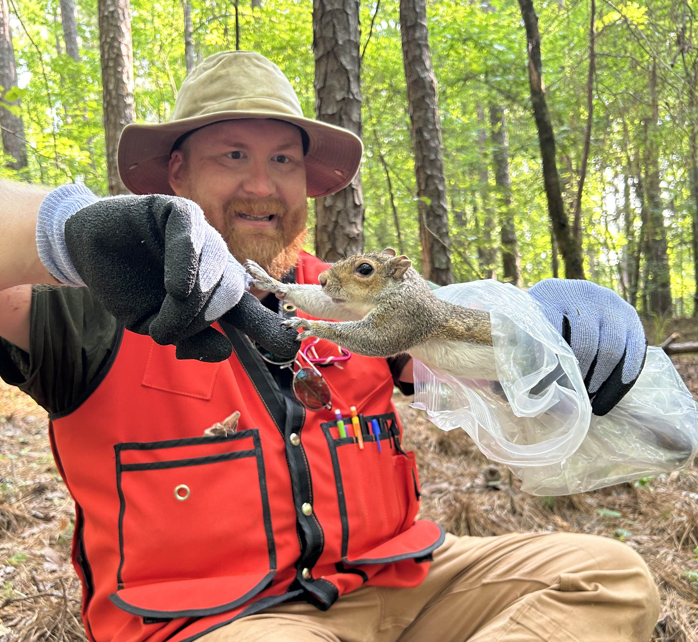
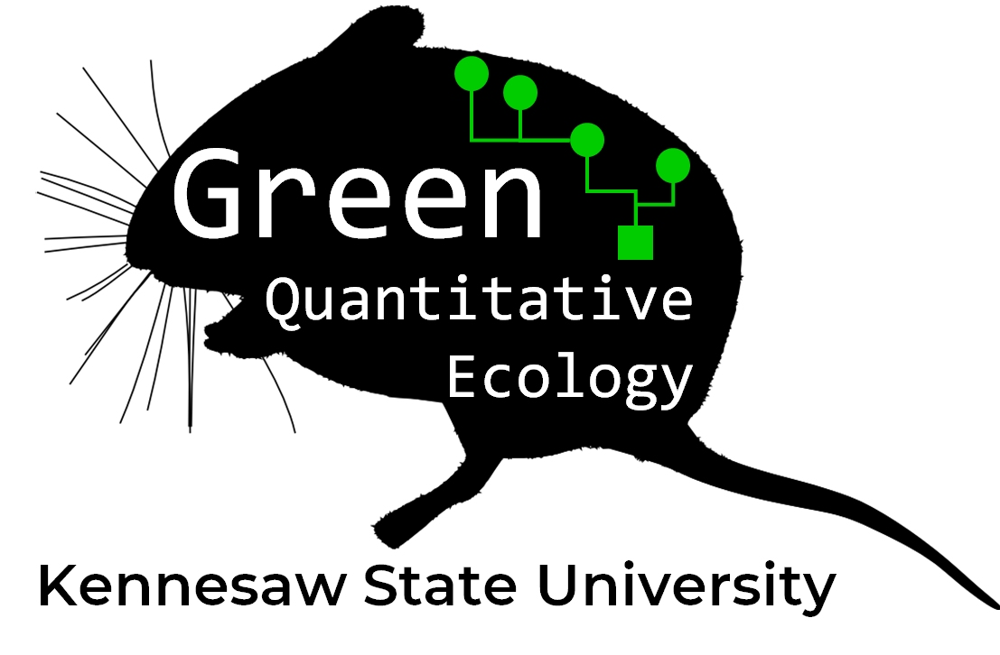

```{r}
#| include: false
options(width=70)
```

# Preface {.unnumbered}

This website accompanies a course I have developed at Kennesaw State University: **BIOL 7410: Applied Biological Data Analysis**. The target audience is biologists who need to analyze data for their research projects. If you find the material here helpful, please let me know! Likewise, if you have comments for improvement, I'd love to hear from you: send all comments to [ngreen62\@kennesaw.edu](mailto:ngreen62@kennesaw.edu)!

If you are a returning visitor, please note that the website has been rearranged since 2024. This was done to make the modules smaller and more digestible.

The Fall 2025 course syllabus can be [downloaded here](https://greenquanteco.github.io/book/202503%20biol%207410%20syllabus%202025-08-05.pdf).

## Work in progress warning! {.unnumbered}

I am actively updating this site throughout the Fall 2026 semester. This means that many cross-references may be broken, pictures missing, etc. Please be patient with me as I get things back into working order.

## Data used in this website {.unnumbered}

This website presents many examples of data analyses or data manipulation. In past versions of the site (and my course), I have tried to use different and interesting datasets for every module, so that examples would feel more relevant and fresh. However, student feedback has convinced me to pursue the opposite strategy: use a single dataset for most examples, so that people could get more familiar with the dataset over the course of the semester. This would prevent having to learn a completely new dataset and biological system every day in class.

However, it turns out that it's hard to do everything with a single dataset. So, I settled on 3 datasets:

1.  The famous `iris` dataset included with R. This will be used primarily in early modules covering data manipulation and data frame management, as well as the review of basic statistics in Module 9.
2.  Datasets simulated *ad hoc* to demonstrate simple concepts with no underlying biological reality (i.e., numbers to demonstrate the properties of a probability distribution).
3.  Small mammal trapping and measurement data from the [National Ecological Observatory Network (NEON)](https://www.neonscience.org/data-collection/small-mammals)[@neon2025]. The details of which data I used and how I packaged them for this website can be found in Appendix A.

## License and permissions {.unnumbered}

This work and its content is released under the [Creative Commons Attribution-ShareAlike 4.0](https://creativecommons.org/licenses/by-sa/4.0/) license. This means that you are allowed to share the material and adapt it for your purposes, under the following conditions:

1.  Give appropriate credit to the [author](https://facultyweb.kennesaw.edu/ngreen62/index.php). This includes citing the original sources of any third-party datasets used in some of the tutorials. I've done my best to provide appropriate citations alongside these datasets.
2.  If you remix, transform, or build upon the material, you must distribute your contributions under the same license as the original.

This site is for educational purposes only. This work and its content is released under the [Creative Commons Attribution-ShareAlike 4.0](https://creativecommons.org/licenses/by-sa/4.0/) license. Inclusion of third-party data for educational purposes falls under guidelines of fair use as defined in [section 107 of the US Copyright Act of 1976](https://www.law.cornell.edu/uscode/text/17/107).

## Course description {.unnumbered}

This course is a survey of data analysis skills and statistical methods essential for careers in biology. This course takes a holistic approach to the data analysis workflow using the open-source software R, including: data management, exploratory analyses, modeling, and reproducible science practices. Statistical topics covered may include generalized linear models, mixed effects models, nonlinear models, and ordination. Students apply techniques learned in class to real biological datasets as a course project.

## Course objectives {.unnumbered}

1.  Engage with current biology literature to explain the role of statistics in the biological sciences and the ways in which analytical results are communicated.
2.  Engage in research using modern statistical methods to investigate biological questions.
3.  Manipulate, summarize, display, and analyze data using the open-source environment and language R.
4.  Use probability distributions to model and think about biological phenomena.
5.  Translate biological hypotheses and ideas into statistical models and vice versa.
6.  Conduct exploratory data analyses in support of scientific investigations, particularly to detect and diagnose common problems with biological datasets.
7.  Communicate data and analytical results to audiences who may or may not have statistical backgrounds.

## Course requirements {.unnumbered}

-   Access to a computer or laptop capable of running [R](https://cran.r-project.org/bin/windows/base/) version 4.0 or above. This site was rendered using R version 4.4.3 and the most recent version of any package mentioned (as of August 8, 2025).

-   A 64-bit system is highly recommended for speed and stability.

-   A separate program in which to write and edit code.

    -   Most people prefer to use an "integrated development environment" (IDE) or dedicated code editor for coding. I recommend some in Module 2.
    -   Most people nowadays prefer [RStudio](https://posit.co/download/rstudio-desktop/). The desktop version is free and has a lot of nice features that make working with R easier.
    -   IDEs and code editors are often subject to irrationally strong personal and organizational preferences, so just pick the one that works for you. Or, use the one your supervisor tells you to use.
    -   My usual workflow includes two windows: the base R GUI, and [Notepad++](https://notepad-plus-plus.org/downloads/).

-   It would helpful to have a dataset of your own to work with. Each course module uses numerous examples with simulated or published datasets. But, at the end of the day, you're probably here because you need to apply these methods to your own work.

## Recommended reading {.unnumbered}

This course has no required textbook. If you want a textbook, then I recommend one of the following:

-   *Ecological models and data in R* by Ben Bolker [@bolker2008ecological]. This is a general statistics textbook for biologists. The applications and examples are focused on ecology, but the statistical exposition is relevant to any area of biology.

-   *Introductory statistics with R* by Peter Dalgaard [@dalgaard2002]. This is a general statistics textbook and introduction to R programming.

-   *A beginner's guide to R* by Alain Zuur and others [@zuur2009]. This book introduces R in a different way than @dalgaard2002.

-   *An introduction to statistical learning: with applications in R* by Gareth James and others [@james2013]. This is a more advanced statistics book that also introduces machine learning. The second edition is available for [free online](https://www.statlearning.com/).

Parts of the course also lean heavily on some more specialized textbooks:

-   *Analysing ecological data* [@zuur2007analysing] and *Mixed effects models and extensions in ecology with R* [@zuur2009mixed] by Alain Zuur and others. These are advanced textbooks aimed at ecologists which introduce GLMs, mixed models, and other topics we will explore in this course.

-   *Analysis of ecological communities* by Bruce McCune and James Grace [@mccune2002analysis] and *Numerical ecology* by Pierre and Louis Legendre [@legendre2012numerical] are introductions to ordination and other multivariate methods. @mccune2002analysis is a gentler introduction but depends on [proprietary software](https://www.wildblueberrymedia.net/pcord). @legendre2012numerical is a little more technical (but still relatively easy to understand) and uses R throughout.

-   *An introduction to WinBUGS for ecologists* by Marc Kéry [@kery2010]. This book introduces Bayesian inference using the free programs WinBUGS or JAGS, which can be accessed from R.

If you want a PDF version of this website, please be patient. I'll put a PDF version here once I can get it to exist.

## Course organization {.unnumbered}

This work is roughly organized into 9 parts. The links below will take you straight to the start of each module.

**Part 1** introduces the use of statistics in modern biology, setting the stage for the rest of the course.

[Module 1](chapters/ch01.qmd#sec-intro) is an introduction to the use of statistics in biology, and explores some fundamental issues related to how biologists make inferences based on data.

**Part 2** is an introduction to R split across several modules. Beginners should start in **Module 2**.

[Module 2](chapters/ch02.qmd#sec-r) is an introduction to the R program and programming language.

[Module 3](chapters/ch03.qmd#sec-data) describes some important R data and object types--how R stores data.

[Module 4](chapters/ch04.qmd#sec-ie) covers methods for importing data in R, and exporting results from R.

[Module 5](chapters/ch05.qmd#sec-manip) takes a deep dive into manipulating data in R. This includes selecting data, relating data tables, and data frame management.

**Part 3** discusses **exploratory data analysis** and **planning your data analysis**. It begins with basic statistical procedures such as descriptive statistics, data summarization, and describing variables using probability distributions. It also includes a module on planning your analysis.

[Module 6](chapters/ch06.qmd#sec-desc) describes **descriptive statistics**, or summaries, of single variables.

[Module 7](chapters/ch07.qmd#sec-summ) describes how to summarize and aggregate data by groups.

[Module 8](chapters/ch08.qmd#sec-plot1) introduces basic data visualizations like histograms, probability density plots, boxplots, and scatterplots.

[Module 9](chapters/ch09.qmd#sec-dist) introduces probability distributions and how to use them to describe your data.

[Module 10](chapters/ch10.qmd#sec-dtest) covers ways to explore how your data fit different probability distributions.

[Module 11](chapters/ch11.qmd#sec-trans) covers common data transforms, like the log, logit, and many more.

[Module 12](chapters/ch12.qmd#sec-problem) covers common statistical problems in biology, including lack of replication, autocorrelation, collinearity, and missing data.

[Module 13](chapters/ch13.qmd#sec-plan) is a guide to selecting statistics for your research. This module contains dichotomous keys to help you decide what statistical methods are most appropriate for the question you are trying to analyze.

**Part 4** is a review of introductory statistics--basically everything you learned in your undergraduate statistics course, but could probably use a refresher on.

[Module 14](chapters/ch14.qmd#sec-review) reviews the structure of biological datasets, null hypothesis significance testing, and the 4 classes of statistical tests used by biologists.

[Module 15](chapters/ch15.qmd#sec-groups) reviews tests for comparing the means or locations of groups of observations: *t*-tests, analysis of variance (ANOVA), and their nonparametric alternatives.

[Module 16](chapters/ch16.qmd#sec-contin) reviews procedures for testing continuous patterns: correlation, linear regression, and analysis of covariance (ANCOVA). This module also takes a deep dive into **linear models** and their fundamental importance for understanding more advanced methods.

[Module 17](chapters/ch17.qmd#sec-indep) reviews tests for contingency and independence such as Fisher's exact test, the $\chi^2$ test, and the *G*-test.

**Part 5** introduces the powerful framework of the generalized linear model (GLM) for modeling for modeling data with a single response variable.

[Module 18](chapters/ch18.qmd#sec-glm1) introduces generalized linear models (GLM), an extremely general and powerful framework for analyzing biological data.

[Module 19](chapters/ch19.qmd#sec-glm2) demonstrates GLMs for continuous data: Gaussian, log-normal, and Gamma GLMs.

[Module 20](chapters/ch20.qmd#sec-glm3) covers GLMs for count data: Poisson and negative binomial GLMs.

[Module 21](chapters/ch21.qmd#sec-glm4) covers GLMs for binomial data and proportional: logistic regression and binomial GLM.

**Part 6** builds upon the GLM framework to introduce nonlinear models and mixed models, which can accomodate many situations where GLMs are inadequate.

[Module 22](chapters/ch22.qmd#sec-non) explores nonlinear models for relationships that don't follow a straight line. These models include biological growth curves and dose response curves.

[Module 23](chapters/ch23.qmd#sec-mixed) introduces mixed models, which extend GLM and other models to include random effects. Mixed models allow biologists to account for variability from unknown sources.

**Part 7** covers multivariate statistics, methods which can consider many variables at a time.

[Module 24](chapters/ch24.qmd#sec-mdata) introduces **multivariate** statistics, which explore patterns in 2 or more variables at once. This module covers the structure of multivariate datasets.

[Module 25](chapters/ch25.qmd#sec-dist) introduces **distance measures** and **dissimilarity metrics**, methods for quantifying how much observations differ from each other. Many of the multivariate methods covered in subsequent modules depend on distance measures.

and distance measures.

[Module 26](chapters/ch26.qmd#sec-clust) explores **cluster analysis**, a class of techniques for identifying groups within multivariate data.

[Module 27](chapters/ch27.qmd#sec-ord) explores **ordination**, a class of techniques for visualizing patterns in multivariate data. Ordination also includes **dimension reduction**, or the consolidation of information from many dimensions into few.

[Module 28](chapters/ch28.qmd#sec-mtest) describes some multivariate hypothesis tests, many of which are extensions of univariate techniques.

**Part 8** introduces two statistical frameworks that can be an alternative to *p*-values and null hypothesis significance testing.

[Module 29](chapters/ch29.qmd#sec-it) introduces information-theoretic model selection, an alternative to null hypothesis significance testing (NHST) that evaluates entire models rather than individual parameters and their *p*-values.

[Module 30](chapters/ch30.qmd#sec-bayes) introduces Bayesian inference using the program JAGS, another alternative to NHST.

**Part 9** is "bonus material"; i.e., additional modules that didn't quite fit in anywhere else. New modules will be added here until the next major update.

[Module 31](chapters/ch31.qmd#sec-plot2) takes a deep dive into building quality graphics using base R.

Finally, [Appendix A](chapters/appa.qmd#sec-append) describes the NEON dataset that I used to build Parts 4 through 8, and the steps taken to process the raw data download to the files provided here.

## About the author {.unnumbered}

{fig-align="center"}

I'm a [quantitative ecologist at Kennesaw State University](https://facultyweb.kennesaw.edu/ngreen62/index.php) who studies human impacts on animal populations. Since earning my PhD at Baylor University in 2012, I've been fortunate to have worked in a variety of government and industry roles. Those experiences have shaped my perspective on biology and education. In my courses and advising I do my best to impress upon students the variety of biological experiences and perspectives that different domains bring to the table...and the value that they all bring. Most of my [current research](https://greenquanteco.github.io/research) focuses on understanding human impacts on animal communities and how animal populations adapt to rapidly changing environments.

{fig-align="center"}

Why am I making this guide? I have been using R since about 2008, when I was a graduate student trying to make a multi-panel plot for a manuscript. I had seen R mentioned in publications and thought that using R would be more effective than kludging something together with Excel and Powerpoint. Needless to say, jumping straight to making plots with the `lattice` package was not the easiest way to learn R. The final result was a little clunky [@kirchner2011] but I am still really proud of it. Eventually I took some courses and did a lot of self-teaching, and am finally (March 2025) pretty decent at R. I have used R in my work pretty much continuously since 2008 for everything from Bayesian data analysis [e.g., @green2020] to simulation modeling [e.g., @green2019].

This guide is meant to be a primer for self-starting with R. In many sections the text is a bit lengthy, but that is because I wanted to provide explanations that might save someone some of the trouble I had getting started. R documentation is notoriously terse and compact--this is great for professionals who need a reminder, but not so much for newcomers who are still trying to learn. This guide also evolved out of course notes, and will continue to evolve based on feedback from students. If you have any feedback or suggestions for improvement, please [send me a message](mailto:ngreen62@kennesaw.edu)!
